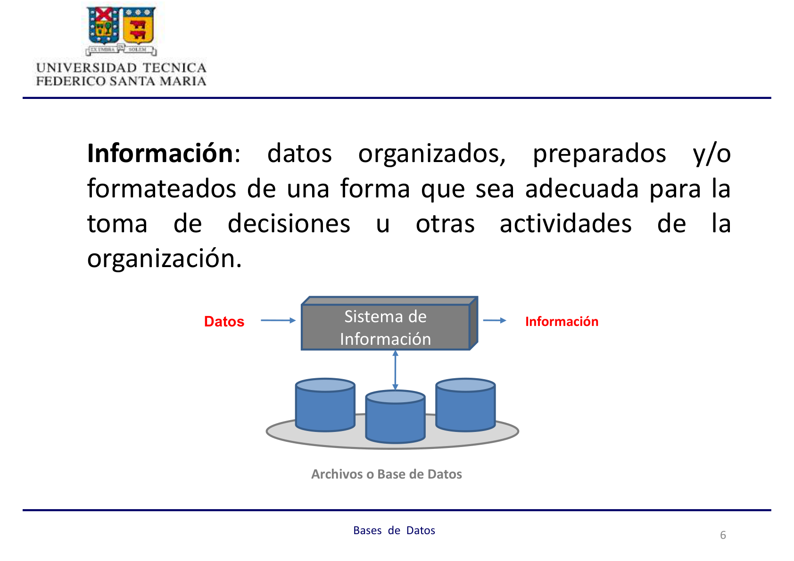
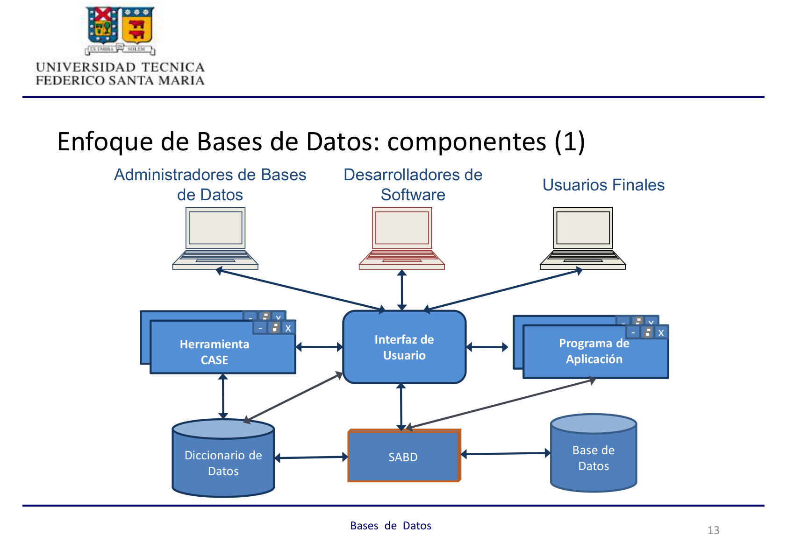
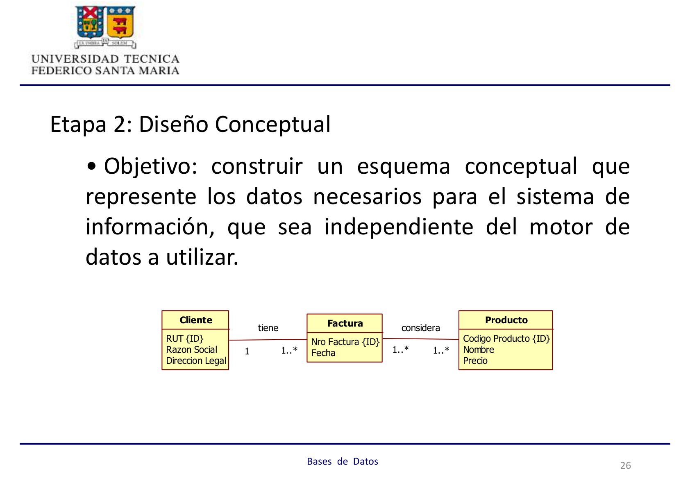
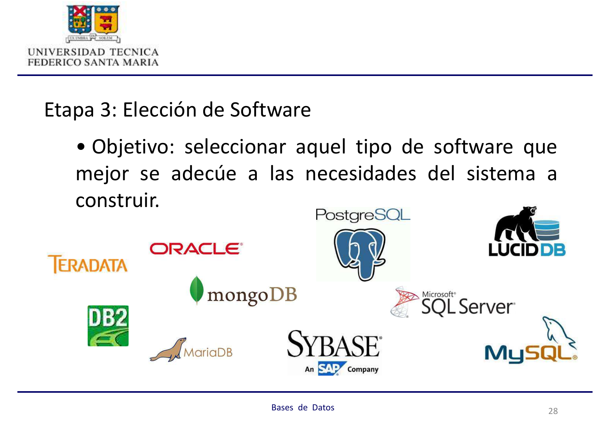
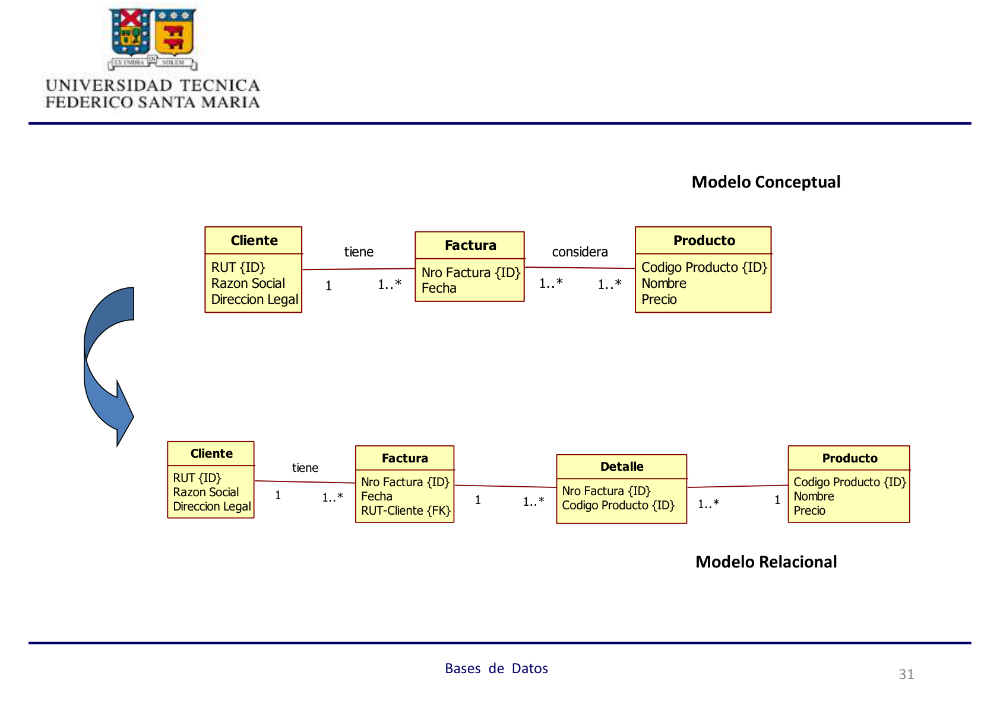

## BASES DE DATOS

Profesor: José Luis Martí Lara

## Unidad 1: Introducción a las Bases de Datos

### Conceptos Básicos Asociados a las Bases de Datos

:::note[Definición de Base de Datos]
Conjunto integrado de archivos (datos) relacionados entre sí.
:::

:::note[Definición de Dato]
Hecho relacionado con personas, objetos, lugares, eventos u otras entidades del mundo real.
:::

**Características del Dato:**

- Cualitativo (descriptivo) o cuantitativo
- Interno o externo
- Histórico o predictivo

:::note[Definición de Información]
Datos organizados, preparados y/o formateados de una forma que sea adecuada para la toma de decisiones u otras actividades de la organización.
:::



- **Archivo:** Conjunto de datos relacionados entre sí, al compartir una misma estructura y/o comportamiento similar.
- **Bases de Datos:** Conjunto integrado de archivos relacionados entre sí.

**Enfoque de Archivos vs. Enfoque de Bases de Datos**

- **Enfoque de Archivos:** Enfoque "del pasado", cuando las organizaciones desarrollaban sus sistemas de información de forma aislada, resultando en _islas de datos_.

  

  **Desventajas del Enfoque de Archivos:**
  - Subutilización del espacio en disco
  - Dependencia de los datos
  - Baja productividad del desarrollador
  - Falta de estandarización
  - Inconsistencia de los datos (resultados)
  - Problemas con el cliente

- **Enfoque de Bases de Datos:** Visión centralizada y única de los datos.

  **Ventajas del Enfoque de Bases de Datos:**
  - Minimización de la redundancia
  - Independencia de los datos
  - Estandarización, Compartición y Seguridad de Datos

  

### Componentes del Enfoque de Bases de Datos



- **Usuarios:** Personas con requisitos de información que realizan operaciones de ingreso, modificación, eliminación, consulta y mantención de la base de datos. Incluyen:
  - Usuario Final
  - Desarrollador de Aplicaciones
  - Diseñador de la Base de Datos
  - Administrador de Bases de Datos (DBA)
  - Administrador de Datos (Arquitecto)

- **Sistema Administrador de Bases de Datos (SABD):** Software que permite crear y mantener una o más bases de datos.
  - También conocido como motor o servidor de datos.
  - **Funciones principales:**
    - **Definición de Datos (DDL):** `create`, `alter`, `drop`...
    - **Manipulación de Datos (DML):** `insert`, `update`, `delete`...
    - **Control de Datos (DCL):** `grant`, `revoke`...

- **Interfaz de Usuario:** Forma en que el SABD permite la interacción con la base de datos.

- **Base de Datos:** Conjunto de datos operacionales, almacenados en el computador y accesados por distintas aplicaciones; o bien el lugar físico donde están almacenados los datos.

- **Diccionario de Datos:** Es una base de datos que guarda una descripción de los datos, como su tipo, largo, propietario, tamaño de los registros, etc.

- **Administrador de la Base de Datos (DBA):** Persona o grupo de personas encargadas de dirigir y controlar el recurso dato, cumpliendo las siguientes funciones:
  - Definición de la base de datos y/o archivos a usar (junto con el analista y usuario).
  - Selección de la estructura de almacenamiento y la estrategia de recuperación.
  - Definición de los distintos tipos de acceso y su mantención.
  - Definición de la estrategia de respaldo a usar, implementarla y controlarla.
  - Preocuparse del desempeño de la base de datos y afinarlo.
  - Proveer de capacitación, entrenamiento y apoyo a las consultas de los usuarios.
  - **Responsable de las bases de datos físicas.**

- **Administrador de Datos (Arquitecto):** Responsable de desarrollar y administrar las normas, procedimientos, prácticas y planes para la definición, organización, protección y utilización eficiente de los datos dentro de la organización, incluyendo todos los datos, estén o no en la base de datos.

### Proceso de Diseño de Bases de Datos

Para diseñar una base de datos, se sigue una serie de pasos que van desde la recolección de información hasta el diseño de los archivos y sus organizaciones, donde finalmente se almacenan los datos.


#### Etapa 1: Recolección y Análisis de Requisitos

- **Objetivo:** Identificar las necesidades de información de los usuarios.
- **Pasos:**
  - Identificación de las áreas de aplicación y grupos de usuarios. Elección de participantes principales.
  - Análisis y estudio de la documentación existente en las actuales aplicaciones (manuales de políticas, formas, reportes y diagramas organizacionales).
  - Estudio del actual ambiente operativo y uso de la información. Incluye un análisis de los tipos de transacciones y sus frecuencias, y del flujo de información en el sistema.
  - Obtención de respuestas de cuestionarios de potenciales usuarios. Identificación de prioridades.
  - Formalización de Requisitos.

#### Etapa 2: Diseño Conceptual

- **Objetivo:** Construir un esquema conceptual que represente los datos necesarios para el sistema de información, siendo independiente del motor de datos a utilizar.

  

- **El modelo conceptual sirve como:**
  - Medio de Comunicación entre usuarios y especialistas; por ende, debe ser expresivo, simple, mínimo, formal, diagramático.
  - Mecanismo para validar el entendimiento del problema por parte del especialista.
  - Descripción Estable del Contenido.

#### Etapa 3: Elección de Software

- **Objetivo:** Seleccionar el tipo de software que mejor se adecúe a las necesidades del sistema a construir.

  

- **Criterios a considerar:**
  - **Costos:** Adquisición de hardware y software; operación y mantención del sistema; migración.
  - **Requisitos del sistema:** Funcionales y no funcionales.
  - **Estructuración de los datos.**

#### Etapa 4: Diseño Lógico

- **Objetivo:** Generar un esquema basado en el modelo de datos soportado por el software escogido.
- **Pasos:**
  - Transformación independiente del sistema a un modelo relacional, orientado al objeto u otro.
  - Conversión de los esquemas a un software de bases de datos específico.

  

#### Etapa 5: Diseño Físico

- **Objetivo:** Escoger las estructuras de almacenamiento y métodos de acceso, además de la ubicación de los archivos de bases de datos, para obtener un buen rendimiento de las distintas aplicaciones que interactúan con la base de datos.
- **Criterios a considerar:**
  - **Tiempo de Respuesta:** Tiempo que transcurre desde el ingreso de la transacción hasta el recibo de su respuesta.
  - **Rendimiento del Sistema:** Número promedio de transacciones que pueden ser procesadas por minuto.
  - **Utilización del espacio en disco:** Cantidad de memoria ocupada por los archivos e índices.

- **Herramientas para el Diseño Físico:**
  - **Estructuras de almacenamiento:**
    - Secuenciales: desordenados, ordenados
    - Directo: _hashing_ estático, o con expansión dinámica
    - De tipo Árbol: B
  - **Índices:**
    - Dinámicos: _hashing_ con expansión dinámica, de tipo Árbol B o B+
    - Bitmap

  

#### Etapa 6: Implementación de la Base de Datos

- **Objetivo:** Codificación de sentencias para la definición y la manipulación de la base de datos, para crear los archivos y su poblamiento.
- **Ejemplos de sentencias SQL:**
  ```sql
  select rut, nombre from alumno;
  ```
  ```sql
  select * from alumno where carrera = 'INF';
  ```
