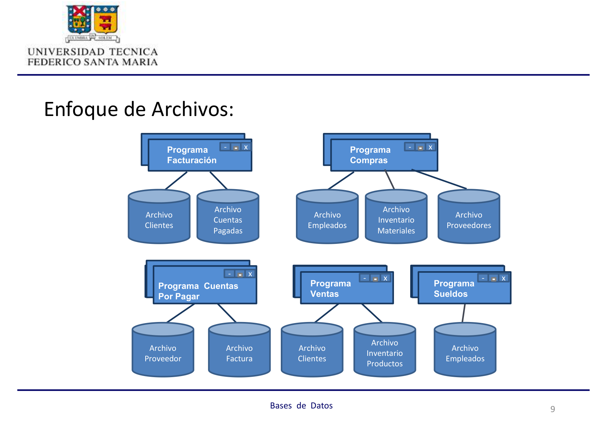
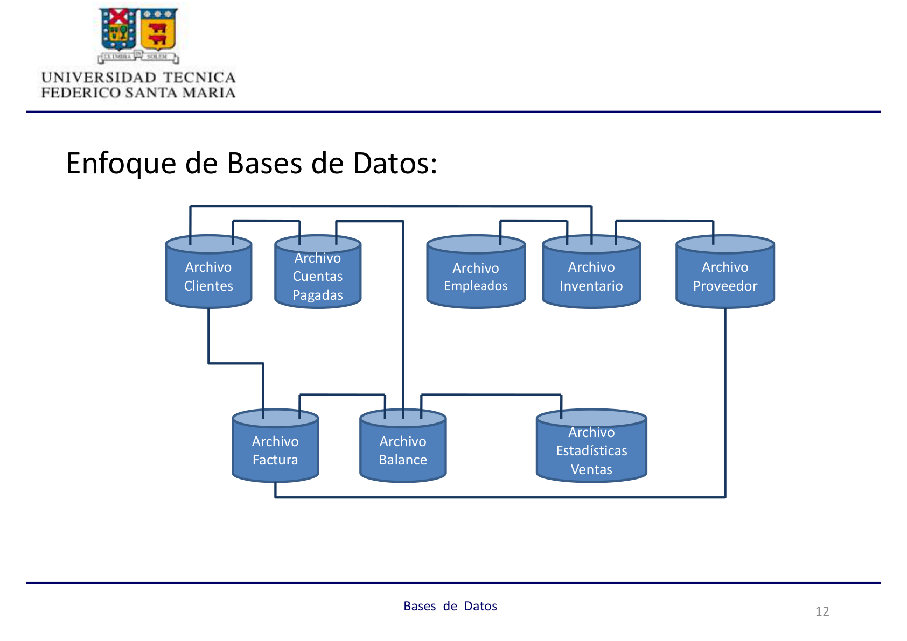
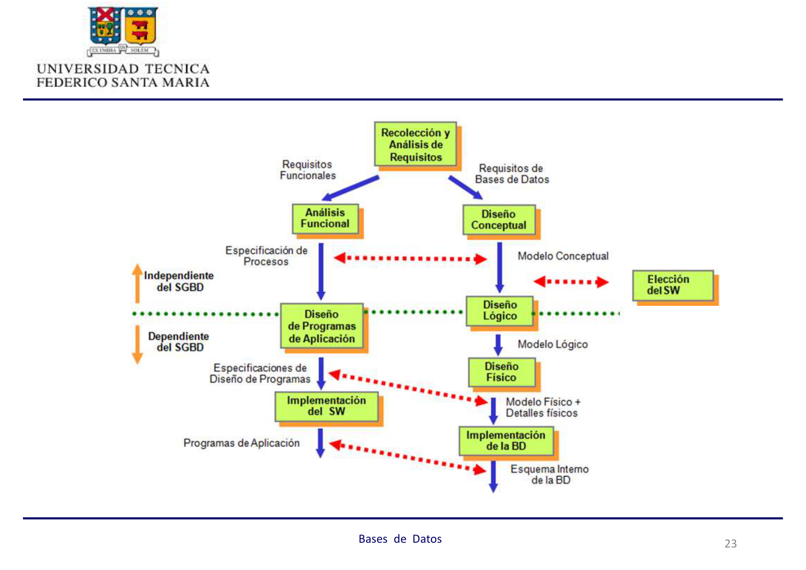
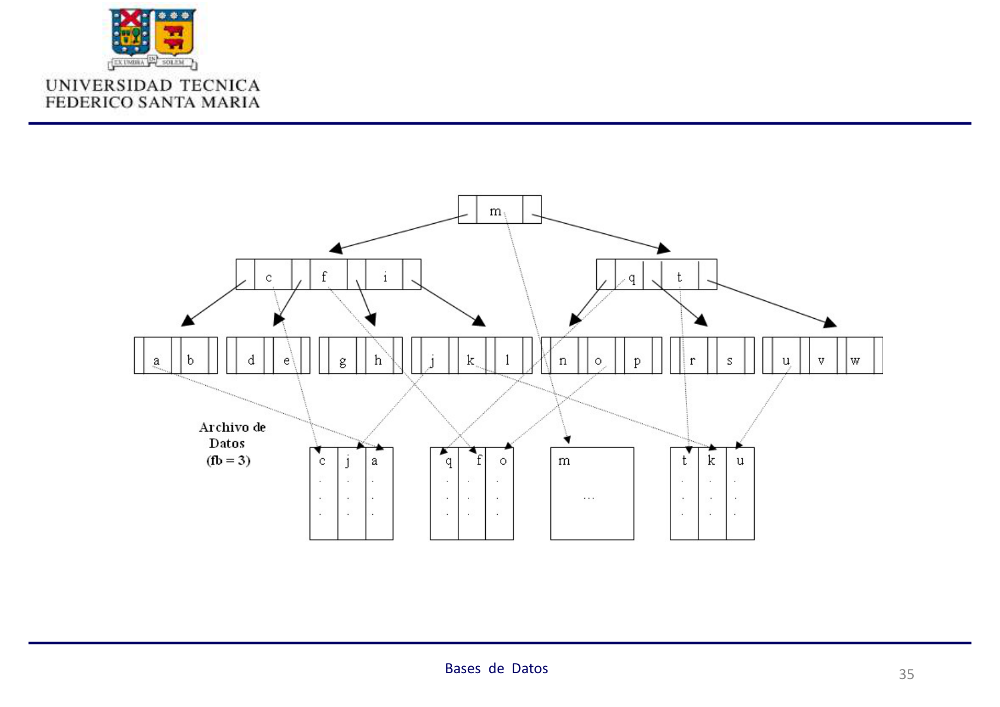

## Unidad 1: Introducción a las Bases de Datos

> **Profesor:** José Luis Martí Lara

---

## 1. Conceptos Básicos

:::note[Base de Datos]
Conjunto integrado de archivos (datos) relacionados entre sí.
:::

:::note[Dato]
Hecho relacionado con personas, objetos, lugares, eventos u otras entidades del mundo real.
:::

**Características del Dato:**

- Cualitativo (descriptivo) o cuantitativo
- Interno o externo
- Histórico o predictivo

:::note[Información]
Datos organizados, preparados y/o formateados de una forma adecuada para la toma de decisiones u otras actividades de la organización.
:::

**Flujo:** Datos → Información → Sistema de Información


- **Archivo:** Conjunto de datos relacionados entre sí, al compartir una misma estructura y/o comportamiento similar.
- **Base de Datos:** Conjunto integrado de archivos relacionados entre sí.

---

## 2. Enfoques de Gestión de Datos

### Enfoque de Archivos (Pasado)

Las organizaciones desarrollaban sus sistemas de forma aislada, creando "islas de datos". Cada programa gestionaba sus propios archivos sin integración.



**Desventajas:**

- Subutilización del espacio en disco
- Dependencia de los datos
- Baja productividad del desarrollador
- Falta de estandarización
- Inconsistencia de los datos (resultados)
- Problemas con el cliente

### Enfoque de Bases de Datos (Actual)

Visión centralizada y única de los datos, gestionados de forma integrada.



**Ventajas:**

- Minimización de la redundancia
- Independencia de los datos
- Estandarización
- Compartición de datos
- Seguridad de datos

---

## 3. Componentes del Enfoque de Bases de Datos


### Usuarios

Personas con requisitos de información que realizan operaciones de ingreso, modificación, eliminación, consulta y mantención de la base de datos.

- Usuario Final
- Desarrollador de Aplicaciones
- Diseñador de la Base de Datos
- Administrador de Bases de Datos (DBA)
- Administrador de Datos (Arquitecto)

### Sistema Administrador de Bases de Datos (SABD)

Software que permite crear y mantener una o más bases de datos. También conocido como **motor** o **servidor de datos**.

**Funciones principales:**

- **Definición de Datos (DDL):** Sentencias para crear, modificar o eliminar la estructura de la base de datos.
  ```sql
  CREATE TABLE ...
  ALTER TABLE ...
  DROP TABLE ...
  ```
- **Manipulación de Datos (DML):** Sentencias para insertar, actualizar o eliminar datos.
  ```sql
  INSERT INTO ...
  UPDATE ...
  DELETE FROM ...
  ```
- **Control de Datos (DCL):** Sentencias para otorgar o revocar permisos.
  ```sql
  GRANT ...
  REVOKE ...
  ```

### Interfaz de Usuario

Forma en que el SABD permite la interacción con la base de datos.

### Base de Datos

Conjunto de datos operacionales almacenados en el computador y accesados por distintas aplicaciones; o bien el lugar físico donde están almacenados los datos.

### Diccionario de Datos

Base de datos que guarda una descripción de los datos: tipo, largo, propietario, tamaño de los registros, etc.

### Administrador de la Base de Datos (DBA)

Persona o grupo de personas encargadas de dirigir y controlar el recurso dato.

**Funciones:**

- Definición de la base de datos y/o archivos a usar (junto con el analista y usuario).
- Selección de la estructura de almacenamiento y la estrategia de recuperación.
- Definición de los distintos tipos de acceso y su mantención.
- Definición de la estrategia de respaldo, implementarla y controlarla.
- Preocuparse del desempeño de la base de datos y afinarlo.
- Proveer de capacitación, entrenamiento y apoyo a los usuarios.

**Responsabilidad:** Las bases de datos físicas.

### Administrador de Datos (Arquitecto)

Responsable de desarrollar y administrar las normas, procedimientos, prácticas y planes para la definición, organización, protección y utilización eficiente de los datos dentro de la organización, incluyendo todos los datos, estén o no en la base de datos.

---

## 4. Proceso de Diseño de Bases de Datos

:::note[Objetivo]
Realizar una serie de pasos que van desde la recolección de información hasta el diseño e implementación de los archivos y sus organizaciones para almacenar los datos.
:::



### Etapa 1: Recolección y Análisis de Requisitos

**Objetivo:** Identificar las necesidades de información de los usuarios.

**Pasos:**

1. Identificación de las áreas de aplicación y grupos de usuarios. Elección de participantes principales.
2. Análisis y estudio de la documentación existente (manuales de políticas, formas, reportes, diagramas organizacionales).
3. Estudio del ambiente operativo actual: tipos de transacciones, frecuencias y flujo de información.
4. Obtención de respuestas de cuestionarios de potenciales usuarios. Identificación de prioridades.
5. Formalización de Requisitos.

### Etapa 2: Diseño Conceptual

**Objetivo:** Construir un esquema conceptual que represente los datos necesarios para el sistema de información, **independiente del motor de datos a utilizar**.


**El modelo conceptual sirve como:**

- **Medio de Comunicación** entre usuarios y especialistas — debe ser expresivo, simple, mínimo, formal, diagramático.
- **Mecanismo de Validación** del entendimiento alcanzado del problema por parte del especialista.
- **Descripción Estable del Contenido.**

**Ejemplo:** Un modelo que muestra entidades como `Factura`, `Cliente`, `Producto` y sus relaciones (`tiene`, `considera`) con atributos clave e indicadores de cardinalidad.

### Etapa 3: Elección de Software (SABD)

**Objetivo:** Seleccionar el tipo de software que mejor se adecúe a las necesidades del sistema a construir.


**Criterios a considerar:**

- **Costos:** Adquisición de hardware y software; operación y mantención del sistema; migración.
- **Requisitos del sistema:** Funcionales y no funcionales.
- **Estructuración de los datos.**

### Etapa 4: Diseño Lógico

**Objetivo:** Generar un esquema basado en el modelo de datos soportado por el software escogido.

**Pasos:**

1. Transformación independiente del sistema a un modelo relacional, orientado a objetos u otro.
2. Conversión de los esquemas a un software de bases de datos específico.


**Ejemplo:** Transformar el modelo conceptual a un modelo relacional donde las relaciones se representan mediante claves foráneas. Por ejemplo, `RUT-Cliente {FK}` en la tabla `Factura`.

### Etapa 5: Diseño Físico

**Objetivo:** Escoger las estructuras de almacenamiento y métodos de acceso, además de la ubicación de los archivos de bases de datos, para obtener un buen rendimiento.

**Criterios a considerar:**

- **Tiempo de Respuesta:** Tiempo que transcurre desde el ingreso de la transacción hasta el recibo de su respuesta.
- **Rendimiento del Sistema:** Número promedio de transacciones procesadas por minuto.
- **Utilización del espacio en disco:** Cantidad de memoria ocupada por los archivos e índices.

**Estructuras de almacenamiento:**

- Secuenciales: desordenados, ordenados
- Directo: _hashing_ estático, o con expansión dinámica
- De tipo Árbol: B

**Índices:**

- Dinámicos: _hashing_ con expansión dinámica, de tipo Árbol B o B+
- Bitmap



### Etapa 6: Implementación de la Base de Datos

**Objetivo:** Codificación de sentencias para la definición y manipulación de la base de datos, para crear los archivos y su poblamiento.

**Ejemplos de sentencias SQL:**

```sql
SELECT rut, nombre FROM alumno;
```

```sql
SELECT * FROM alumno WHERE carrera = 'INF';
```
