## Semántica de los Datos

:::note[Definición de Semántica de los Datos]
Se refiere al significado de las relaciones que tienen los datos entre sí.
:::

A continuación, se explicarán dichas semánticas usando la notación del diagrama de clases UML.

### Notaciones Comunes para Modelos de Datos

- Diagrama de Bachmann
- Diagramas Entidad-Relación (E-R): básico, extensiones.
- Diagrama de Clases

Aquí un ejemplo de un modelo de datos utilizando un diagrama Entidad-Relación:
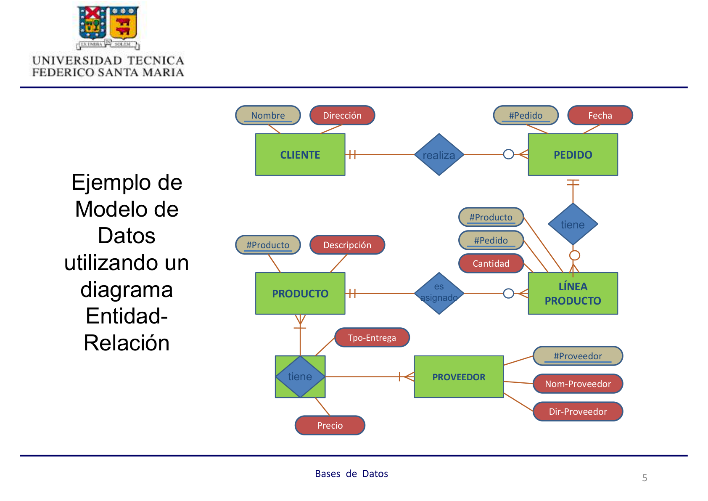

Un ejemplo de clase en UML:
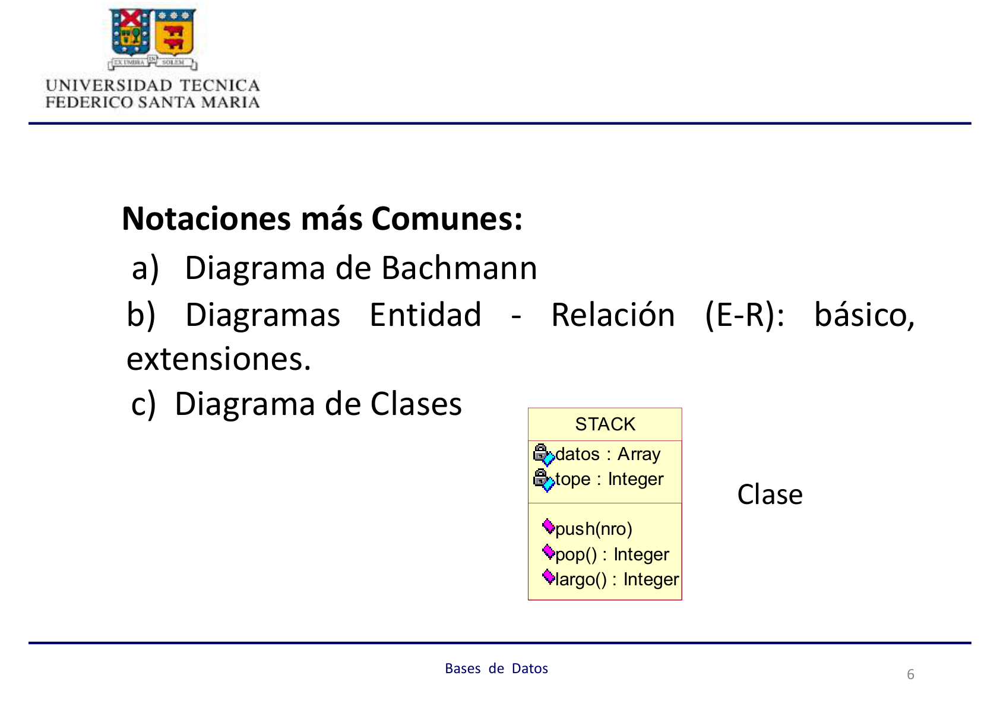

### Atributos

La sintaxis para un atributo es: `visibilidad nombre : tipo = valor_inicial {propiedad}`

- **Visibilidad:**
  - `+`: pública
  - `#`: protegida
  - `-`: privada
- **Propiedades comunes:**
  - `{unique}`
  - `{not null}`

## Tipos de Semánticas

## a) Cardinalidad (Multiplicidad)

:::note[Definición de Cardinalidad]
Se refiere al número de entidades con que otra entidad se relaciona.
:::

- **Tipos de multiplicidades:**
  - **1:1 (uno a uno):** Una entidad X se relaciona solo con otra entidad, y esta última solo lo hace con X.
    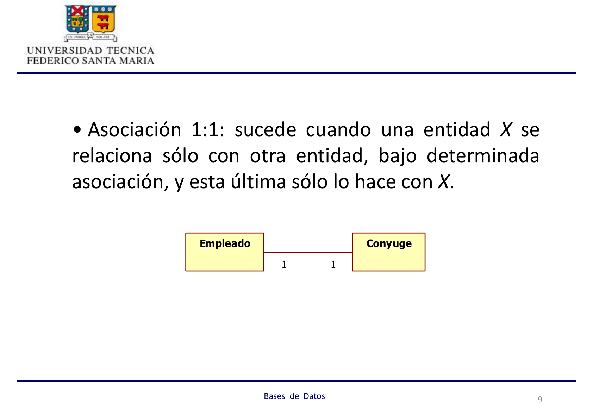
  - **1:N (uno a muchos):** Una entidad X se relaciona con varias entidades, pero cada una de estas solo lo hace con X.
    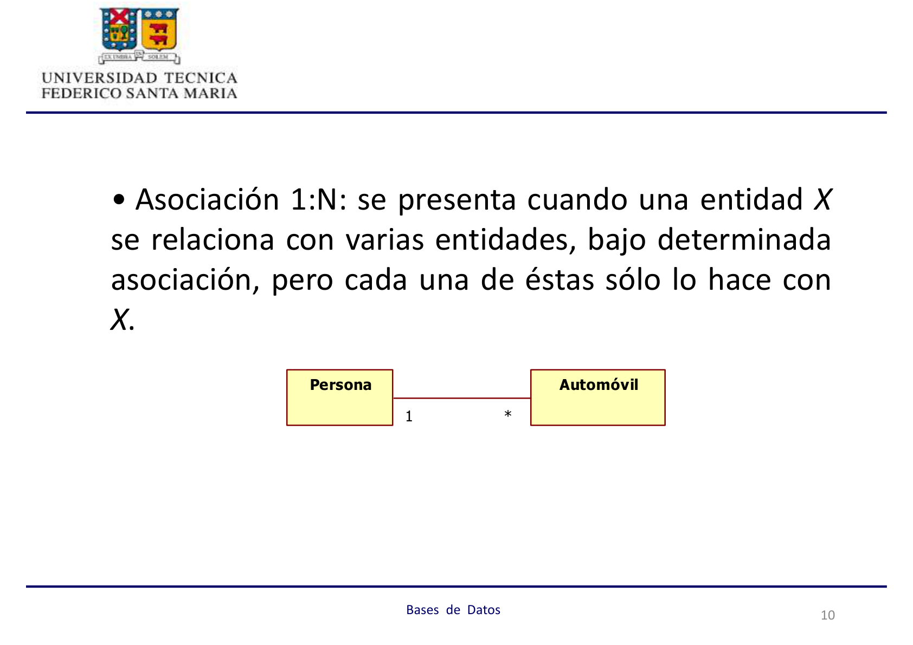
  - **M:N (muchos a muchos):** Una entidad X se relaciona con varias entidades, y cada una de estas, a su vez, se relaciona con X y, probablemente, otras entidades más del mismo tipo de X.
    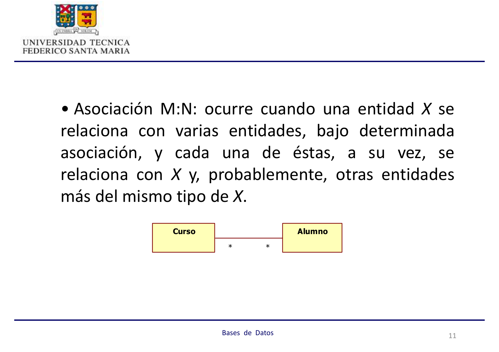

### Obligatoriedad (Opcionalidad)

Propiedad adicional de las asociaciones que indica si la relación es obligatoria (1 o más) u opcional (0 o más).

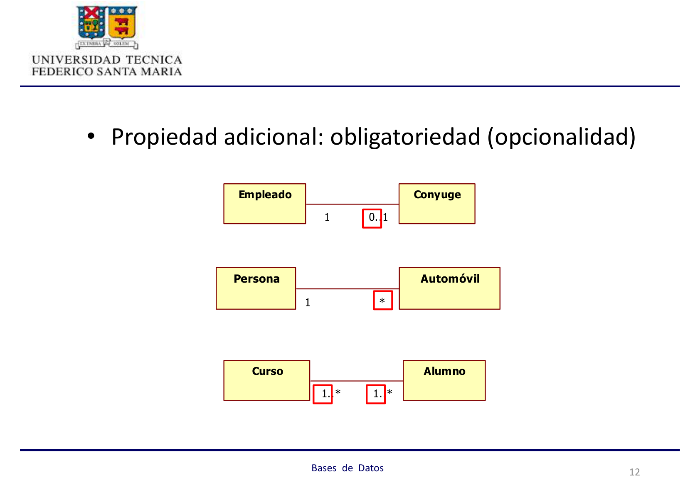

### Nombres y Roles en Asociaciones

Las asociaciones pueden tener nombres y las entidades participantes pueden desempeñar roles específicos.

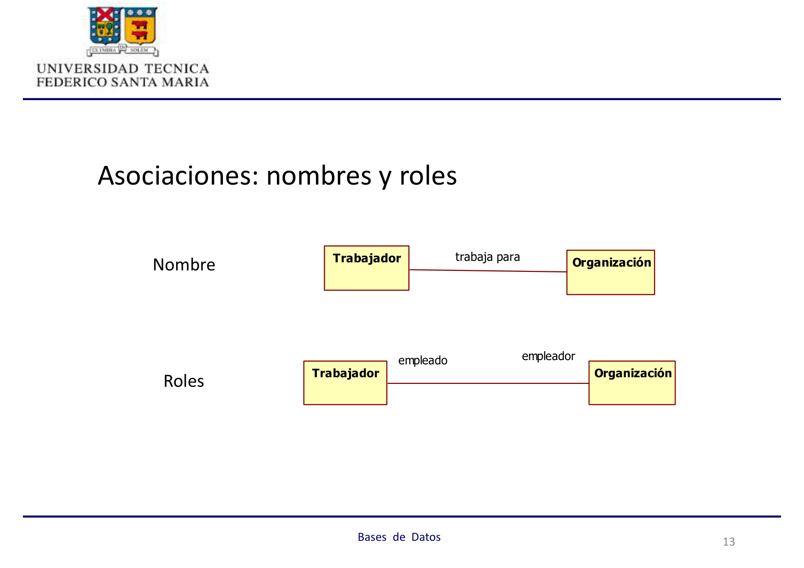

### Clase de Asociación

Una clase que modela atributos adicionales de la asociación misma.

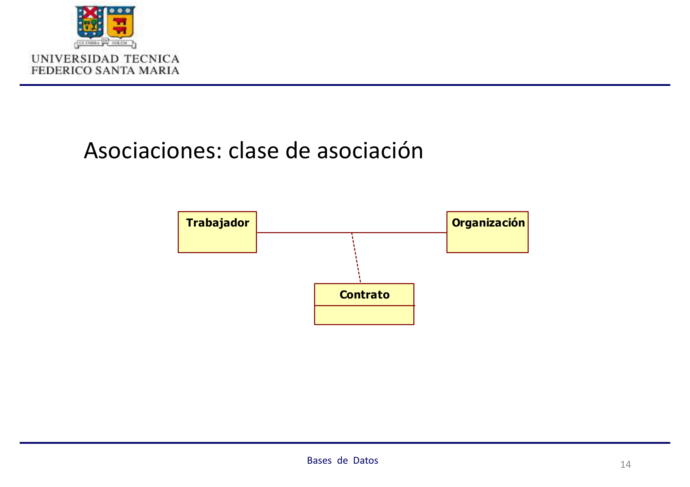

## b) Grado

:::note[Definición de Grado]
Se define como el número de tipos o clases de entidades que participan en una asociación.
:::

- **Tipos de asociaciones, según el grado:**
  - **Unaria:** Una asociación que considera un solo tipo de entidad que se relaciona consigo mismo.
    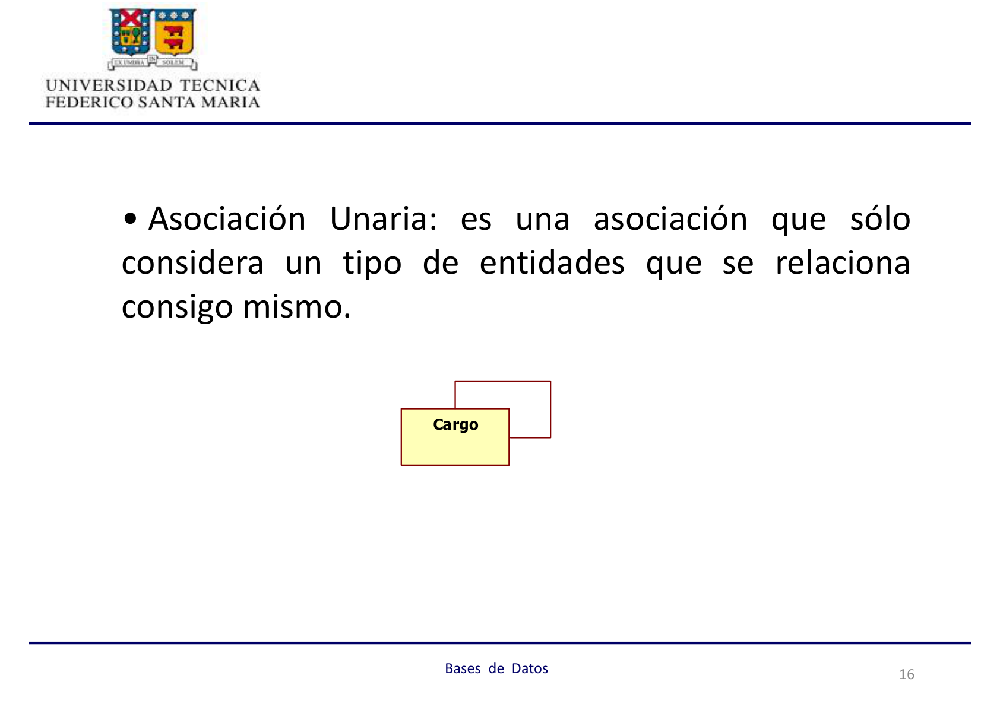
  - **Binaria:** Una relación conformada por dos tipos de entidades entre sí.
    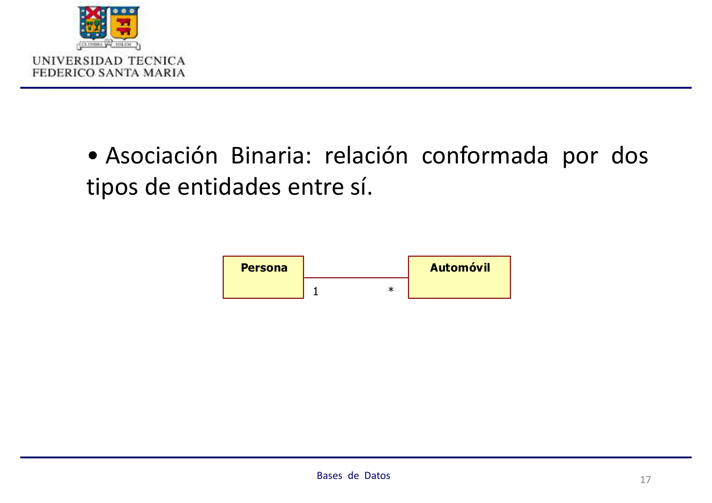
  - **Ternaria:** Una relación constituida por tres tipos de entidades.
    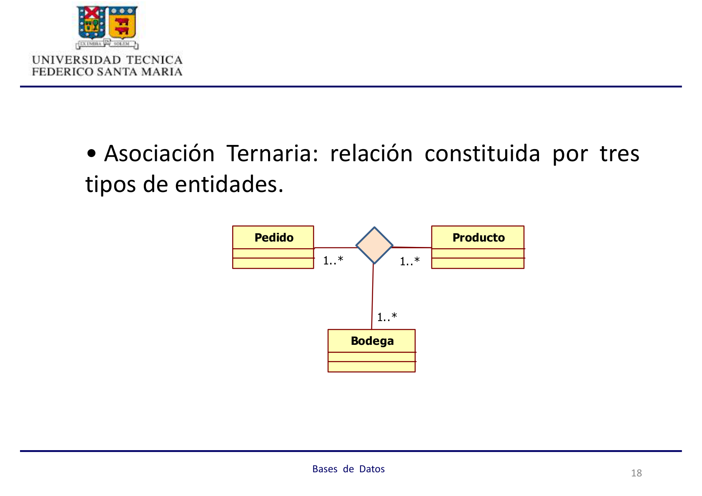
  - n-aria

## c) Dependencia Existencial

:::note[Definición de Dependencia Existencial]
Se refiere al hecho de que la ocurrencia de una entidad depende de la presencia de otra entidad.
:::

- Un objeto no puede existir sin que previamente exista otro (ej.: una Orden de Cliente no puede existir si dicho Cliente aún no existe).
- Un objeto no puede existir si el que le da sentido es eliminado (ej.: si un Cliente es borrado, deben eliminarse todas las Órdenes de Cliente asociadas).

**Beneficios generales y presencia en un modelo relacional:**

- Integridad referencial
- Acceso fácil a la entidad dependiente
- Claves foráneas
- Claves primarias compuestas en "tipos de entidades débiles"

## d) Tiempo

:::note[Semántica de Tiempo]
Referido a la variación del contenido de una base de datos con respecto al tiempo.
:::

- Estampillas de Tiempo.
- Restricciones de Inserción y de Retención.

### Estampilla de Tiempo

:::note[Definición de Estampilla de Tiempo]
Atributo que se incluye dentro de la descripción de una entidad para indicar el momento o intervalo de validez de los valores almacenados.
:::

- **Ejemplos:**
  - Fecha de Pago (para una validez inmediata, retroactiva, futura).
  - Fecha de Contrato (ídem a lo anterior).

### Restricciones de Inserción y Retención

- **Inserción:** Instante del tiempo en que el dato puede ser ingresado a la base de datos (antes o después de la presencia de otro dato relacionado).
- **Retención:** Período de tiempo en el cual tiene sentido registrar una relación.

## e) Unicidad

:::note[Definición de Unicidad]
Asociado con la presencia única (o exclusiva) de un dato, objeto o relación.
:::

- **Unicidad por Identificador:**
  - Ejemplo: Persona con `RUT {ID}` (identificador único).
- **Exclusividad (OR):** Un objeto puede pertenecer a un tipo o a otro, pero no a ambos simultáneamente.

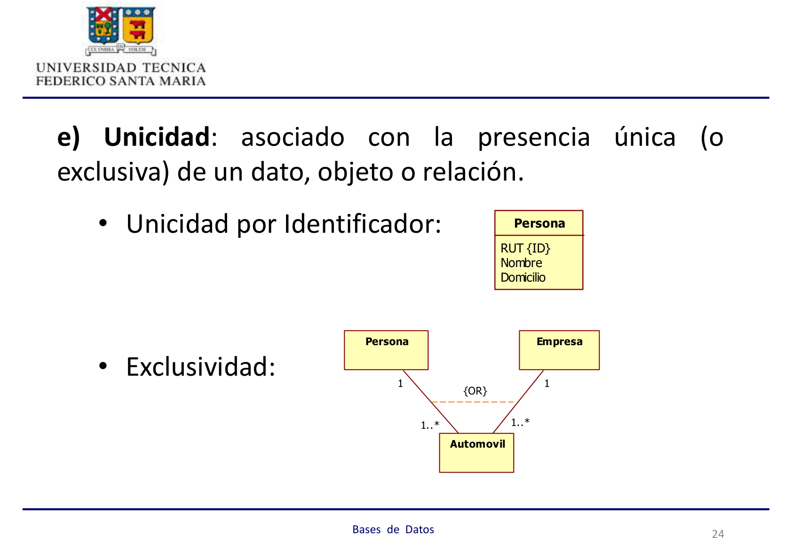

## f) Herencia

:::note[Definición de Herencia]
Permite ver un conjunto de entidades, con propiedades similares (atributos, operaciones), como un mismo tipo de entidades.
:::

- **Conceptos asociados:**
  - **Supertipo (clase):** Tipo de entidad más general.
  - **Subtipo (clase):** Subconjunto de un (super)tipo que ha sido dividido. Reusa las propiedades definidas en el supertipo del cual se origina.
  - **Relación del tipo “es un(a)”**.

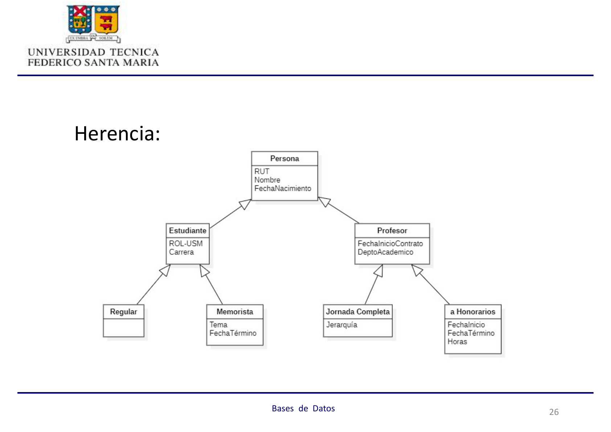

### Propiedades de la Herencia

- **Cobertura:** Si todas las entidades del supertipo pueden ser clasificadas por, al menos, uno de los subtipos, la jerarquía de herencia tiene cobertura completa (total, exhaustiva).
  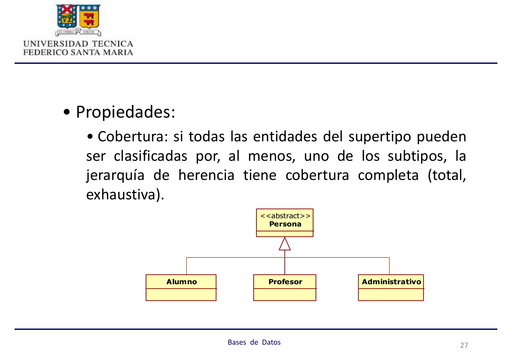
  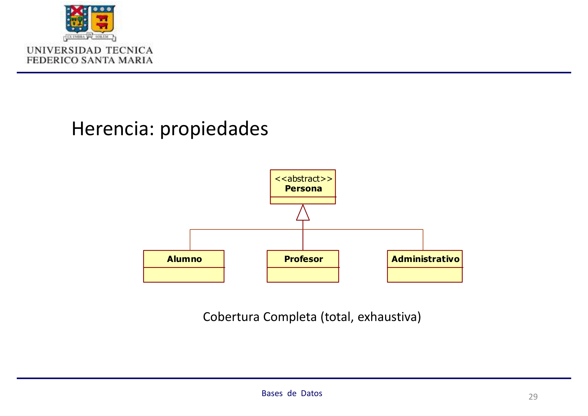

- **Exclusividad:** Si una entidad solo puede pertenecer a uno de los subtipos a la vez, la jerarquía de herencia es exclusiva.
- **Dinamicidad:** Si una entidad está asociada a uno de los subtipos, y en otro momento a otro(s) subtipo(s), la jerarquía de herencia es dinámica.
  - **Ejemplo de Exclusividad:** Si un alumno puede ser profesor al mismo tiempo, entonces es herencia no exclusiva; si ya no puede seguir siendo alumno, herencia exclusiva.
  - **Ejemplo de Dinamicidad:** Si un alumno pasa a ser profesor, entonces la herencia es dinámica; si nunca será el caso, herencia no dinámica (o estática).

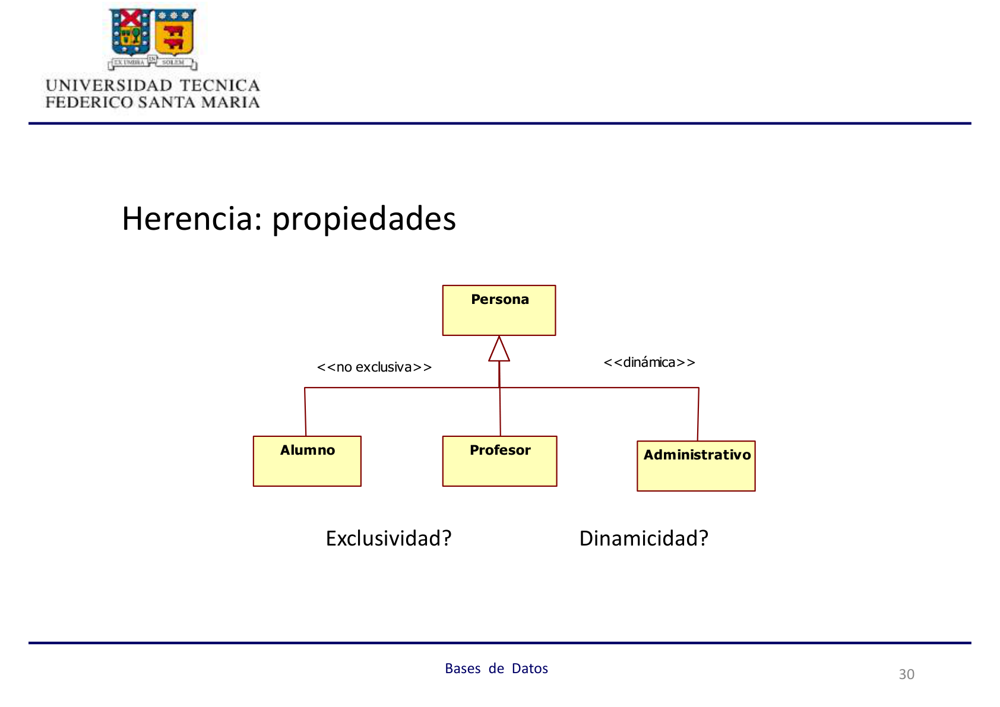

Se sugiere unir todas las subclases obtenidas a partir de un mismo criterio, hacia la superclase en cuestión.

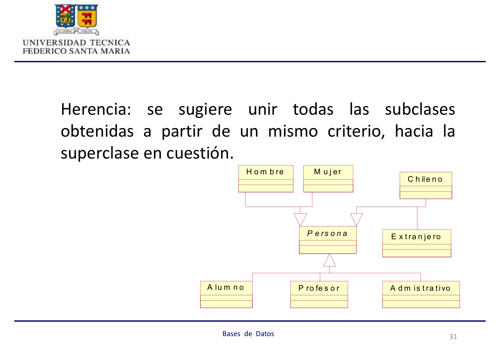

### Herencia Múltiple

La herencia múltiple permite que una clase herede de múltiples superclases.

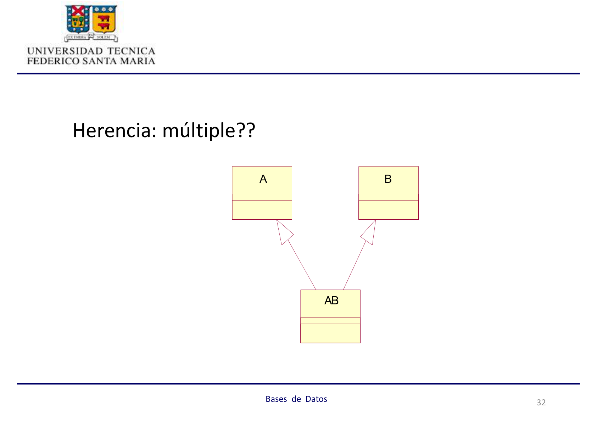

## g) Agregación

:::note[Definición de Agregación]
Es una colección de entidades, normalmente, de diferentes tipos.
:::

- **Conceptos asociados:**
  - **Objeto compuesto:** Que agrupa la colección.
  - **Objeto componente:** Contenido en el anterior.
  - **Relación del tipo “(con)tiene”**.
- **Ejemplos:** cuerpo humano, computador, automóvil.

La agregación puede ser:

- **Simple:** Las partes pueden existir independientemente del todo.
- **Compuesta (Composición):** Las partes no pueden existir sin el todo (relación de vida-muerte).

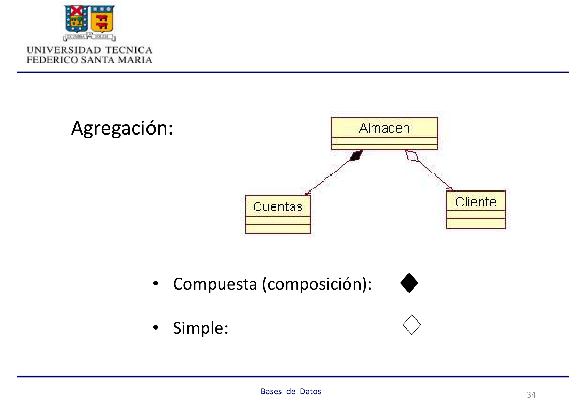

## h) Categorización (Interfaces)

:::note[Definición de Categorización]
Modela una relación de clases que tienen diferentes tipos de datos.
:::

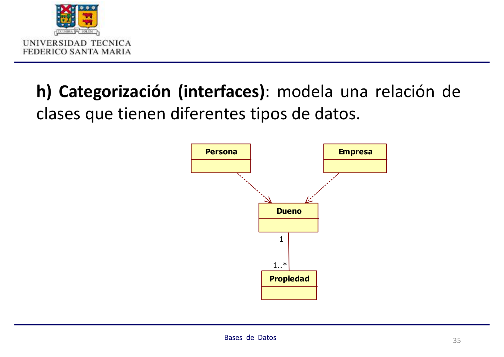

Las interfaces especifican un contrato de comportamiento.

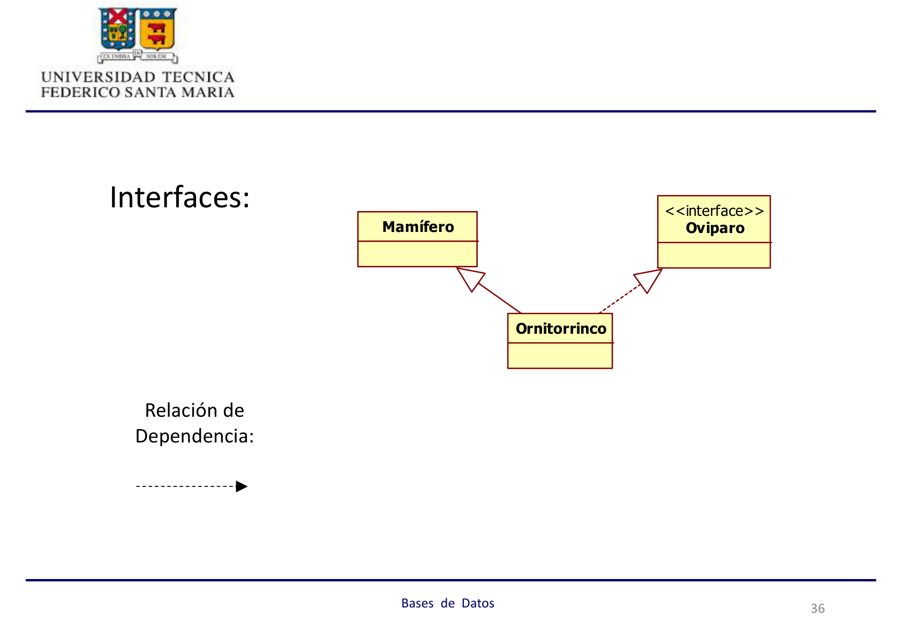

## Adicionales

### Restricciones a Nivel de Relaciones

Pueden existir restricciones específicas sobre cómo se relacionan las entidades, como el ordenamiento (`{ordenado}`) o la exclusividad (`{OR}`).

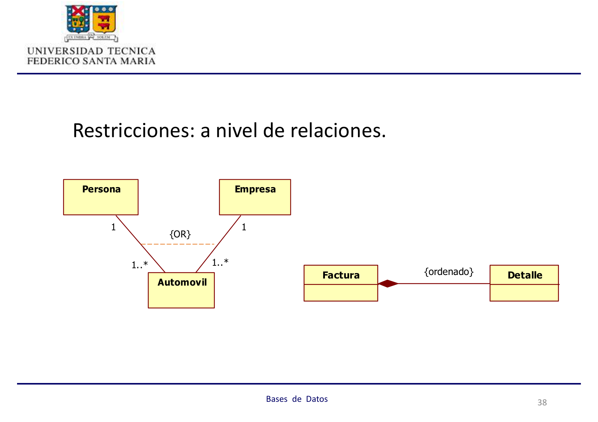
