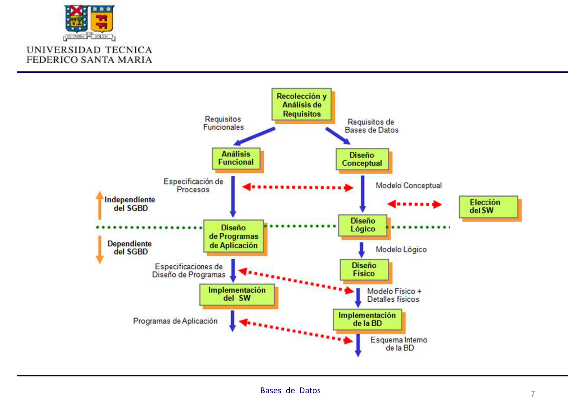
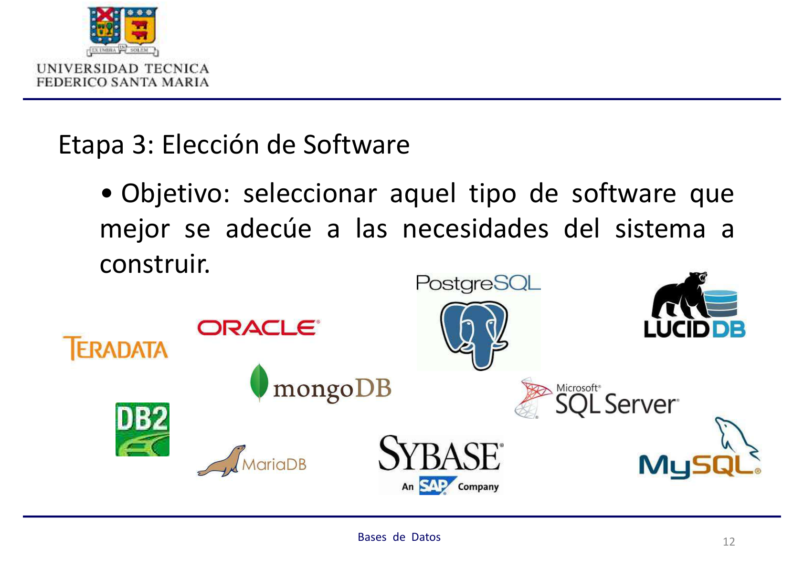
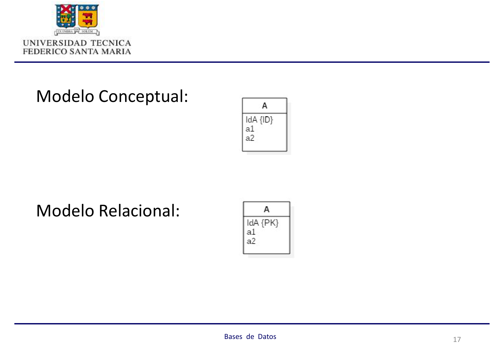
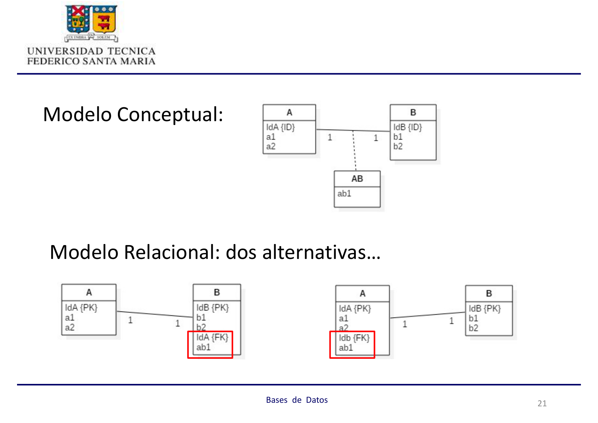
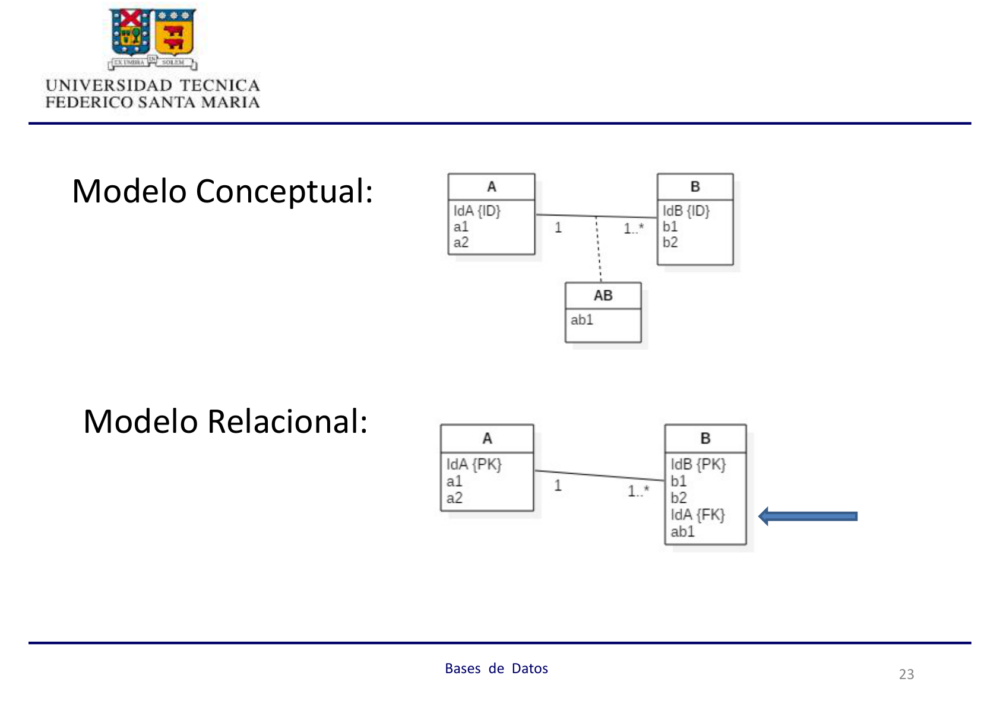
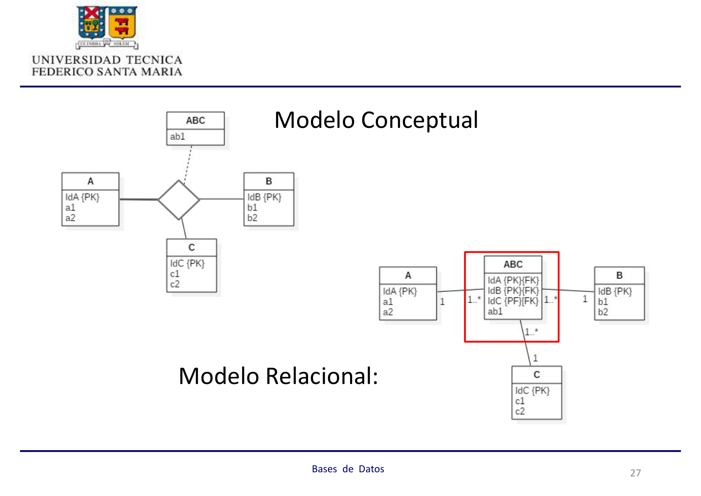
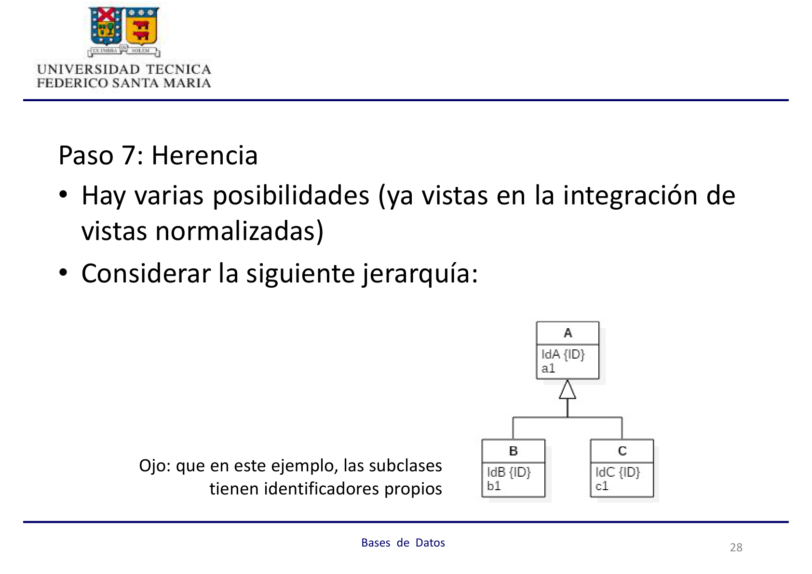
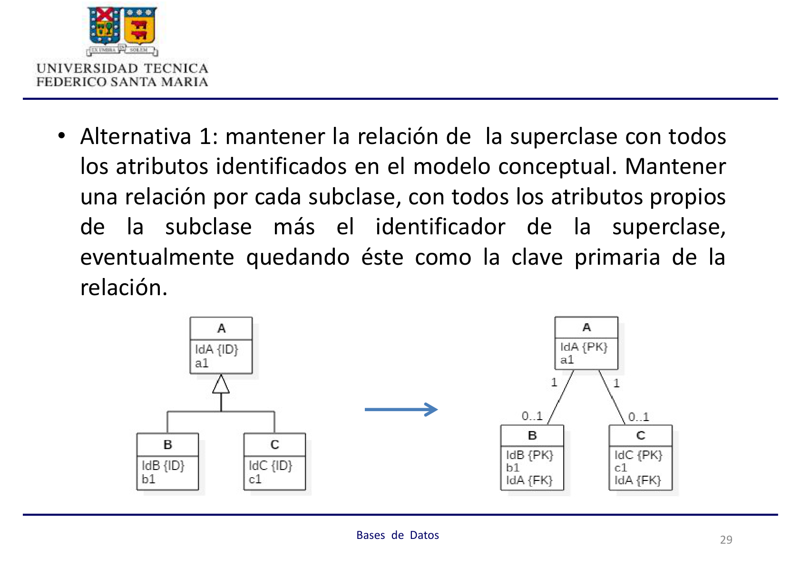

import { Aside } from "@astrojs/starlight/components";

## 1. Modelo de Datos Relacional

Un **modelo de datos lógico** se genera al tomar un modelo conceptual e incorporarle las características propias del software donde se implementará. Existen varios tipos de modelos lógicos:

- Jerárquico
- Reticular
- **Relacional** ← enfoque del curso
- Orientado al Objeto
- Multidimensional

### Terminología básica

| Término Conceptual | Término Relacional | Definición                                                |
| :----------------- | :----------------- | :-------------------------------------------------------- |
| Archivo / Entidad  | **Relación**       | Tabla bidimensional; el orden de las filas no importa.    |
| Registro           | **Fila / Tupla**   | Cada entrada individual en la tabla.                      |
| Atributo           | **Columna**        | Contiene valores del mismo tipo para todos los registros. |
| Rango de valores   | **Dominio**        | Conjunto de valores posibles para una columna.            |

- La **cardinalidad** es el número de filas de una relación.
- La **clave primaria (PK)** es el atributo —o combinación— que identifica de forma única cada fila. No admite valores repetidos ni nulos.

<Aside type="tip" title="Concepto Clave: Unicidad">
  En el modelo relacional **cada fila debe ser única**. Esto se logra mediante
  la **Clave Primaria (PK)**.
</Aside>

---

## 2. Estrategias de Diseño

Para obtener un modelo relacional existen dos caminos principales:

- **Top-Down:** Se construye un modelo conceptual y luego se convierte en uno relacional aplicando reglas de transformación formales.
- **Bottom-Up:** Se integran modelos parciales obtenidos de la normalización de vistas (reportes, salidas del sistema).

<Aside type="note" title="Enfoque del Curso">
  En esta unidad nos enfocamos exclusivamente en el **Top-Down**: el estándar
  cuando diseñas un sistema desde cero, partiendo de los requisitos del negocio.
</Aside>

---

## 3. Ciclo de Vida del Diseño

El proceso sigue una jerarquía de dependencia tecnológica:

### Fase Independiente del SGBD

1. **Recolección y Análisis de Requisitos** — Identificar las necesidades de información de los usuarios.
2. **Diseño Conceptual** — Construir el modelo conceptual (diagrama de clases UML), independiente del motor a usar.

### Fase Dependiente del SGBD

3. **Elección de Software** — Seleccionar el tipo de software (ej. relacional) que mejor se adecúe al sistema.

   

4. **Diseño Lógico** — Transformar el modelo conceptual en uno relacional, orientado a objetos u otro según el software escogido.
5. **Diseño Físico** — Escoger estructuras de almacenamiento e índices para obtener buen rendimiento.
6. **Implementación** — Codificar sentencias SQL para crear los archivos y poblarlos.

<Aside type="danger" title="Error frecuente en examen">
  Elegir el motor de base de datos (PostgreSQL, Oracle, etc.) **antes** de
  terminar el Diseño Conceptual es incorrecto. La elección del SW ocurre justo
  antes o durante el Diseño Lógico, no antes.
</Aside>

---

## 4. Caso de Estudio: Campeonato de Fórmula 1

:::tip[Ejercicio de Requisitos]
En un campeonato mundial de carreras de fórmula 1, es posible identificar los siguientes hechos:

Los pilotos firman contratos para correr durante una temporada en los autos de una escudería. Por ésta pueden firmar contrato varios pilotos. La escudería debe tener al menos un piloto y debe pertenecer a un país; notar que cada país puede tener varias escuderías.

Los automóviles deben estar inscritos en una escudería para poder participar. Estos son asignados a los pilotos para una carrera en particular, dependiendo si están disponibles técnicamente. Un piloto puede usar sólo un automóvil durante una carrera.

En una temporada se realizan muchas carreras en circuitos existentes en los distintos países. En un mismo circuito pueden desarrollarse varias carreras. Además, un circuito puede estar en reparaciones y no tener carreras programadas.
:::

**Entidades identificadas:** `País`, `Escudería`, `Piloto`, `Automóvil`, `Circuito`, `Carrera`, `Temporada`.

> Ver resolución completa: [Top-Down F1 (resumen)](./top-down-f1) · [Top-Down F1 (detallado)](./top-down-f1-detallado) · [Análisis de Transformación](./Analisis-audio)

---

## 5. Reglas de Transformación (Top-Down)

La transformación se aplica sobre un **diagrama de clases UML** como modelo conceptual.

### Paso 1: Entidades Fuertes

Por cada entidad fuerte, crear una relación con todos sus atributos simples. Escoger uno como **Clave Primaria (PK)**.

### Paso 2: Entidades Débiles

Por cada entidad débil (dependiente de una entidad F), crear una relación que incluya sus atributos simples más los atributos de la clave primaria de F. La PK es la **concatenación** de la clave de F con el identificador de la entidad débil.

### Paso 3: Asociaciones 1:1

Por cada asociación binaria 1:1, escoger una de las relaciones e incluir la PK de la otra como **Clave Foránea (FK)**.

### Paso 4: Asociaciones 1:N

Identificar la relación en el lado N e incluir en ella como FK la PK de la entidad con cardinalidad 1.

### Paso 5: Asociaciones M:N

Crear una **nueva relación intermedia** que incluya como FK las PK de ambas entidades participantes, más los atributos propios de la asociación.

### Paso 6: Asociaciones N-arias (n ≥ 3)

Crear una nueva relación que incluya como FK las PK de todas las entidades participantes. Normalmente la concatenación de esas claves forma la PK de la nueva relación.

### Paso 7: Herencia

Considerar la siguiente jerarquía como referencia (las subclases tienen identificadores propios):

- **Alternativa 1:** Tabla para la superclase + tabla por cada subclase (con la PK de la superclase como FK/PK).
  

- **Alternativa 2:** Eliminar la tabla de la superclase; cada subclase incluye todos los atributos heredados.
  

- **Alternativa 3:** Una sola tabla con todos los atributos, más un **atributo discriminador** que indica la subclase.
  

- **Alternativa 4:** Una sola tabla con todos los atributos, más **atributos booleanos** por subclase.
  

### Paso 8: Categorización (Interfaces)

Cuando las superclases tienen **diferentes identificadores**, se crea una **clave sustituta** (_surrogate key_) para la relación que representa la categoría. A cada relación de la superclase se le agrega esta clave sustituta como FK.

Cuando las superclases tienen el **mismo identificador**, no se necesita clave sustituta y se aplica un esquema similar al Paso 7.

