## Sistemas Administradores de Bases de Datos Relacionales (SABDR)

## 4.1 Arquitectura y Funciones de un SABDR

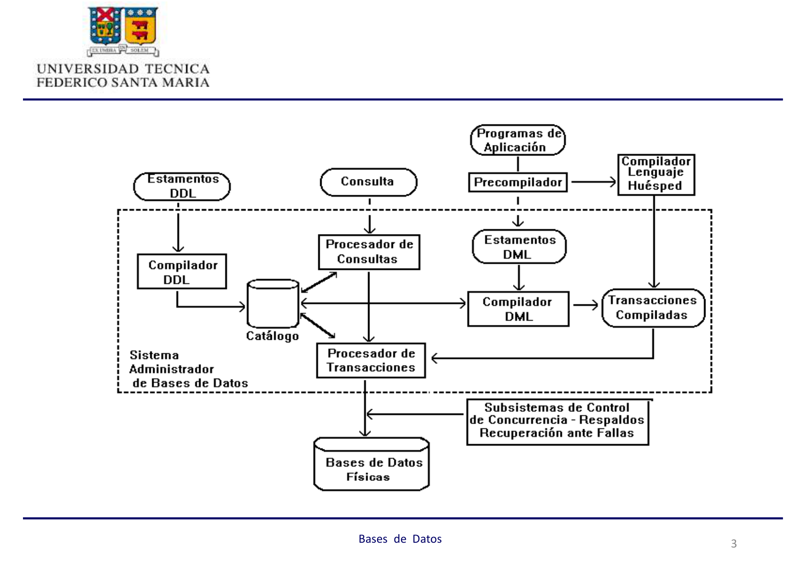

### Componentes de un SABD: Funciones Generales

- Mecanismos de Seguridad
- Control de la Concurrencia
- Servicios de Respaldo
- Mecanismos de Recuperación

### Funciones Generales

- **Definición de los datos** (comandos DDL): `create`, `alter`, `drop`...
- **Manipulación de los datos** (comandos DML): `insert`, `update`, `delete`...
- **Servicios de Integridad:** reglas de validación e integridad referencial
- **Manipulación de un Diccionario de Datos** (DD)
- **Integridad en las Transacciones:** evitando que las transacciones finalicen en un estado intermedio

### Mecanismos de Seguridad

- **Vistas** (subesquemas)
- **Perfiles de usuarios** o Reglas de autorización
- **Encriptación**
- **Autentificación**

### Control de la Concurrencia

:::caution[Problema a evitar: Falta de Control de Concurrencia]
Sin un control adecuado, operaciones concurrentes pueden llevar a estados inconsistentes de los datos. El siguiente diagrama ilustra cómo dos usuarios intentando modificar el mismo dato sin control pueden sobrescribir los cambios del otro, resultando en la pérdida de una actualización.
:::
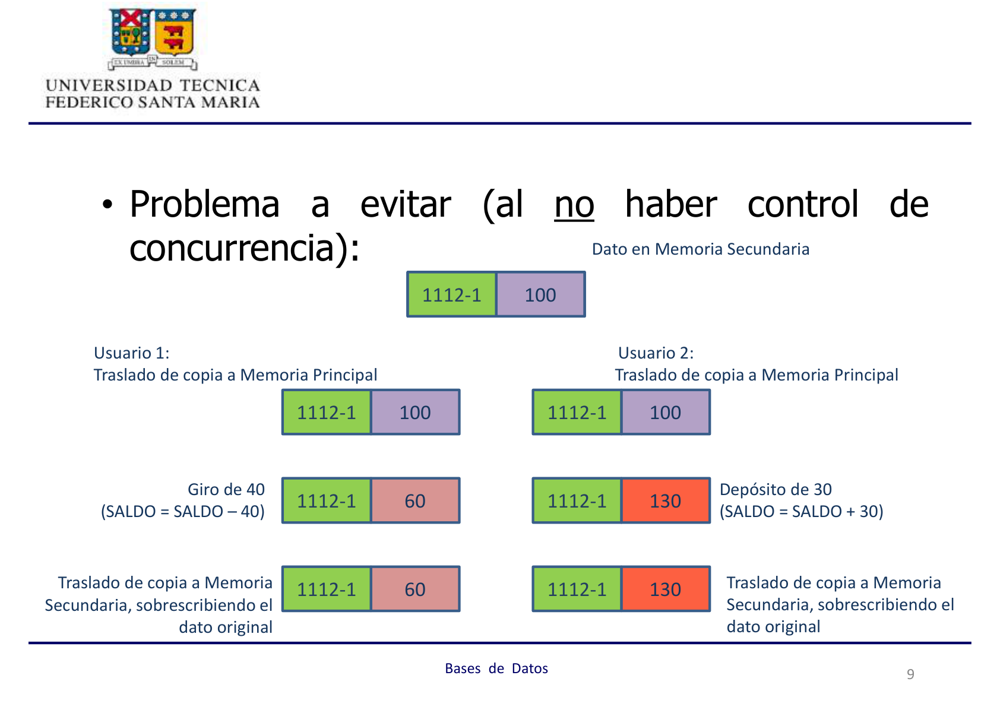

### Técnicas de Control de Concurrencia

- **Control pesimista:**
  - Basadas en bloqueos
    - :::note[Granularidad "gruesa"]
      Aplica a la base de datos completa o a un archivo.
      :::
    - :::note[Granularidad "media"]
      Aplica a un bloque (página) de registros.
      :::
    - :::note[Granularidad "fina"]
      Aplica a un registro o un atributo específico.
      :::
  - Multigranulares
  - Basadas en marcas temporales
- **Control optimista:**
  - Basadas en validación
  - Original de control de concurrencia

### Servicios de Respaldo

:::note[Definición de Respaldo]
Copia de los datos en "otro medio", a partir de la cual es posible restaurar el sistema a un momento previo.
:::

**Aspectos a considerar:**

- Plan de respaldo (¡documentado y comunicado!)
- Cuándo hacerlo
- Cuáles datos incluir
- Cantidad de copias
- Modalidad de las copias
- Tipos de respaldos

### Modalidad de las Copias

- **Copia Simple:** se hace un único ejemplar del respaldo.
- **Copia Doble:** se repite la tarea de respaldar, con el fin de tener dos ejemplares del mismo.
- **Copia generacional (abuelo-padre-hijo):** se hacen respaldos a lo largo del tiempo, generándose una historia de los respaldos.

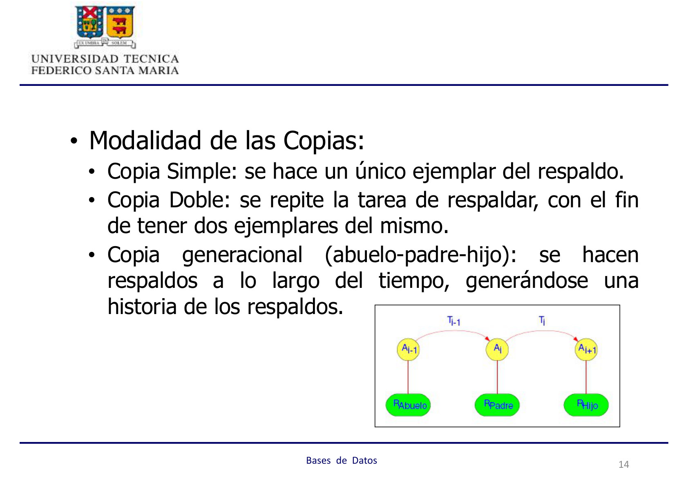

### Tipos de Respaldos

- **Offline**
- **Online:** apoyado con discos espejos
- **Global, completo** (full back-up).
- **Parcial:** sólo una aplicación, una plataforma...
- **Diferencial:** respalda sólo los archivos que han sido creados o actualizados desde la última copia completa.
- **Incremental:** respalda sólo los archivos creados o modificados desde el último respaldo, ya sea completo o diferencial.

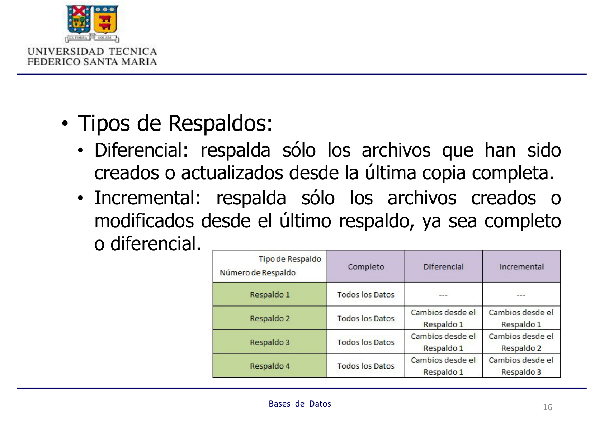

### Mecanismos de Recuperación

**A nivel de la base de datos, los métodos de recuperación incluyen:**

- Restore / Rerun
- Rollback
- Rollforward

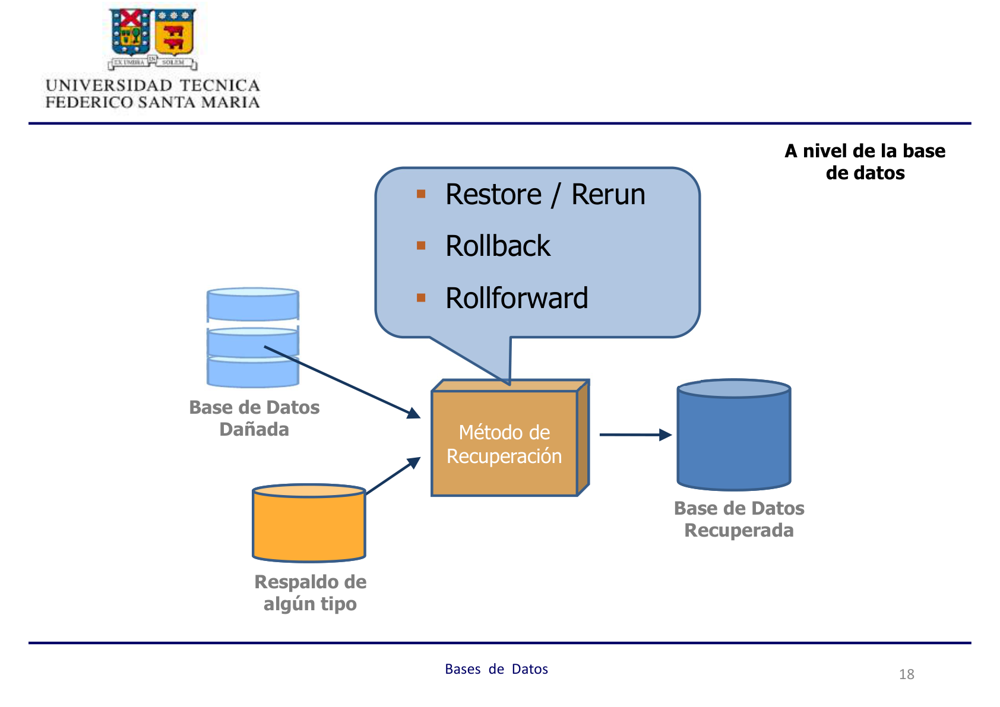

#### Restore / Rerun

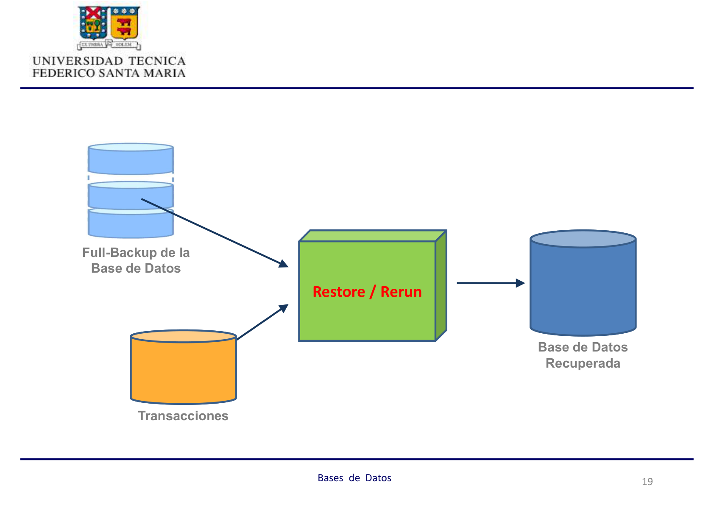

#### Rollback (UNDO)

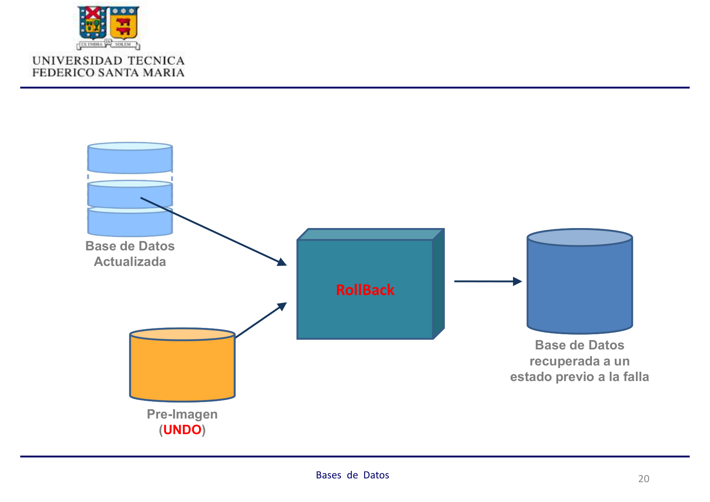

#### RollForward (REDO)

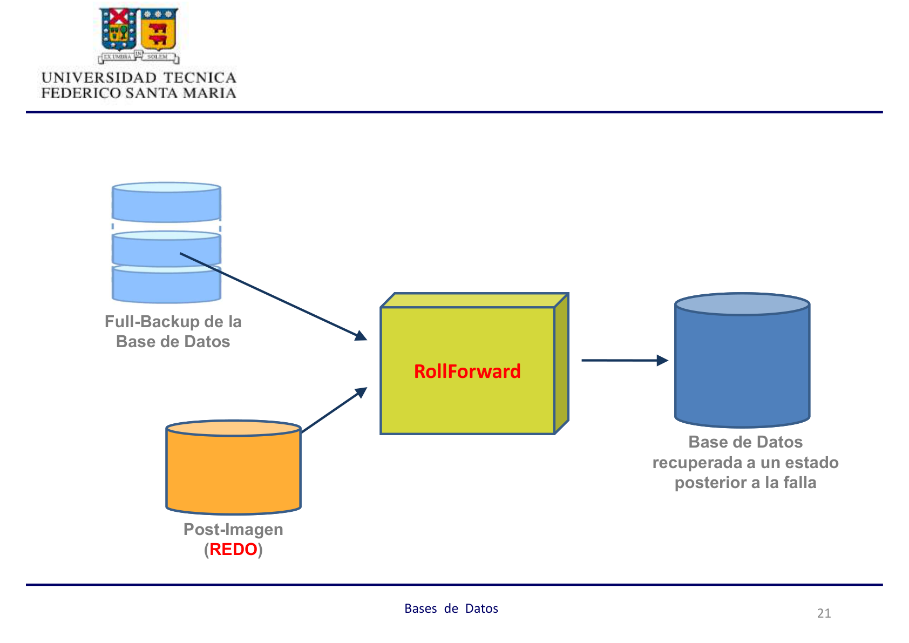

### Puntos de Chequeo o Revisión (Checkpoint)

Los checkpoints son puntos en el tiempo donde la base de datos asegura un estado consistente, facilitando la recuperación al definir hasta dónde rehacer operaciones.

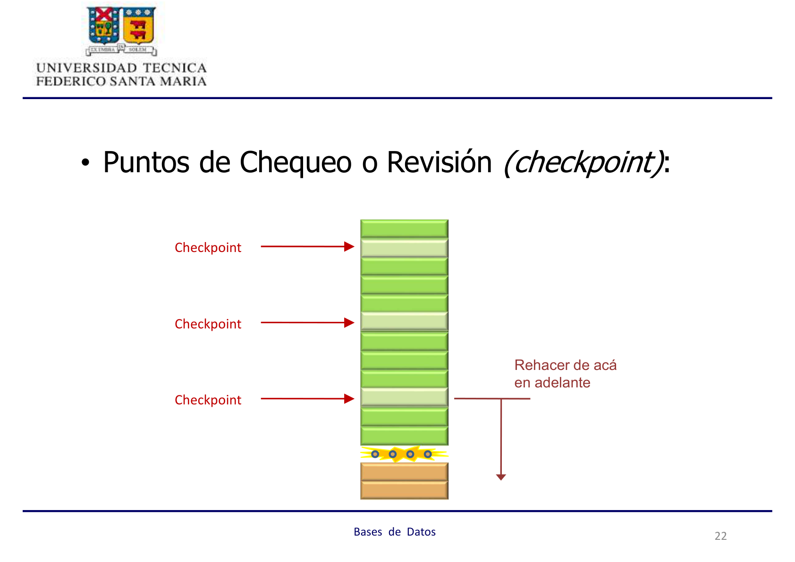

## 4.2 Procesamiento de Transacciones

### Transacción: Definición

:::note[Definición de Transacción]
Conjunto de operaciones que se ejecutan en forma indivisible (atómica) sobre una base de datos.
:::

### Ejemplo: Transferencias Bancarias

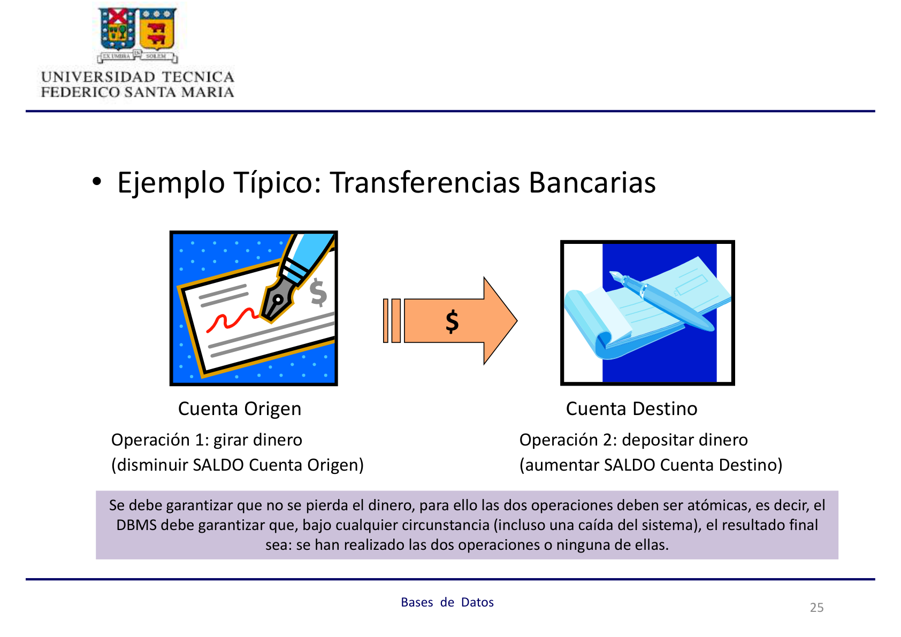

:::tip[Garantía de Atomicidad en Transacciones Bancarias]
Para una transferencia bancaria (disminuir saldo de origen y aumentar saldo en destino), se debe garantizar que no se pierda el dinero. Las dos operaciones deben ser atómicas. Esto significa que el DBMS debe asegurar que, bajo cualquier circunstancia (incluso una caída del sistema), el resultado final sea: **se han realizado ambas operaciones o ninguna de ellas**.
:::

### Transacción: Operaciones Básicas

- **Compromiso de una Transacción:** Indicación de que una transacción se ha ejecutado por completo y que todos los cambios se deben guardar "para siempre" en la base de datos.
- **Rollback de una Transacción:** Trabajo consistente en deshacer todas las operaciones ya ejecutadas por una transacción, hasta dejar la base de datos en el estado anterior.

### Transacciones: Propiedades ACID

- :::note[Atomicidad (Atomicity)]
  Cualquier cambio de estado producido por una transacción es atómico ("todo o nada").
  :::
- :::note[Consistencia (Consistency)]
  Cada transacción lleva a una base de datos desde un estado consistente a otro también consistente.
  :::
- :::note[Aislamiento (Isolation)]
  La ejecución concurrente de un conjunto de transacciones debe comportarse como si cada transacción fuera la única en proceso.
  :::
- :::note[Durabilidad (Durability)]
  La base de datos garantiza que los cambios producto de una transacción comprometida perduren en el tiempo.
  :::

### Transacciones: Registros Importantes (1/2)

- **Undo log:** Registro de las operaciones `undo` de las transacciones aún en progreso (esquema que solo se guarda en memoria principal).
- **Redo log:** Registro de las operaciones `redo` de las transacciones (esquema que guarda en memoria principal los `redo` de las transacciones en progreso, y en memoria secundaria los de transacciones comprometidas).

### Transacciones: Registros Importantes (2/2)

- **Undo:** Versión del dato previo a una actualización.
- **Redo:** Versión del dato tras una actualización.

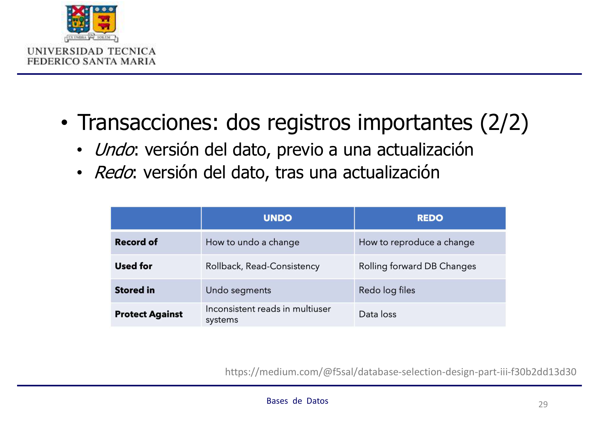

### Transacciones: Implementación (1/2)

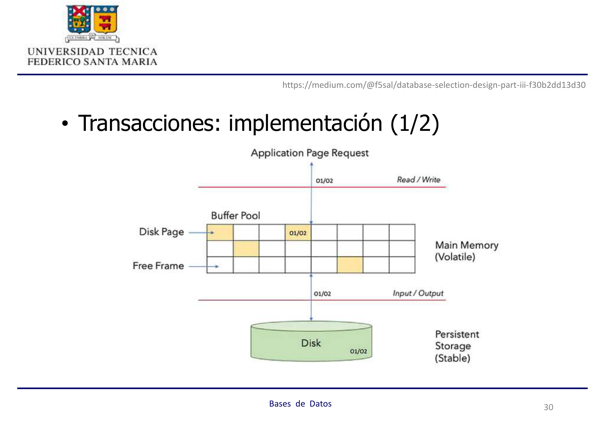

### Transacciones: Implementación (2/2)

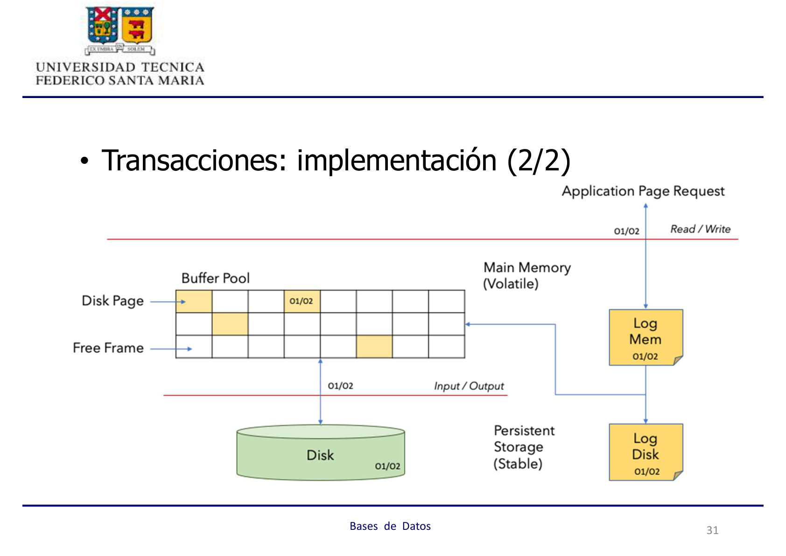

### Ejercicio de Buffer Compartido (LRU)

Sobre una base de datos se ejecutan concurrentemente cuatro transacciones, que accesan diferentes bloques de datos, los que se van guardando en un buffer compartido con capacidad para cuatro bloques de datos. Las operaciones de cada transacción se indican en la siguiente tabla, las que se ejecutan de forma intercalada, una por cada turno de ejecución.

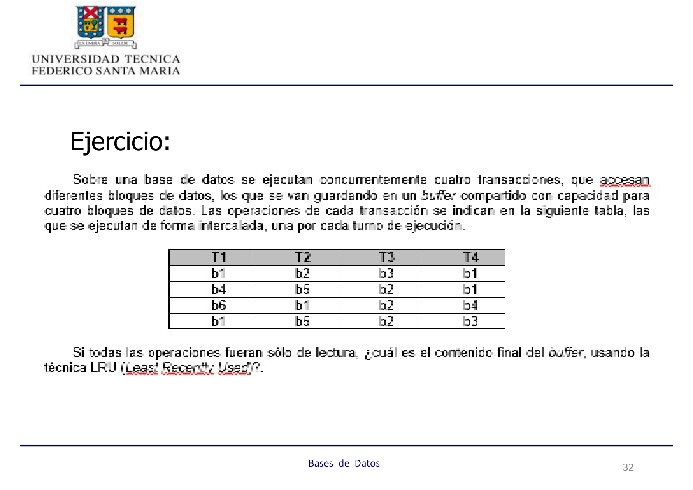

Si todas las operaciones fueran sólo de lectura, ¿cuál es el contenido final del buffer, usando la técnica LRU (Least Recently Used)?.

### Ejercicio de Transacciones y Logs

Considerar las siguientes transacciones, donde todos los datos a actualizar tienen un valor inicial igual a 0.

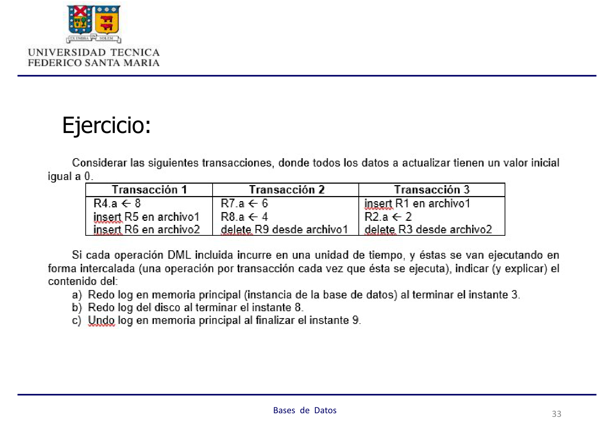

Si cada operación DML incluida incurre en una unidad de tiempo, y éstas se van ejecutando en forma intercalada (una operación por transacción cada vez que ésta se ejecuta), indicar (y explicar) el contenido del:

- Redo log en memoria principal (instancia de la base de datos) al terminar el instante 3.
- Redo log del disco al terminar el instante 8.
- Undo log en memoria principal al finalizar el instante 9.
