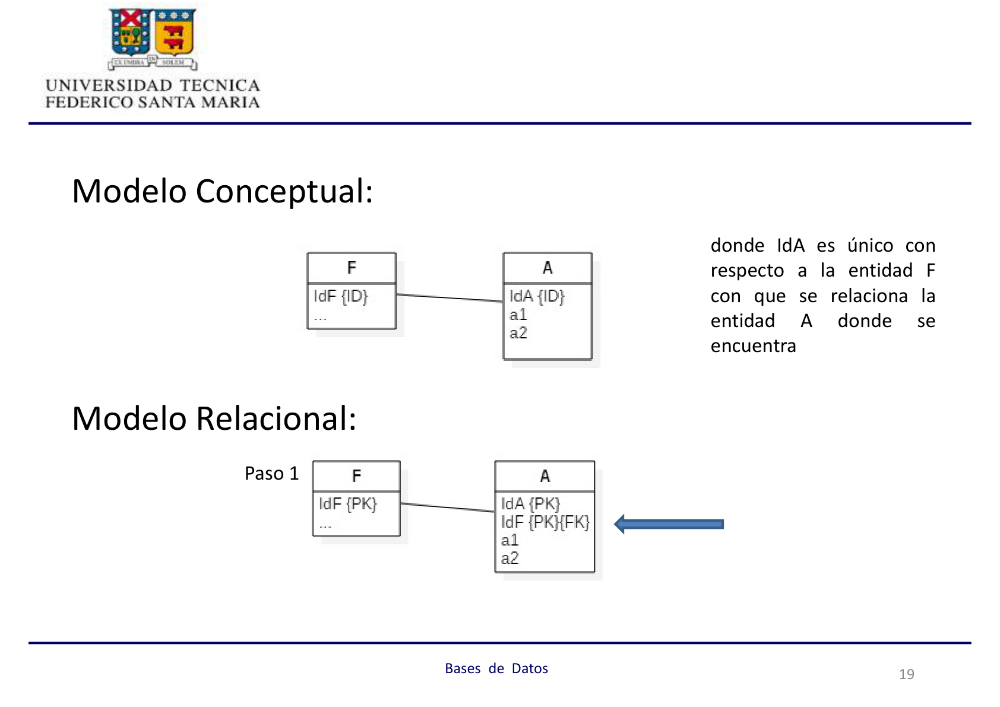
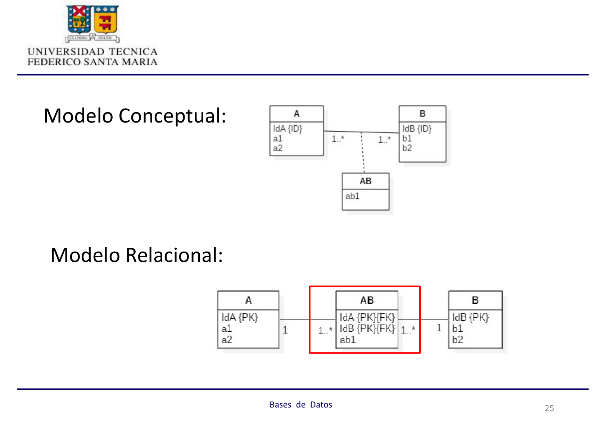
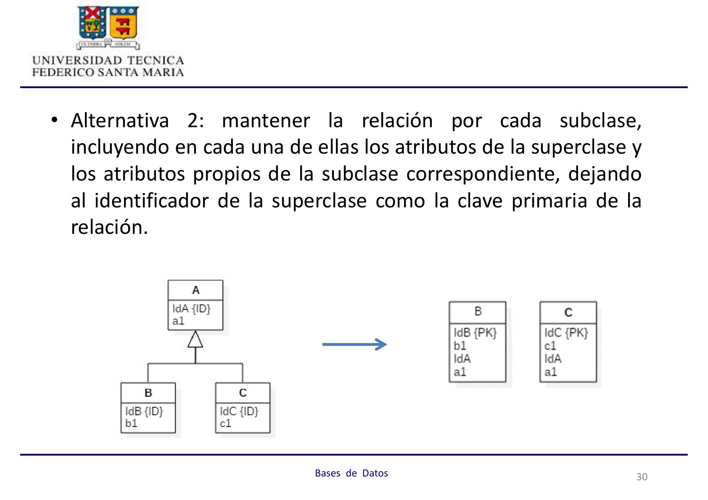
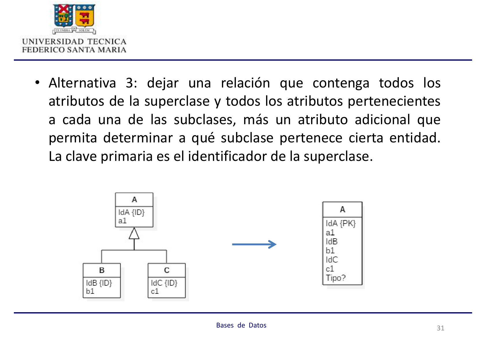
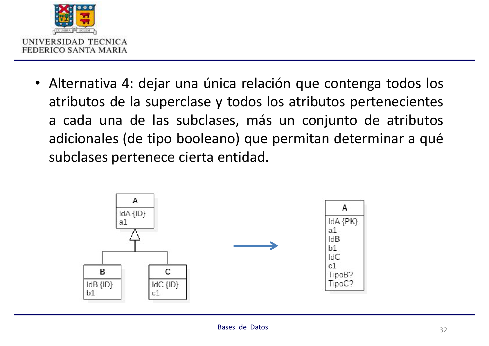
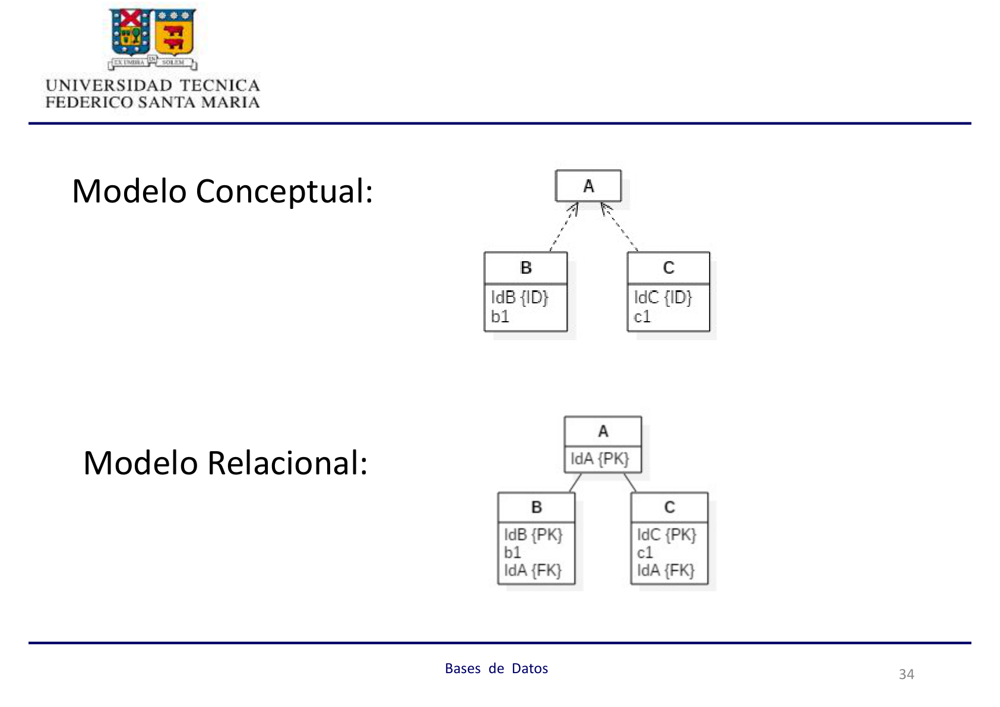

## Diseño Top-Down de una Base de Datos Relacional

### Fundamentos del Modelo de Datos Relacional

Un modelo de datos lógico se genera al tomar un modelo conceptual e incorporarle las características propias de la clase de software sobre el cual se realizará la posterior implementación.

**Modelos de datos lógicos existentes:**
*   Jerárquico
*   Reticular
*   Relacional
*   Orientado al Objeto
*   Multidimensional
*   ...

### Terminología Básica del Modelo Relacional

*   Se denomina **relación** a un archivo.
*   Una relación corresponde a una **tabla bidimensional**, en la cual el orden de sus filas (registros) es irrelevante.
*   Cada columna contiene valores del mismo atributo, los que deben ser del mismo tipo. Al conjunto de valores posibles para una columna se llama **Dominio**.
*   Cada fila es única, y la unicidad está dada al manejar una columna que no soporte valores repetidos, que corresponde a la **clave primaria** (lógica).
*   **Cardinalidad** es el número de filas de una relación.

### Formas de Obtener un Modelo Relacional

*   **Esquema Top-Down:** Construir un modelo conceptual y luego convertirlo en uno relacional, aplicando reglas de transformación formales.
*   **Esquema Bottom-Up:** Mediante la integración de modelos parciales, obtenidos a partir de la normalización de las vistas (salidas, reportes) que componen un sistema.

## Etapas del Diseño Top-Down

### Etapa 1: Recolección y Análisis de Requisitos

*   **Objetivo:** Identificar las necesidades de información de los usuarios.
*   **Pasos:**
    *   Identificación de las áreas de aplicación y grupos de usuarios. Elección de participantes principales.
    *   Análisis y estudio de la documentación existente en las actuales aplicaciones. Además, considerar manuales de políticas, formas, reportes y diagramas organizacionales.

:::tip[Ejercicio de Requisitos: Campeonato de Fórmula 1]
En un campeonato mundial de carreras de fórmula 1, es posible identificar los siguientes hechos y eventos:

Los pilotos firman contratos para correr durante una temporada en los autos de una escudería. Por ésta pueden firmar contrato varios pilotos. La escudería debe tener al menos un piloto y debe pertenecer a un país; notar que cada país puede tener varias escuderías.

Los automóviles deben estar inscritos en una escudería para poder participar. Estos son asignados a los pilotos para una carrera en particular, dependiendo si están disponibles técnicamente. Un piloto puede usar sólo un automóvil durante una carrera. La participación de un piloto en una carrera exige que se le tenga asignado un automóvil.

En una temporada se realizan muchas carreras en circuitos existentes en los distintos países. En un mismo circuito pueden desarrollarse varias carreras (en una misma o distintas temporadas). Además, un circuito puede estar en reparaciones y no tener carreras programadas.
:::

### Etapa 2: Diseño Conceptual

*   **Objetivo:** Construir un esquema conceptual que represente los datos necesarios para el sistema de información, que sea independiente del motor de datos a utilizar.

### Etapa 3: Elección de Software

*   **Objetivo:** Seleccionar aquel tipo de software que mejor se adecúe a las necesidades del sistema a construir.

### Etapa 4: Diseño Lógico

*   **Objetivo:** Generar un esquema basado en el modelo de datos soportado por el software escogido.
*   **Pasos:**
    *   Transformación independiente del sistema a un modelo relacional, orientado al objeto u otro.
    *   Conversión de los esquemas a un software de bases de datos específico.

## Método Top-Down: Transformación de un Modelo Conceptual a uno Relacional

La transformación se realiza mediante la aplicación de reglas bien definidas. Para efectos del curso, se hará uso de un modelo conceptual expresado en un diagrama de clases UML.

### Paso 1: Tipos de Entidades "Fuertes"

*   Por cada tipo de entidad fuerte del modelo conceptual, crear una relación que incluya todos los atributos simples de ésa. Incluir sólo los atributos componentes simples de un atributo compuesto.
*   Escoger uno de los atributos claves del tipo de entidad como clave primaria en la relación correspondiente. Si la clave escogida es compuesta, el conjunto de atributos simples que la conforman serán parte de la clave primaria de la relación.

**Modelo Conceptual y Relacional:**

### Paso 2: Tipos de Entidades "Débiles"

*   Por cada tipo de entidad débil del modelo conceptual, dependiente de una entidad F, crear una relación que incluya todos los atributos simples, los atributos simples de los posibles atributos compuestos que existan, y los atributos que formen parte de la clave primaria de F.
*   Dejar como clave primaria de la relación a la concatenación de la clave primaria de F con el identificador del tipo de entidad débil.

**Modelo Conceptual y Relacional:**

_donde IdA es único con respecto a la entidad F con que se relaciona la entidad A donde se encuentra Paso 1_

### Paso 3: Asociaciones 1:1

*   Por cada asociación binaria 1:1, identificar las relaciones del modelo relacional correspondientes; escoger una de las relaciones e incluir su clave primaria como clave foránea en la otra relación.

**Modelo Conceptual y Relacional (dos alternativas):**

### Paso 4: Asociaciones 1:N

*   Por cada asociación binaria 1:N (no débil), identificar la relación B que tiene está en el lado de la cardinalidad “muchos”, e incluir en ésta como clave foránea, la clave primaria de la entidad con cardinalidad 1 (bajo esta asociación).
*   Incluir cualquier atributo simple de la asociación como atributo de B.

**Modelo Conceptual y Relacional:**

### Paso 5: Asociaciones M:N

*   Por cada asociación binaria M:N, crear una nueva relación que la represente. Incluir como claves foráneas a las claves primarias de las relaciones que participan en la asociación.
*   Incluir, también, cualquier atributo simple de la asociación.

**Modelo Conceptual y Relacional:**

### Paso 6: Asociaciones n-arias (n ≥3)

*   Por cada asociación de grado 3 o más, crear una nueva relación para representarla.
*   Incluir como claves foráneas a las claves primarias de las relaciones que representan a los tipos de entidades que participan en dicha asociación; normalmente, la concatenación de estas claves es la clave primaria de la nueva relación.

**Modelo Conceptual y Relacional:**

### Paso 7: Herencia

Existen varias posibilidades (ya vistas en la integración de vistas normalizadas). Considerar la siguiente jerarquía:

:::note[Atención]
En este ejemplo, las subclases tienen identificadores propios.
:::

*   **Alternativa 1:** Mantener la relación de la superclase con todos los atributos identificados en el modelo conceptual. Mantener una relación por cada subclase, con todos los atributos propios de la subclase más el identificador de la superclase, eventualmente quedando éste como la clave primaria de la relación.

*   **Alternativa 2:** Mantener la relación por cada subclase, incluyendo en cada una de ellas los atributos de la superclase y los atributos propios de la subclase correspondiente, dejando al identificador de la superclase como la clave primaria de la relación.

*   **Alternativa 3:** Dejar una relación que contenga todos los atributos de la superclase y todos los atributos pertenecientes a cada una de las subclases, más un atributo adicional que permita determinar a qué subclase pertenece cierta entidad. La clave primaria es el identificador de la superclase.

*   **Alternativa 4:** Dejar una única relación que contenga todos los atributos de la superclase y todos los atributos pertenecientes a cada una de las subclases, más un conjunto de atributos adicionales (de tipo booleano) que permitan determinar a qué subclases pertenece cierta entidad.

### Paso 8: Categorización (Interfaces)

*   **Para el caso de que las superclases tengan diferentes identificadores:**
    *   Se debe crear una clave primaria especial, que se denomina **clave sustituta**, para la relación que representa la categoría; a ésta se le incluyen los atributos definidos en la categoría en el modelo conceptual.
    *   Finalmente, a cada relación asociada con una superclase de la categoría, se le agrega como clave foránea la clave sustituta.

**Modelo Conceptual y Relacional:**

*   **Para el caso de que las superclases tengan el mismo identificador:** No hay necesidad de la clave sustituta, y se usa algún esquema similar a los usados en el paso 7.