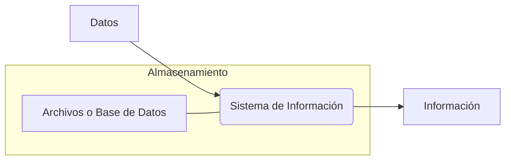
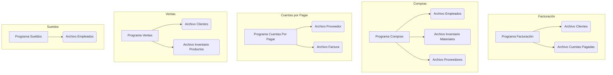
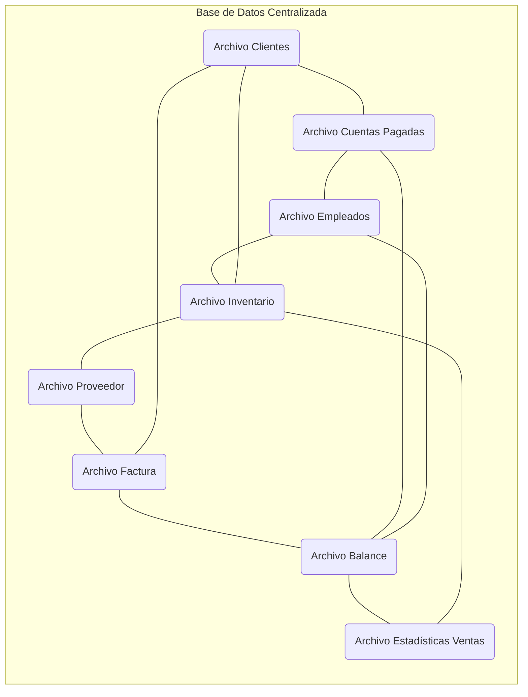
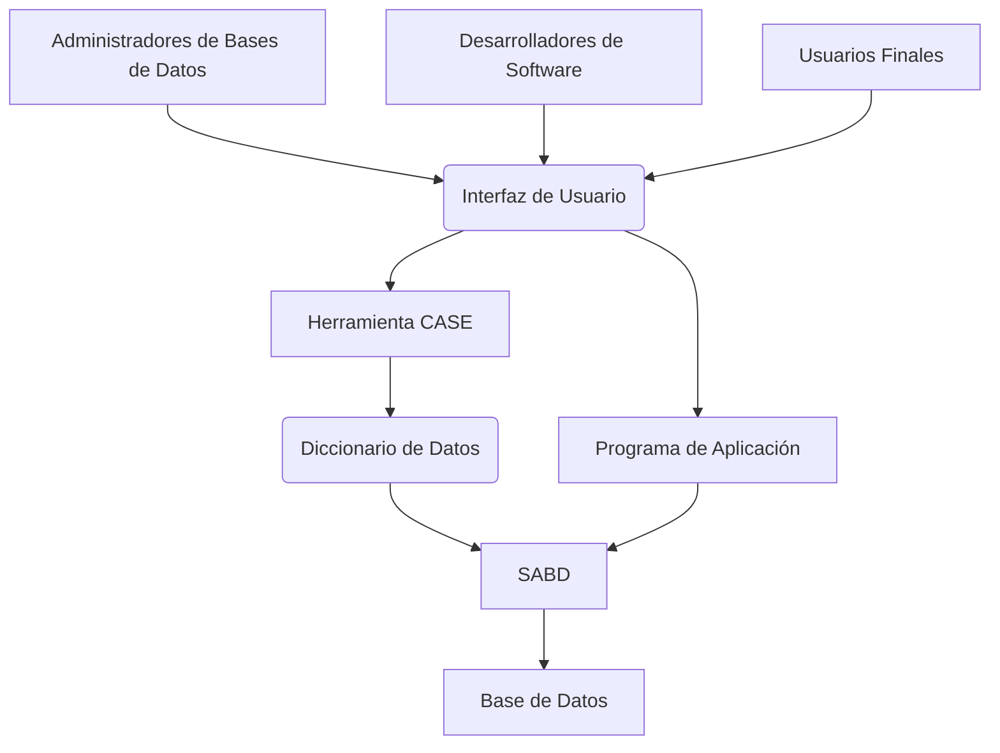
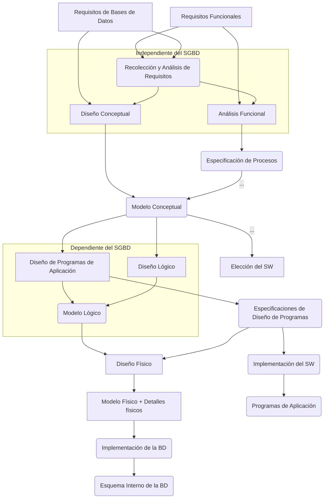

## Bases de Datos
Profesor: José Luis Martí Lara

## Introducción a las Bases de Datos

### Conceptos Básicos asociados a las Bases de Datos

:::note[Definición de Base de Datos]
Conjunto integrado de archivos (datos) relacionados entre sí.
:::

:::note[Definición de Dato]
Hecho relacionado con personas, objetos, lugares, eventos u otras entidades del mundo real.
:::

**Características de un Dato:**
*   Cualitativo (descriptivo) o cuantitativo
*   Interno o externo
*   Histórico o predictivo

:::note[Definición de Información]
Datos organizados, preparados y/o formateados de una forma que sea adecuada para la toma de decisiones u otras actividades de la organización.
:::

El flujo de procesamiento de datos a información se puede visualizar así:



*   **Archivo**: Conjunto de datos relacionados entre sí, al compartir una misma estructura y/o comportamiento similar.
*   **Bases de Datos**: Conjunto integrado de archivos relacionados entre sí.

### Enfoques de Gestión de Datos

#### Enfoque de Archivos (Pasado)
*   Las organizaciones desarrollaban sus sistemas de información de forma aislada, creando "islas de datos".

**Diagrama de Enfoque de Archivos:**
En este enfoque, cada programa o aplicación tiene sus propios archivos de datos, lo que lleva a una estructura descentralizada y duplicación.



:::caution[Desventajas del Enfoque de Archivos]
*   Subutilización del espacio en disco
*   Dependencia de los datos
*   Baja productividad del desarrollador
*   Falta de estandarización
*   Inconsistencia de los datos (resultados)
*   Problemas con el cliente
:::

#### Enfoque de Bases de Datos (Actual)
*   Visión centralizada y única de los datos.

:::tip[Ventajas del Enfoque de Bases de Datos]
*   Minimización de la redundancia
*   Independencia de los datos
*   Estandarización
*   Compartición de datos
*   Seguridad de datos
*   ...
:::

**Diagrama de Enfoque de Bases de Datos:**
Este enfoque muestra una base de datos centralizada con archivos interconectados, accesible por diversas aplicaciones.



### Componentes del Enfoque de Bases de Datos

**Diagrama de Componentes de un Sistema de Bases de Datos:**



**Roles de los Usuarios:**
Son personas con requisitos de información que realizan operaciones de ingreso, modificación, eliminación, consulta y mantención de la base de datos. Incluye:
*   Usuario Final
*   Desarrollador de Aplicaciones
*   Diseñador de la Base de Datos
*   Administrador de Bases de Datos (DBA)
*   Administrador de Datos (Arquitecto)

:::note[Sistema Administrador de Bases de Datos (SABD)]
Software que permite crear y mantener una o más bases de datos. También conocido como motor o servidor de datos.
:::

**Principales funciones asociadas al SABD:**
*   **Definición de Datos (DD)**: `create`, `alter`, `drop`...
*   **Manipulación de Datos (DM)**: `insert`, `update`, `delete`...
*   **Control de Datos (DC)**: `grant`, `revoke`...

*   **Interfaz de Usuario**: Forma en que el SABD permite la interacción con la base de datos.
*   **Base de Datos**: Conjunto de datos operacionales, almacenados en el computador y accesados por distintas aplicaciones; o bien el lugar físico donde están almacenados los datos.

:::note[Diccionario de Datos]
Es una base de datos que guarda una descripción de los datos, como su tipo, largo, propietario, tamaño de los registros, etc.
:::

:::note[Administrador de la Base de Datos (DBA)]
Persona o grupo de personas encargadas de dirigir y controlar el recurso dato, cumpliendo las siguientes funciones:
*   Definición de la base de datos y/o archivos a usar (junto con el analista y usuario).
*   Selección de la estructura de almacenamiento y la estrategia de recuperación.
*   Definición de los distintos tipos de acceso y su mantención.
*   Definición de la estrategia de respaldo a usar, implementarla y controlarla.
*   Preocuparse del desempeño de la base de datos y afinarlo.
*   Proveer de capacitación, entrenamiento y apoyo a las consultas de los usuarios.
:::

:::note[Administrador de Datos (Arquitecto)]
Responsable de desarrollar y administrar las normas, procedimientos, prácticas y planes para la definición, organización, protección y utilización eficiente de los datos dentro de la organización, incluyendo todos los datos, estén o no en la base de datos.
:::

## Proceso de Diseño de Bases de Datos

Para poder diseñar una base de datos es preciso realizar una serie de pasos, los cuales parten de la recolección de la información necesaria para construir el sistema de información, hasta el diseño de los archivos y sus organizaciones, donde finalmente quedarán los datos.

**Flujo del Proceso de Diseño de Bases de Datos:**



### Etapa 1: Recolección y Análisis de Requisitos

*   **Objetivo**: Identificar las necesidades de información de los usuarios.

**Pasos:**
*   Identificación de las áreas de aplicación y grupos de usuarios. Elección de participantes principales.
*   Análisis y estudio de la documentación existente en las actuales aplicaciones. Además, considerar manuales de políticas, formas, reportes y diagramas organizacionales.
*   Estudio del actual ambiente operativo y uso de la información. Incluye un análisis de los tipos de transacciones y sus frecuencias, y del flujo de información en el sistema.
*   Respuestas de cuestionarios son obtenidas desde los potenciales usuarios. Identificación de prioridades.
*   Formalización de Requisitos.

### Etapa 2: Diseño Conceptual

*   **Objetivo**: Construir un esquema conceptual que represente los datos necesarios para el sistema de información, que sea independiente del motor de datos a utilizar.

**Ejemplo de Modelo Conceptual (Diagrama Entidad-Relación):**
```mermaid
erDiagram
    Cliente {
        STRING RUT ID
        STRING Razon_Social
        STRING Direccion_Legal
    }
    Factura {
        STRING Nro_Factura ID
        DATE Fecha
    }
    Producto {
        STRING Codigo_Producto ID
        STRING Nombre
        FLOAT Precio
    }

    Cliente ||--o{ Factura : tiene
    Factura ||--o{ Producto : considera
```

:::note[Propósitos del Modelo Conceptual]
El modelo conceptual sirve como:
*   **Medio de Comunicación** entre usuarios y especialistas; por ende debe ser expresivo, simple, mínimo, formal, diagramático.
*   **Mecanismo para validar** entendimiento alcanzado del problema, por parte del especialista.
*   **Descripción Estable** del Contenido.
:::

### Etapa 3: Elección de Software

*   **Objetivo**: Seleccionar aquel tipo de software que mejor se adecúe a las necesidades del sistema a construir.

**Ejemplos de Sistemas de Gestión de Bases de Datos (SGBD):**
*   PostgreSQL
*   ORACLE
*   TERADATA
*   mongoDB
*   DB2
*   MariaDB
*   SYBASE
*   Microsoft® SQL Server
*   LUCIDDB
*   MySQL

**Criterios a considerar para la elección del SGBD:**
*   **Costos**: Adquisición de hardware y software; operación y mantención del sistema; migración.
*   **Requisitos del sistema**: Funcionales y no funcionales.
*   **Estructuración de los datos**.

### Etapa 4: Diseño Lógico

*   **Objetivo**: Generar un esquema basado en el modelo de datos soportado por el software escogido.

**Pasos:**
*   Transformación independiente del sistema a un modelo relacional, orientado al objeto u otro.
*   Conversión de los esquemas a un software de bases de datos específico.

**Ejemplo de Transformación: Modelo Conceptual a Modelo Relacional:**

```mermaid
erDiagram
    %% Modelo Conceptual
    subgraph Modelo Conceptual
        C_MC[Cliente {RUT {ID}, Razon Social, Direccion Legal}]
        F_MC[Factura {Nro Factura {ID}, Fecha}]
        P_MC[Producto {Codigo Producto {ID}, Nombre, Precio}]

        C_MC ||--o{ F_MC : tiene "1..*"
        F_MC ||--o{ P_MC : considera "1..*"
    end

    %% Modelo Relacional
    subgraph Modelo Relacional
        C_MR[Cliente {RUT {ID}, Razon Social, Direccion Legal}]
        F_MR[Factura {Nro Factura {ID}, Fecha, RUT-Cliente {FK}}]
        D_MR[Detalle {Nro Factura {ID}, Codigo Producto {ID}}]
        P_MR[Producto {Codigo Producto {ID}, Nombre, Precio}]

        C_MR ||--|{ F_MR : tiene "1..*"
        F_MR ||--|{ D_MR : tiene "1..*"
        P_MR ||--|{ D_MR : tiene "1..*"
    end

    %% Representación de la transformación (implícita en el diagrama)
    style C_MC fill:#fff,stroke:#333,stroke-width:2px
    style F_MC fill:#fff,stroke:#333,stroke-width:2px
    style P_MC fill:#fff,stroke:#333,stroke-width:2px
    style C_MR fill:#ddf,stroke:#333,stroke-width:2px
    style F_MR fill:#ddf,stroke:#333,stroke-width:2px
    style D_MR fill:#ddf,stroke:#333,stroke-width:2px
    style P_MR fill:#ddf,stroke:#333,stroke-width:2px
```
*En el modelo relacional, la relación "considera" de muchos a muchos entre `Factura` y `Producto` se resuelve con una tabla `Detalle` intermedia.*

### Etapa 5: Diseño Físico

*   **Objetivo**: Escoger las estructuras de almacenamiento y métodos de acceso, además de la ubicación de los archivos de bases de datos, para obtener un buen rendimiento de las distintas aplicaciones que interactúan con la base de datos.

**Criterios a considerar:**
*   **Tiempo de Respuesta**: Es el tiempo que transcurre desde el ingreso de la transacción hasta el recibo de su respuesta.
*   **Rendimiento del Sistema**: Número promedio de transacciones que pueden ser procesadas por minuto.
*   **Utilización del espacio en disco**: Cantidad de memoria ocupada por los archivos e índices.

**Herramientas (Estructuras de almacenamiento e índices):**
*   **Estructuras de almacenamiento:**
    *   Secuenciales: desordenados, ordenados
    *   Directo: *hashing* estático, o con expansión dinámica
    *   De tipo Árbol: B-Trees
*   **Índices:**
    *   Dinámicos: *hashing* con expansión dinámica, de tipo Árbol B o B+
    *   Bitmap

**Descripción de un Árbol B (B-Tree):**
Un árbol B es una estructura de datos de árbol autoequilibrado que mantiene los datos ordenados y permite búsquedas, accesos secuenciales, inserciones y eliminaciones en tiempo logarítmico. Se utiliza comúnmente en bases de datos y sistemas de archivos. El diagrama muestra un ejemplo de un árbol B donde:
*   `m` es la raíz del árbol.
*   Los nodos internos (`c, f, i`, `q, t`) contienen claves que dirigen la búsqueda a los nodos hijos.
*   Los nodos hoja (`a, b, d, e`, `g, h`, `j, k, l`, `n, o, p`, `r, s`, `u, v, w`) contienen punteros a los registros de datos reales en el "Archivo de Datos".
*   Las flechas punteadas muestran cómo las claves en los nodos internos apuntan a rangos de datos en el archivo de datos, permitiendo una búsqueda eficiente. Por ejemplo, la clave `f` en el nodo raíz `m` separa los valores menores de `f` de los mayores, llevando a diferentes ramas.
*   La referencia `(fb = 3)` en el "Archivo de Datos" podría indicar un factor de bloqueo o tamaño de bloque para la gestión del almacenamiento físico de los registros.

### Etapa 6: Implementación de la Base de Datos

*   **Objetivo**: Codificación de sentencias para la definición y la manipulación de la base de datos, para crear los archivos y su poblamiento.

**Ejemplos de sentencias SQL:**
```sql
SELECT rut, nombre FROM alumno;
SELECT * FROM alumno WHERE carrera = 'INF';
```