## Estadística Aplicada

### Información General del Curso

- **Profesor**: Sergio Quezada A. (sergio.quezadaa@usm.cl, sergio.quezada.acosta@gmail.com)
- **Fecha**: marzo de 2026

### Evaluación

- Exposiciones
- 2 Certámenes/Trabajos (40% y 45%)
- "Control/Tarea" semanal/quincenal (15%)
  - Las notas de controles/tareas no se recuperan.
  - La no entrega implica nota mínima.

### Calendario y Contenidos

- **Clase 01-02**:
  - **Definiciones**: Población, Muestra, Parámetros, Estimación, Estadísticos, Estadística Descriptiva.
  - **Variables**: Variable aleatoria; Cualitativas (nominales, ordinales), Cuantitativas (discretas, continuas).
  - **Medidas**: Tendencia central, posición y dispersión.
- **Clase 03-04**:
  - Introducción a Regresión.
  - Aplicaciones.
- **Clase 05-06**:
  - Probabilidad (Definición, distribución de una variable aleatoria, condicional y eventos independientes, Total, Teorema de Bayes).
- **Clase 07-08**:
  - Ejercicios y aplicaciones. Prueba.
- **Clase 09-10**:
  - Variable Aleatoria, Distribución de probabilidades, Valor esperado y varianza.
  - Distribuciones Discretas (aplicaciones y uso).
- **Clase 11-12**:
  - Distribuciones continuas (aplicaciones y uso).
  - Estimación Puntual; Intervalos de confianza.
- **Clase 13-14**:
  - Ejercicios y aplicaciones. Prueba.
- **Clase 15-16**:
  - Ejercicios. Prueba Recuperativa.

## Correlación

### Concepto de Correlación

- Mide el grado de **asociación LINEAL** entre dos variables.
- Puede ser negativa o positiva.
- Indica si la relación es decreciente o creciente.

:::note[Interpretación Gráfica]
La correlación está asociada a la "pendiente" de una "recta" imaginaria que relaciona las variables.
:::

#### Correlación Negativa o Decreciente

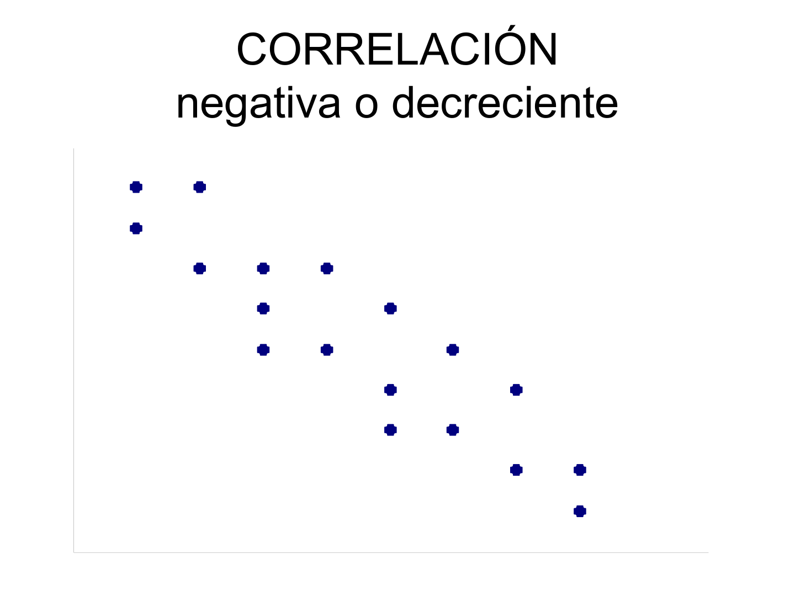

#### Correlación Positiva o Creciente

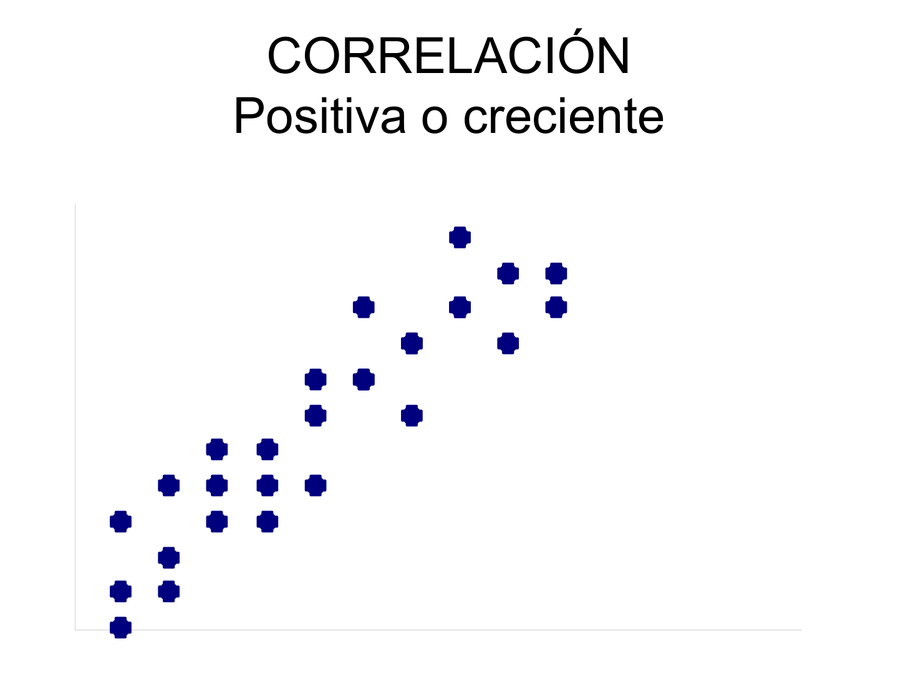

### Rango del Coeficiente de Correlación

- Siempre se mide entre **-1 y 1**.
- **Correlación 1**: Significa alta correlación positiva entre las variables.
- **Correlación -1**: Significa alta correlación negativa entre las variables.
- **Correlación 0**: Indica que no hay una asociación lineal entre las variables.

### Estimación de la Correlación

- La correlación poblacional es un parámetro.
- Se utiliza un estimador puntual, denotado por **r**, para una muestra determinada.

### Ejemplo de Cálculo de Correlación

Un profesor de Estadística examina la relación entre las calificaciones de un examen final y un proyecto. Se obtiene una muestra aleatoria de calificaciones.

#### Datos de la Muestra

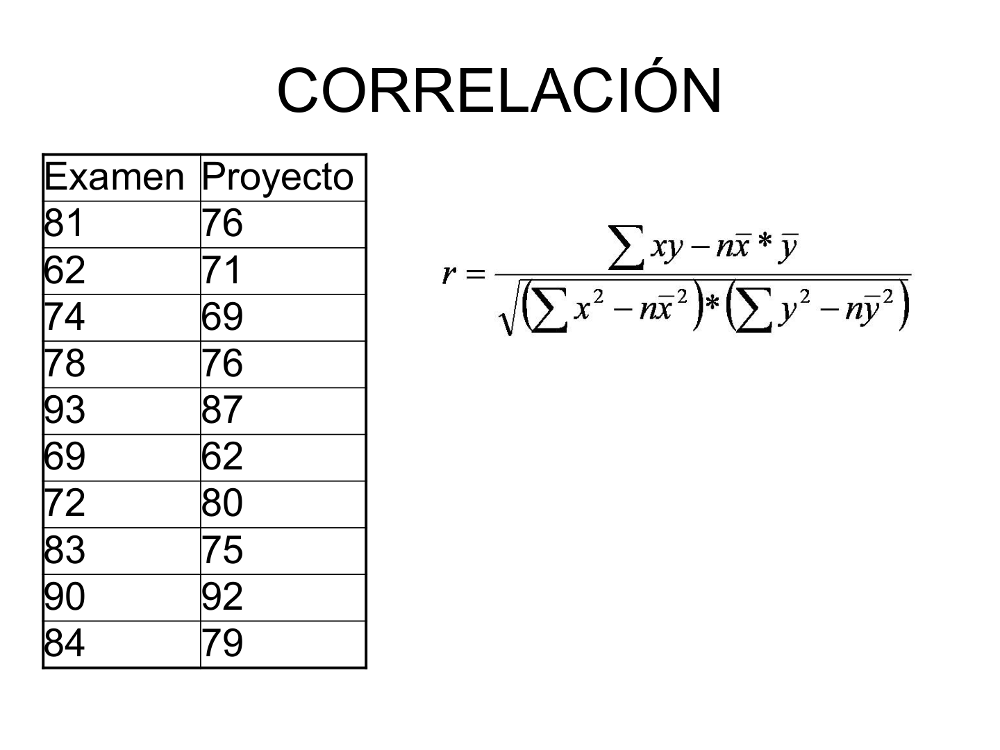

#### Cálculos Auxiliares

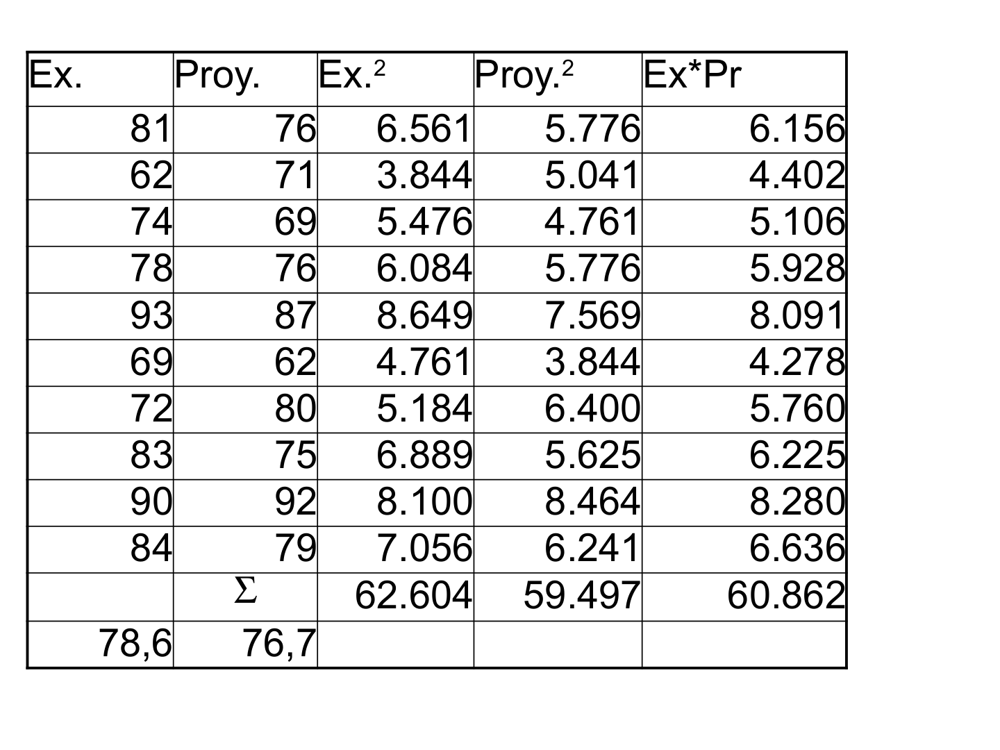

#### Fórmula de Correlación

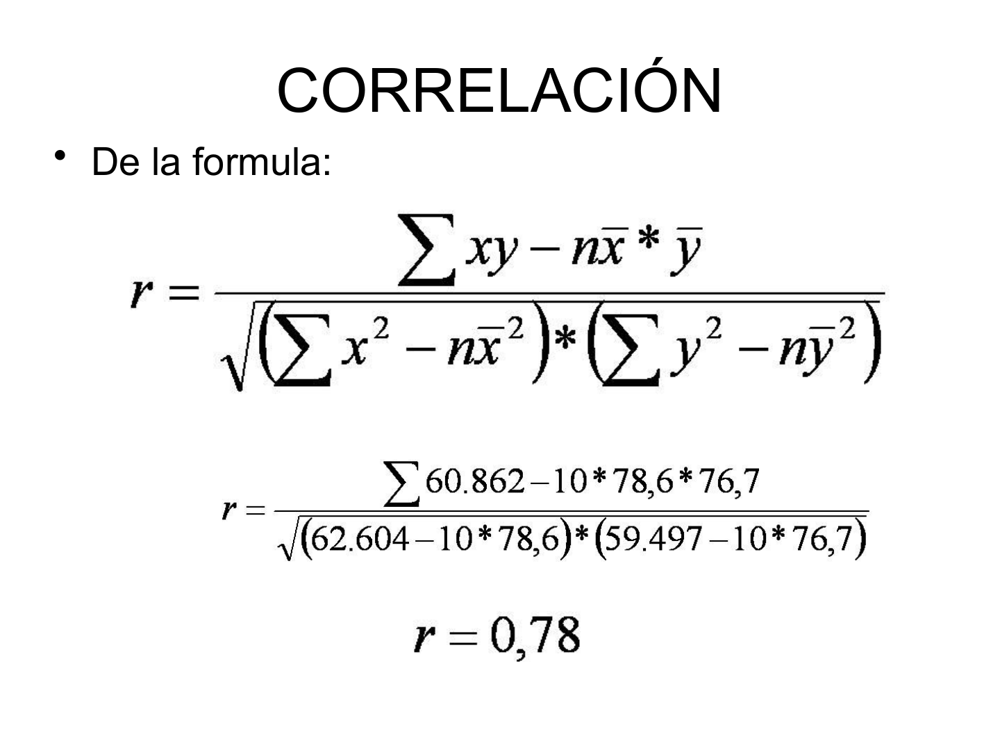

### Tarea

- **En parejas**:
  - Seleccionar al menos dos variables con relación lógica.
  - Recopilar al menos 30 pares de valores o períodos de información.
  - Definir tipos de variable.
  - Calcular Moda, Media, Mediana.
  - Desviación estándar, Varianza, Coeficiente de variación.
  - Percentiles.
  - Coeficiente de correlación.
  - **(TODO lo hace Excel)**
- **Evaluación**: 30% numérico; 70% interpretación.

### Recursos de Apoyo (YouTube)

- **Medidas de tendencia central**: https://www.youtube.com/watch?v=jiceVfALmV0
- **Medidas de dispersión**: https://www.youtube.com/watch?v=oZRaDwnpXkY
- **Correlación lineal**: https://www.youtube.com/watch?v=1o_qbkzYyVk

## Regresión

### Contexto y Aplicaciones de la Regresión

La regresión es una técnica para establecer asociaciones entre variables de interés.
Considera los siguientes escenarios:

- Medición de la felicidad de un país.
- Cálculo de la alerta ambiental en Santiago.
- Diagnóstico de sobrepeso o desnutrición en niños.
- Ajuste de la recta de Paris en mecánica (fatiga de materiales).
- Obtención del valor de una resistencia y su error en electricidad.
- Calibración de un sensor de temperatura (termopar).
- Predicción de la resistencia a la compresión del hormigón a partir del módulo de elasticidad.

:::note[Punto en Común]
Todos estos tópicos tienen en común la necesidad de cuantificar, medir y establecer relaciones para hacer predicciones o interpretaciones basadas en datos.
:::

### Origen del Término "Regresión"

- **Pionero**: Francis Galton (1822-1911), polímata.
- **Estudio Clásico**: Galton investigó la altura de los hijos en relación con la altura de sus padres. Observó que la altura de hijos de padres extraordinariamente altos "regresaba" hacia la media de la población, y de padres muy bajos, tendía a ser más alta hacia la media.
- **Uso Actual**: Actualmente, el término "regresión" se usa para predecir una variable en función de otra y no implica necesariamente una regresión a la media.

### Fundamentos de la Regresión

- Estudia la distribución conjunta de probabilidad de dos variables.
- Busca ajustar una función matemática sencilla (parsimoniosa), como un polinomio, a un conjunto de datos para describir el comportamiento de una variable **respuesta (Y)**, dados los valores de las **variables de predicción (X)**.

### Variables en Regresión Lineal Simple

- **Y**: Variable dependiente, variable respuesta.
- **X**: Variable independiente, variable predictora o de predicción.

:::caution[Cuidado: No Causalidad]
El método de regresión NO permite obtener una relación de **causa y efecto**. Solo descubre una **asociación** entre la variable respuesta y la(s) variable(s) de predicción.

**Ejemplos**:

- Existe relación entre peso y altura, pero cambiar el peso no cambia la estatura.
- Un factor económico puede estar asociado a un ciclo económico, pero no lo "causa".
- La asociación entre fumar crónicamente y la incidencia de cáncer pulmonar es abrumadora, pero la regresión por sí misma no establece causalidad directa según el argumento de la industria tabacalera.
  :::

### Ecuación de Regresión Lineal Simple

#### Forma General de la Ecuación de la Recta

$Y = A + BX$

- **A**: Intercepto (valor de Y cuando X es cero).
- **B**: Pendiente (cambio esperado en Y por cada unidad de cambio en X).

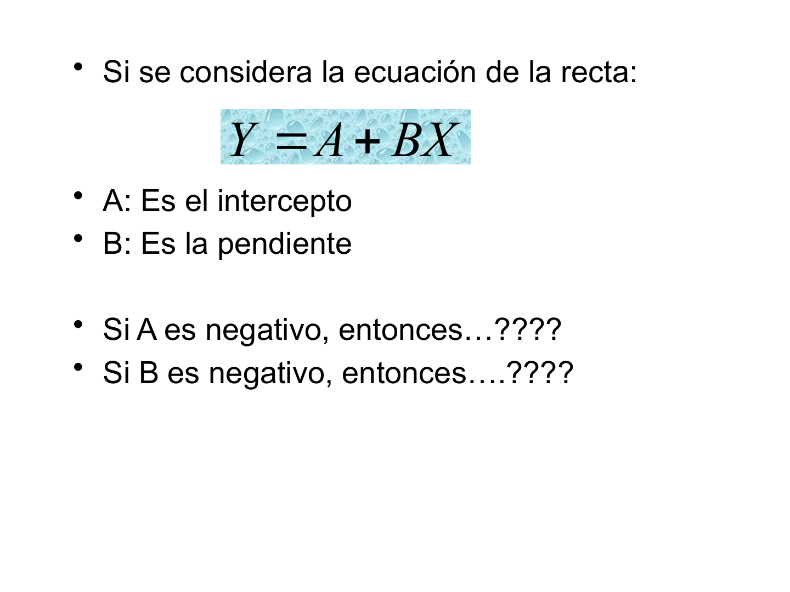

#### Ecuaciones de Regresión (Poblacional y Muestral)

- **Poblacional**: $Y_i = \alpha + \beta X_i + \epsilon_i$
- **Muestral**: $Y_i = A + B X_i + e_i$

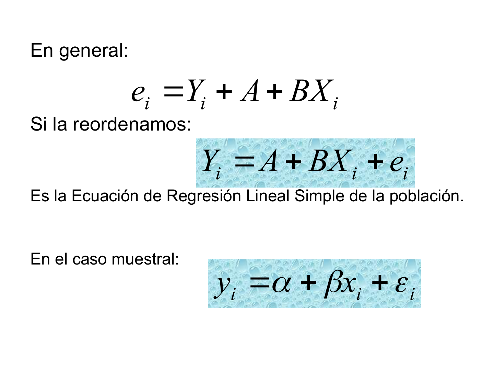

:::note[Linealidad en los Parámetros]
Una regresión lineal es aquella que es lineal en sus **parámetros** ($\alpha$, $\beta$).

- **Es lineal**:
  - $Y = \alpha + \beta X + \epsilon$
  - $Y = \alpha + \beta (1/X) + \epsilon$
  - $Y = \alpha + \beta (\ln X) + \epsilon$
  - $Y = \alpha + \beta_1 X_1 + \beta_2 X_2 + \epsilon$

- **NO es lineal**:
  - $Y = \alpha + \beta^2 X + \epsilon$ (no lineal en el parámetro $\beta$)

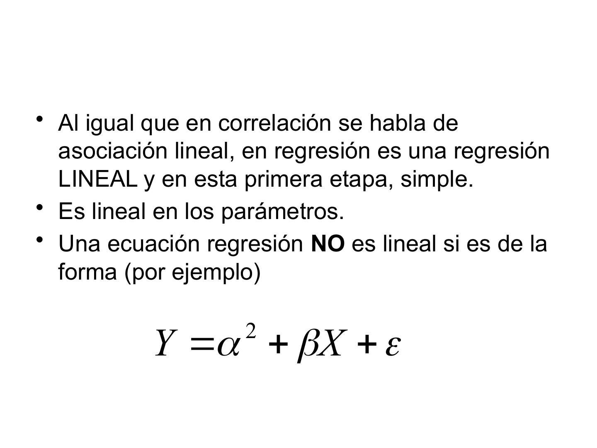
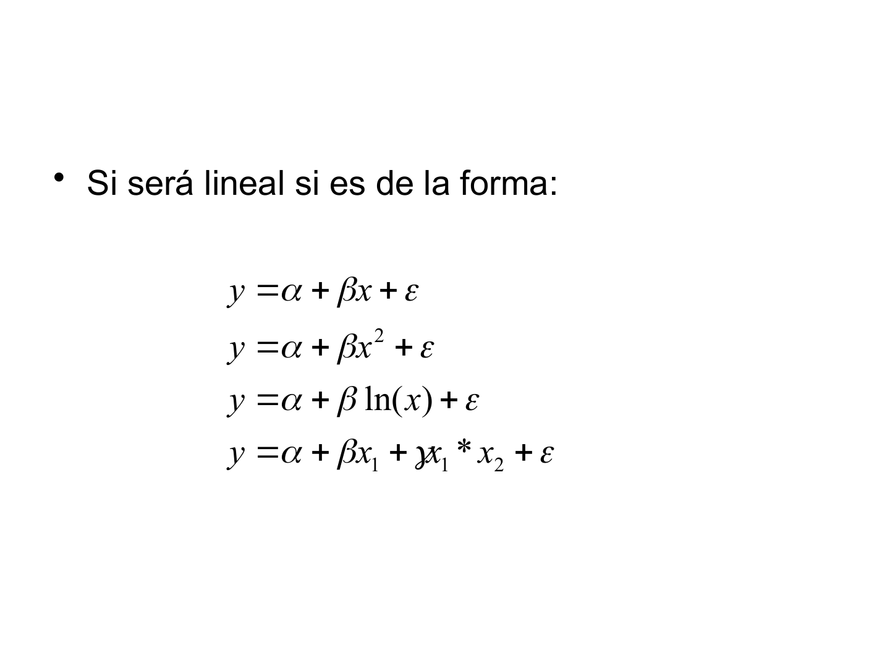
:::

### Transformaciones para Linealizar Modelos

Algunas ecuaciones de regresión no lineales pueden transformarse en lineales aplicando funciones como el logaritmo.

**Ejemplo**:
Si la ecuación es $Y = \alpha e^{\beta X} + \epsilon$
Aplicando el logaritmo natural (ln):
$\ln(Y) = \ln(\alpha e^{\beta X}) + \ln(\epsilon)$
$\ln(Y) = \ln(\alpha) + \beta X + \ln(\epsilon)$
Esto se puede reescribir como $Z = A' + B X + \epsilon'$, donde $Z=\ln(Y)$, $A'=\ln(\alpha)$, y $\epsilon'=\ln(\epsilon)$, lo cual es una forma lineal.

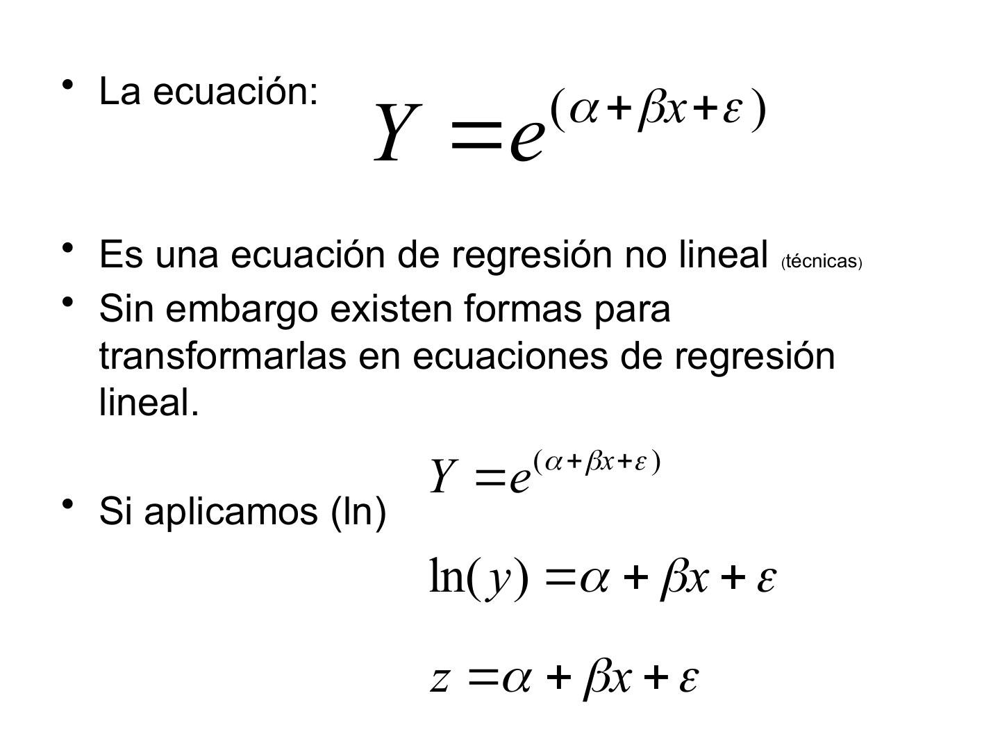
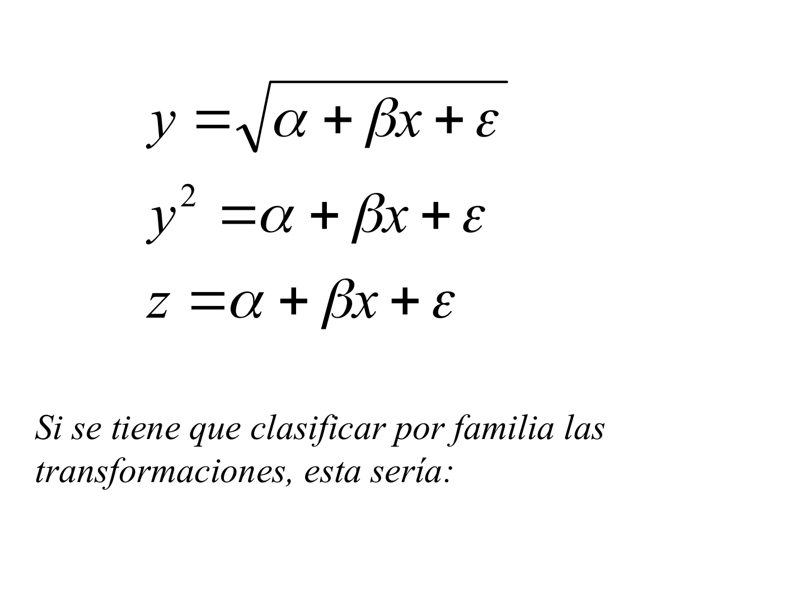

#### Familias de Transformaciones Comunes

| Familia     | Función Original                      | Transformación (para linealizar)             |
| :---------- | :------------------------------------ | :------------------------------------------- |
| Exponencial | $Y = ae^{bx} + \epsilon$              | $\ln(Y) = \ln(a) + bx + \ln(\epsilon)$       |
| Potencia    | $Y = ax^b + \epsilon$                 | $\lg(Y) = \lg(a) + b \lg(x) + \lg(\epsilon)$ |
| Inversa     | $Y = a + b/x + \epsilon$              | $Y = a + b(1/x) + \epsilon$                  |
| Logística   | $Y = 1 / (1 + ae^{-(bx)}) + \epsilon$ |                                              |

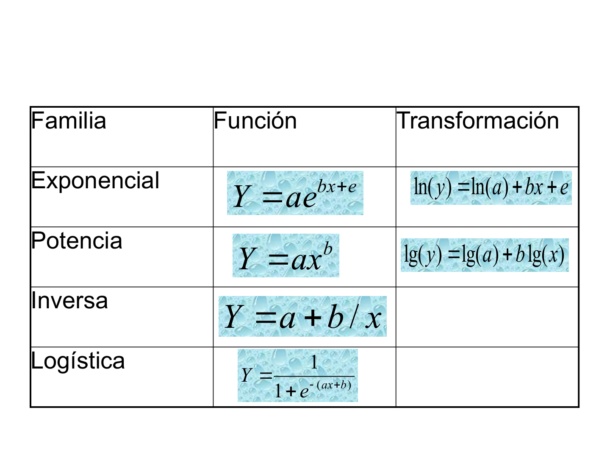

#### Propiedades de Logaritmos Relevantes

- $\log_u(uv) = \log_u(u) + \log_u(v)$
- $\log_u(u/v) = \log_u(u) - \log_u(v)$
- $\log_u(v^n) = n \log_u(v)$
- $\log_u(u) = 1$

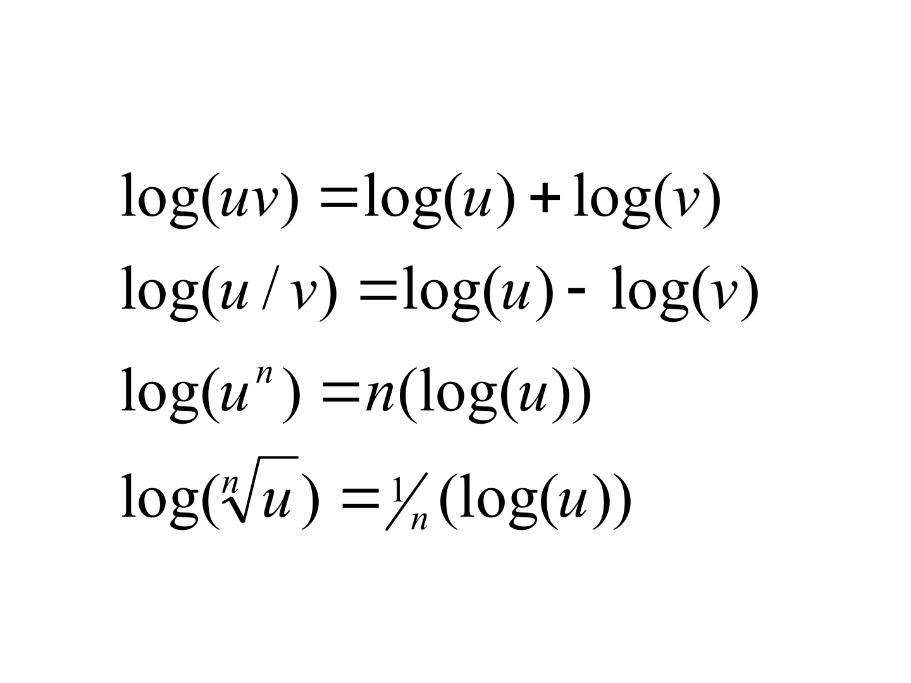

#### Ejemplo de Ecuación

$Y = a X^b$

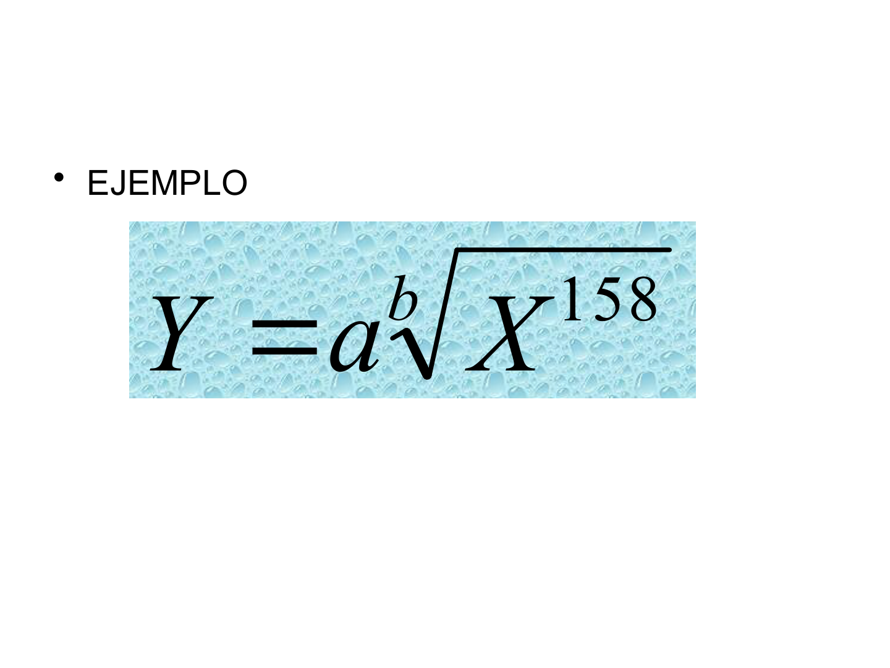

### Interpretación de los Parámetros (a y b)

- **b (pendiente)**: Es el cambio esperado (promedio) en la variable dependiente (Y) por cada unidad en que varía o cambia la variable independiente (X).
  - **Ejemplo**: Si Peso = 15 + 0.8(Estatura), un aumento de 1 unidad en estatura se asocia con un aumento promedio de 0.8 unidades en peso.
- **a (intercepto)**: Es el valor que tomará la variable dependiente (Y) cuando la variable independiente (X) es cero.

### Estimación de Parámetros (a y b)

Existen dos métodos principales para estimar los coeficientes de regresión:

1.  **Método de Máxima Verosimilitud (MMV)**
2.  **Método de Mínimos Cuadrados (MCO)** o (Mico)

#### Representación Gráfica de MCO

MCO busca minimizar la suma de los cuadrados de las distancias verticales de cada punto a la línea de regresión.
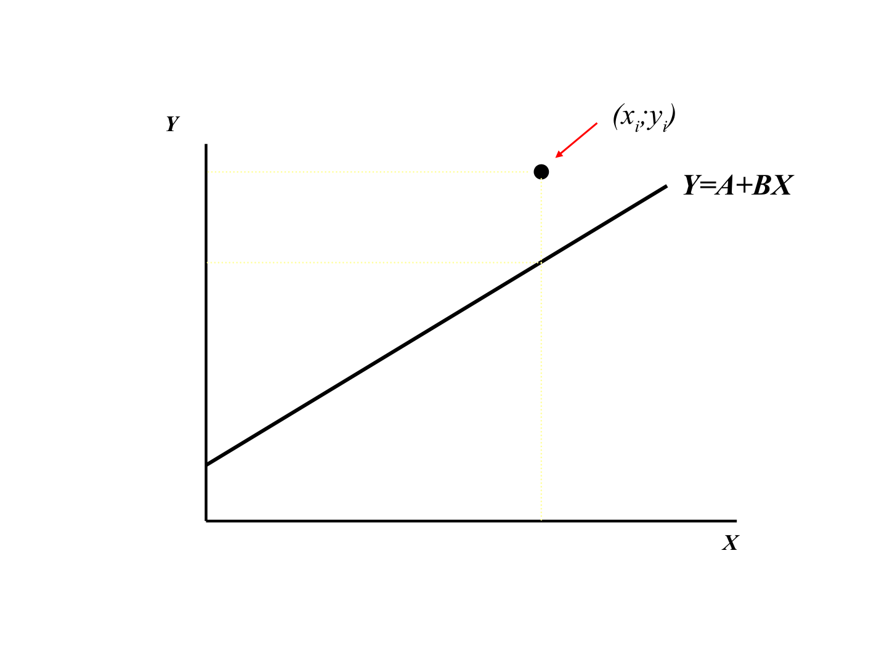

#### Fórmulas del Método de Mínimos Cuadrados

- **Beta ($\beta$)**:
  ```
  β = (n * Σ(xy) - Σx * Σy) / (n * Σ(x^2) - (Σx)^2)
  ```
  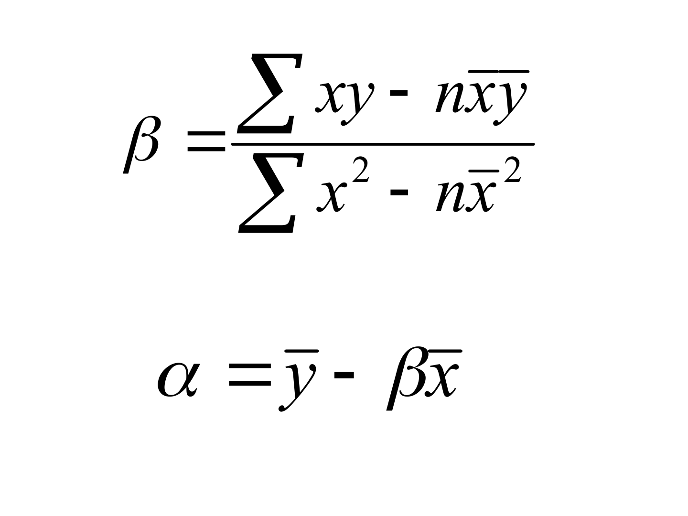
- **Alfa ($\alpha$)**:
  ```
  α = promedio(y) - β * promedio(x)
  ```

### Ejemplo Aplicado: Publicidad y Ventas

Una cadena de comida rápida experimenta con la influencia del gasto en publicidad sobre las ventas en 8 regiones.

#### Datos

- **Variable Independiente (X)**: Incremento del gasto en publicidad.
- **Variable Dependiente (Y)**: Incremento en las ventas.

| Publicidad (X) | Ventas (Y) |
| :------------- | :--------- |
| 0              | 2.4        |
| 4              | 7.2        |
| 14             | 10.3       |
| 10             | 9.1        |
| 9              | 10.2       |
| 8              | 4.1        |
| 6              | 7.6        |
| 1              | 3.5        |

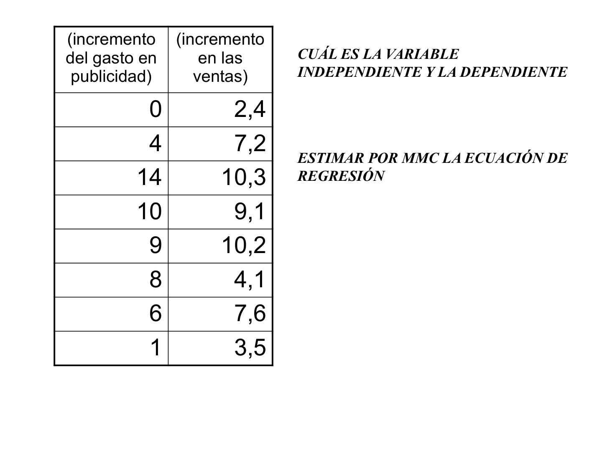

#### Gráfico de Dispersión

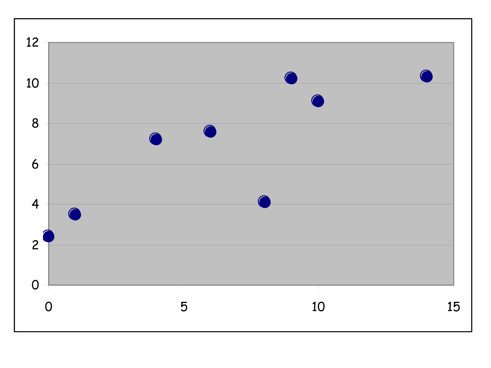

#### Cálculos para Estimación MCO

|       X       |    Y    |     XY     |    X^2     |    Y^2     |
| :-----------: | :-----: | :--------: | :--------: | :--------: |
|       0       |   2.4   |    0.00    |    0.00    |    5.76    |
|       4       |   7.2   |   28.80    |   16.00    |   51.84    |
|      14       |  10.3   |   144.20   |   196.00   |   106.09   |
|      10       |   9.1   |   91.00    |   100.00   |   82.81    |
|       9       |  10.2   |   91.80    |   81.00    |   104.04   |
|       8       |   4.1   |   32.80    |   64.00    |   16.81    |
|       6       |   7.6   |   45.60    |   36.00    |   57.76    |
|       1       |   3.5   |    3.50    |    1.00    |   12.25    |
|   **Sumas**   |         | **437.70** | **494.00** | **437.36** |
| **Promedios** | **6.5** |  **6.8**   |            |            |

- **Cálculo de $\beta$**:
  $\beta = \frac{n \sum XY - \sum X \sum Y}{n \sum X^2 - (\sum X)^2} = \frac{8(437.70) - (6.5 \times 8)(6.8 \times 8)}{8(494) - (6.5 \times 8)^2} = \frac{3497.6 - (52)(54.4)}{3952 - (52)^2} = \frac{3497.6 - 2828.8}{3952 - 2704} = \frac{668.8}{1248} \approx 0.5359$
- **Cálculo de $\alpha$**:
  $\alpha = \bar{Y} - \beta \bar{X} = 6.8 - 0.5359 \times 6.5 \approx 6.8 - 3.48335 \approx 3.31665$

**(Nota: Los cálculos en la diapositiva original presentan valores ligeramente distintos, que parecen ser resultado de un error de transcripción o redondeo. Se adhieren a los valores de la diapositiva para fines de este apunte, que son $\alpha \approx 3.296$ y $\beta \approx 0.539$ como se indica en la p50/61, lo que sugiere un cálculo ligeramente diferente al realizado de forma manual exacta.)**

**Interpretación de $\alpha$ y $\beta$ (con valores de la diapositiva: 3.296 y 0.539)**:

- **$\alpha \approx 3.296$**: Cuando el incremento en el gasto de publicidad es cero, se espera un incremento en las ventas de aproximadamente 3.296 unidades.
- **$\beta \approx 0.539$**: Por cada unidad de incremento en el gasto de publicidad, se espera un aumento promedio de 0.539 unidades en las ventas.

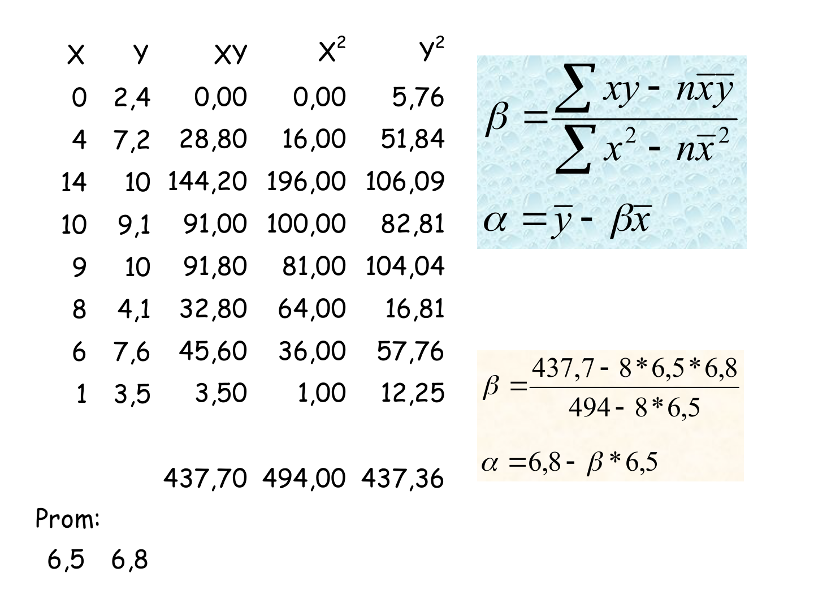
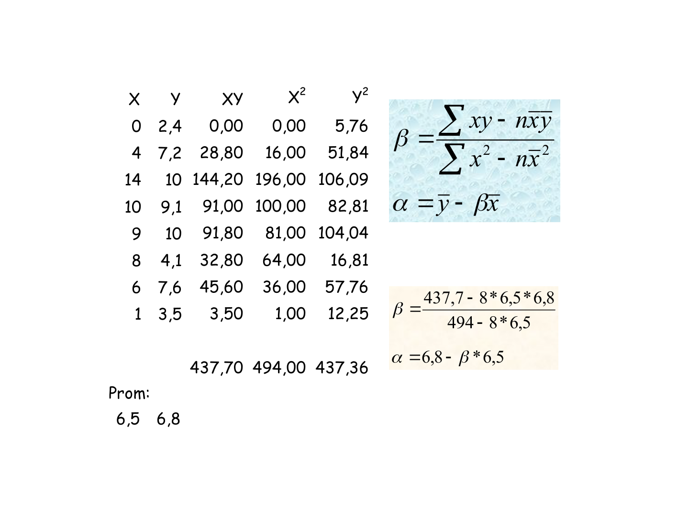

### Capacidad Explicativa de una Ecuación de Regresión

Una ecuación de regresión busca emplear la información de una variable independiente (X) para explicar el comportamiento de una variable dependiente (Y).

#### Coeficiente de Determinación (R²)

- **Fórmula**: A partir de $Y_i = \alpha + \beta X_i + e_i$:
  - La parte $\alpha + \beta X_i$ "Explica" la variabilidad de Y.
  - La parte $e_i$ "NO Explica" la variabilidad de Y.
- **Definición**: $R^2$ es la **proporción de la variabilidad total de Y que es explicada por el modelo de regresión**.
- **Recorrido**: $0 \le R^2 \le 1$.
- **Interpretación**: Un $R^2$ de 0.70 significa que el 70% de la variación en Y es explicada por el modelo con X.

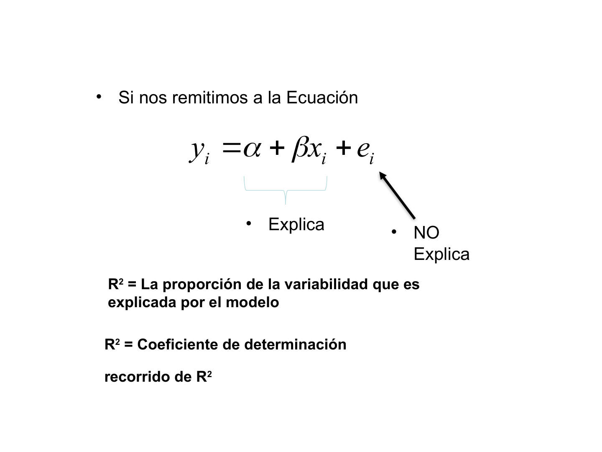

:::caution[Lo que R² NO hace]

- El coeficiente de determinación **NO MIDE la validez del modelo de regresión propuesto**.
- Solo mide cuánto de la variación total de Y es explicada por la ecuación de regresión.
  :::

### Recursos Adicionales (YouTube)

- **Explicación de R²**: https://www.youtube.com/watch?v=SsFBnvkoZa4&t=339s
- **Conceptos de Regresión**: https://www.youtube.com/watch?v=zSK60knsPnU
- **Regresión paso a paso en Excel**: https://www.youtube.com/watch?v=BDf88CXvA_8 (Recomendado por el profesor)
