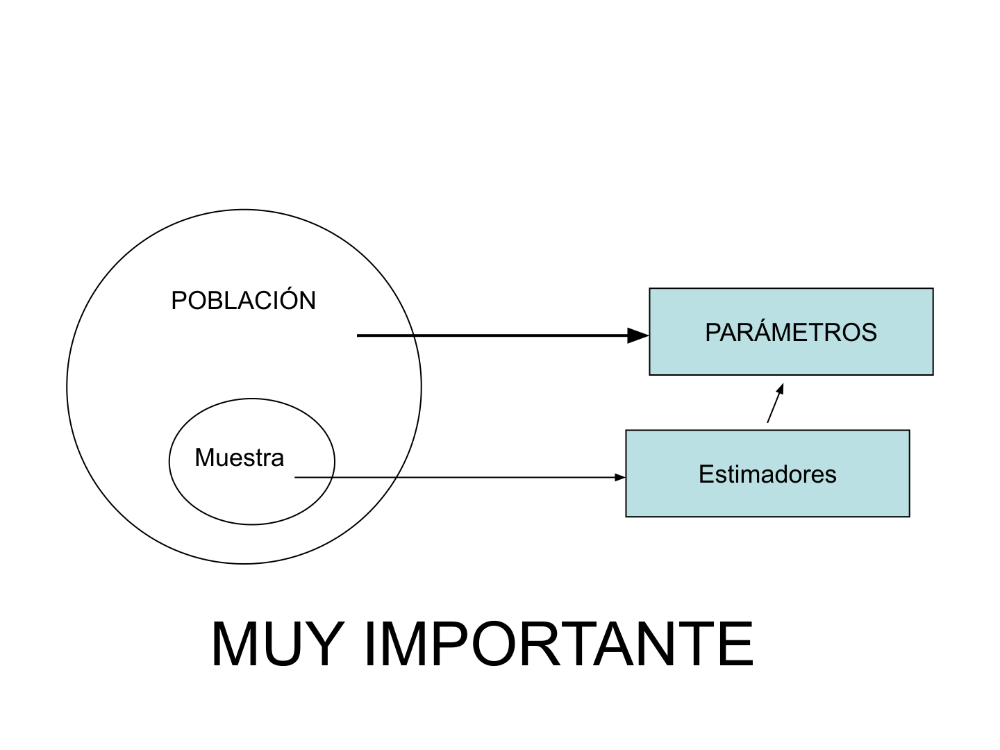
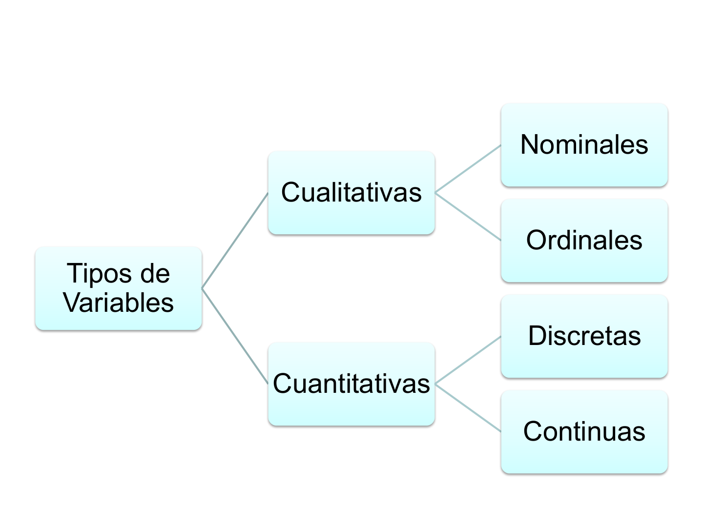
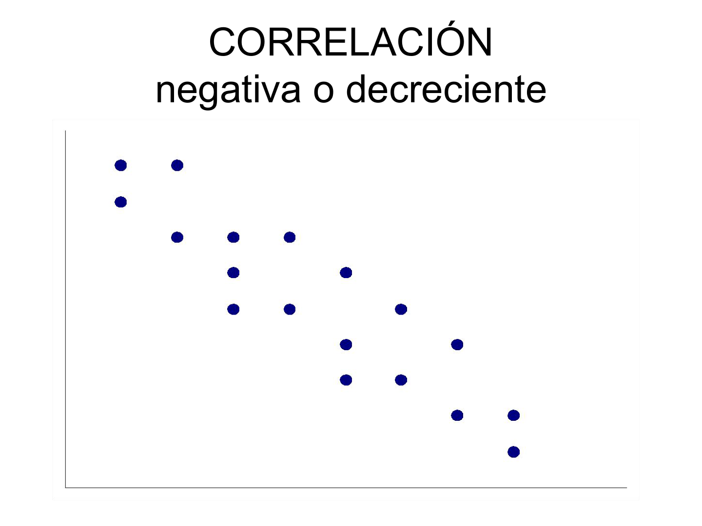
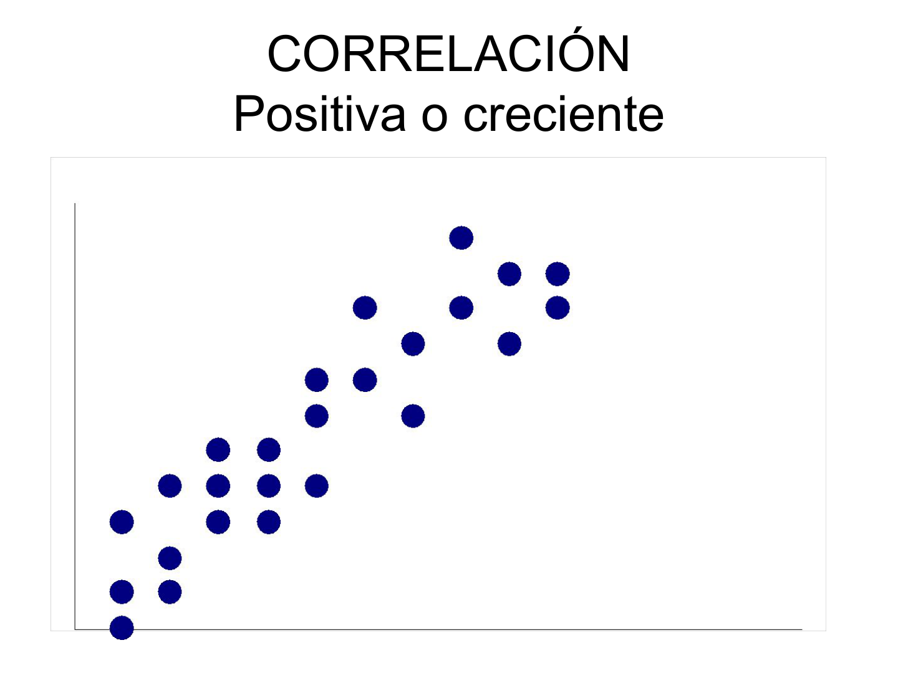
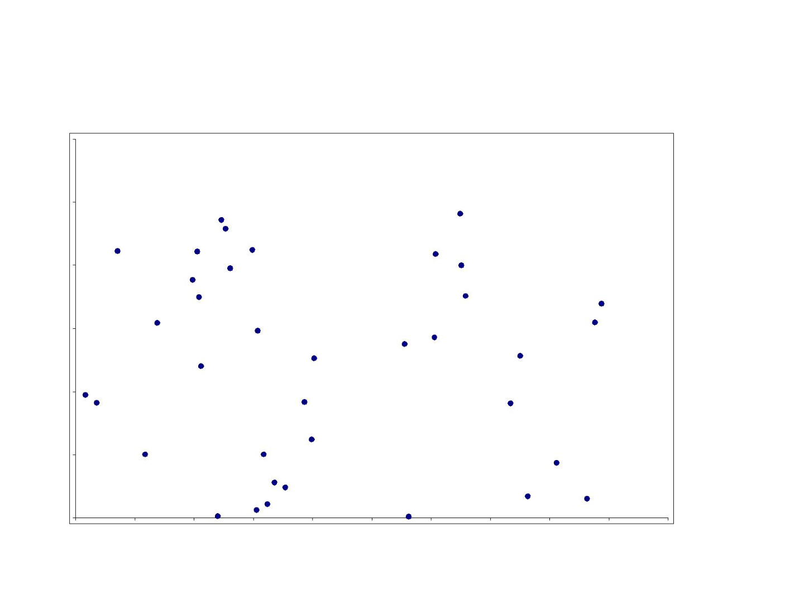

## Estadística Aplicada

### Información del Curso

- **Evaluación:**
  - Exposiciones
  - 2 Certámenes/Trabajos (40% ; 45% del total)
  - "Control/Tarea" (semanal/quincenal): 15% del total. Las notas de estos no son recuperables y la no entrega significa nota mínima.

### Programa del Curso

- **Clases 01-02:**
  - **Definiciones:** Población, Muestra, Parámetros, Estimación, Estadísticos, Estadística Descriptiva.
  - **Variables:** Variable aleatoria; Variables cualitativas (nominales, ordinales), Cuantitativas (discretas, continuas).
  - **Medidas:** Tendencia central, posición y dispersión.
- **Clases 03-04:** Introducción a Regresión; Aplicaciones.
- **Clases 05-06:**
  - Definición de probabilidad, distribución de una variable aleatoria (con ejemplos y ejercicios).
  - Probabilidad condicional y eventos independientes (ejemplos y ejercicios).
  - Probabilidad Total; Teorema de Bayes.
- **Clases 07-08:** Ejercicios y aplicaciones (Preparación Prueba).
- **Clases 09-10:**
  - Variable Aleatoria, Distribución de probabilidades, Valor esperado y varianza.
  - Distribuciones Discretas (aplicaciones y uso de las distribuciones).
- **Clases 11-12:**
  - Distribuciones Continuas (aplicaciones y uso de las distribuciones).
  - Estimación Puntual; Intervalos de confianza.
- **Clases 13-14:** Ejercicios, aplicaciones y Prueba.
- **Clases 15-16:** Ejercicios y Prueba Recuperativa.

## Fundamentos de Estadística

### ¿Qué es la Estadística?

:::note[Definición de Estadística]
La Estadística, históricamente conocida como la "Ciencia del estado", comprende conceptos y técnicas empleadas en la recopilación, presentación e interpretación de información con el objetivo de contribuir al **análisis de datos** y al **proceso de toma de decisiones**.
:::

### Desarrollo Histórico de la Estadística

- **Impulsores del desarrollo:**
  1.  **Demanda:** Gobiernos, empresas e instituciones requieren información sobre ciudadanos, negocios, etc.
  2.  **Avance Matemático:** El progreso en la teoría de la probabilidad impulsó su desarrollo.
- **Contexto histórico:**
  - **Antigüedad:** Civilizaciones Egipcias, Griegas y Romanas ya recopilaban datos con fines impositivos y militares.
  - **Edad Media:** Instituciones eclesiásticas documentaban nacimientos, muertes y matrimonios.

### Objetivos Principales de la Estadística

1.  **Estadística Descriptiva:**
    - **Propósito:** Describir cuantitativamente una serie de personas, lugares o cosas.
    - **Métodos:** Implica la recopilación, presentación y caracterización de un conjunto de datos.
2.  **Inferencia Estadística:**
    - **Propósito:** Generar información que permita obtener conclusiones sobre un grupo grande (población) a partir de la observación de solo una pequeña parte (muestra).
    - **Fundamento:** Se basa en la teoría de probabilidades.

### Conceptos Fundamentales

:::note[Población o Universo]
Es el conjunto total de individuos o elementos sobre los cuales podemos observar o medir una característica o atributo. Se define por una o más características comunes a todos sus componentes, y solo a ellos. Puede ser finito o infinito.
:::

:::note[Muestra]
Es una proporción o subconjunto de la población que se selecciona para realizar el análisis. Agrupa elementos o individuos que representan aproximadamente las características de la población relevantes para una investigación.
:::

:::note[Parámetro]
Una variable que, dentro de una familia de elementos, los representa. Son las medidas o datos que se obtienen para describir una característica específica de una población determinada.
:::

:::note[Estadístico / Estadígrafo / Estimación]
Son los datos o medidas que se obtienen sobre una muestra. Constituyen una estimación de los parámetros de la población de la cual fue extraída la muestra.
:::

### Relación entre Población, Muestra, Parámetros y Estimadores

## Variables Estadísticas y su Clasificación

### Definiciones Clave

:::note[Variable]
Es aquella característica de las unidades de estudio que interesa investigar en una investigación científica.
:::

:::note[Variable Aleatoria]
Una variable es aleatoria si los valores numéricos que asume provienen de factores fortuitos y si un determinado valor no puede ser predicho con exactitud de antemano.
:::

### Notación de Variables Aleatorias

- Las variables aleatorias (v.a.) se representan comúnmente con letras mayúsculas, como $X, Y, Z$.
- Las realizaciones o valores específicos de una variable aleatoria se denotan con letras minúsculas, como $x, y, z$.
- Los subíndices ($x_1, x_2, ..., x_6$) se utilizan para distinguir diferentes valores de una misma variable aleatoria.

### Clases de Datos

Las variables aleatorias proporcionan dos clases de datos principales:

- **Datos Cualitativos:** Producen respuestas categóricas, es decir, miden cualidades o atributos.
- **Datos Cuantitativos:** Ofrecen respuestas numéricas.

### Esquema de Clasificación de Variables

### Clasificación Detallada de Variables

#### Variables Cualitativas

- **Nominales:**
  - Los datos se agrupan sin establecer ninguna jerarquía u orden inherente entre ellos.
  - **Ejemplos:** Nombres de personas, nombres de establecimientos, raza, grupos sanguíneos, estado civil.
- **Ordinales:**
  - Las categorías o valores que adopta la variable cualitativa poseen un orden, secuencia o progresión natural esperable.
  - **Ejemplos:** Grados de desnutrición, respuesta a un tratamiento, nivel socioeconómico, intensidad de consumo de alcohol, días de la semana, meses del año.
    :::caution[Consideración Importante]
    A pesar de la existencia de un orden jerárquico, no es posible establecer una valoración numérica lógica o una distancia significativa entre dos valores de una variable ordinal.
    :::

#### Variables Cuantitativas

- **Discretas:**
  - Son respuestas numéricas que resultan de un proceso de conteo.
  - Asumen valores de un conjunto finito o de un conjunto infinito pero numerable.
- **Continuas:**
  - Son respuestas numéricas que provienen de un proceso de medición.
  - Asumen valores de un conjunto infinito y no numerable (es decir, cualquier valor dentro de un rango).
    :::note[Agrupación por Intervalos]
    Tanto las variables discretas como las continuas pueden agruparse construyendo intervalos. Sin embargo, en un sentido estricto, únicamente las variables continuas son adecuadas para ser categorizadas mediante intervalos.
    :::

## Medidas Estadísticas

### Tipos de Medidas (Parámetros)

Las medidas estadísticas se clasifican en:

- Medidas de Tendencia Central
- Medidas de Dispersión
- Medidas de Posición
- Medidas de Forma (no se cubrirán en este curso)

### Medidas de Tendencia Central

- **Moda:**
  - Es el valor que se presenta con mayor frecuencia en un conjunto de datos.
  - Puede ser: Unimodal (una moda), Bimodal (dos modas), Multimodal (múltiples modas).
- **Media Aritmética o Promedio ($\bar{X}$):**
  - Representa un "punto de equilibrio" del conjunto de datos.
  - **Fórmula general:**
    $$ \bar{X} = \frac{\sum_{i=1}^{n} X_i}{n} $$
  - **Propiedad (al sumar una constante):**
    $$ \frac{\sum_{i=1}^{n} (X_i + C)}{n} = \bar{X} + C $$
  - **Propiedad (al multiplicar por una constante):**
    $$ \frac{\sum_{i=1}^{n} (C \cdot X_i)}{n} = C \cdot \bar{X} $$
  - **Notación para Población y Muestra:**
    - **Población ($\mu$):**
      $$ \mu = \frac{\sum_{i=1}^{N} X_i}{N} $$
    - **Muestra ($\bar{X}$):**
      $$ \bar{x} = \frac{\sum\_{i=1}^{n} x_i}{n} $$
- **Mediana (Md):**
  - Es el valor que se sitúa justo en el centro de una secuencia de datos previamente ordenada.
  - **Cálculo:**
    $$
    Md =
    \begin{cases}
    X_{\left(\frac{n+1}{2}\right)} & \text{si } n \text{ es impar} \\
    \frac{X_{\left(\frac{n}{2}\right)} + X_{\left(\frac{n}{2} + 1\right)}}{2} & \text{si } n \text{ es par}
    \end{cases}
    $$

### Medidas de Dispersión

Estas medidas nos indican el grado de variabilidad o diseminación de los datos alrededor de un valor central.

- **Varianza ($S^2$ o $\sigma^2$):**
  - Es el "promedio" de las distancias cuadráticas de cada observación respecto a su media.
  - **Fórmula para la muestra:**
    $$ S^2 = \frac{\sum_{i=1}^{n} (x_i - \bar{x})^2}{n - 1} $$
    - O de forma equivalente:
      $$ S^2 = \frac{\sum x_i^2 - n\bar{x}^2}{n - 1} $$

  - **Notación para Población y Muestra:**
    - **Población ($\sigma^2$):**
      $$ \sigma^2 = \frac{\sum_{i=1}^{N} (X_i - \mu)^2}{N} $$
    - **Muestra ($S^2$):**
      $$ S^2 = \frac{\sum_{i=1}^{n} (x_i - \bar{x})^2}{n - 1} $$

- **Desviación Estándar ($S$ o $\sigma$):**
  - Es la raíz cuadrada de la varianza. Representa el promedio de las distancias de cada observación a la media, en las unidades originales de los datos.
  - **Fórmula para la muestra:**
    $$ S = \sqrt{ \frac{\sum_{i=1}^{n} (x_i - \bar{x})^2}{n - 1} } $$
- **Rango ($R$):**
  - La diferencia entre el valor máximo y el valor mínimo en un conjunto de datos.
  - **Fórmula:**
    $$ R = X_{\text{max}} - X_{\text{min}} $$
- **Coeficiente de Variación ($C.V.$):**
  - Una medida relativa de dispersión que indica la variabilidad de los datos en relación con la media. Es útil para comparar la dispersión de conjuntos de datos con diferentes unidades o medias.
  - **Fórmula:**
    $$ C.V. = \left( \frac{S}{\bar{x}} \right) \cdot 100\% $$
    :::tip[Interpretación del C.V.]
    Un menor valor del Coeficiente de Variación indica que el conjunto de datos es más homogéneo o consistente.
    :::

### Medidas de Posición

Son medidas útiles para resumir las propiedades de grandes volúmenes de datos cuantitativos. Generalmente se les conoce como **cuantiles**.

- **Percentiles ($P_p$):**
  - Dividen un conjunto ordenado de observaciones en cien partes iguales.
  - El percentil $p$ es el valor por debajo del cual se encuentra el $p$% del total de observaciones, y por encima del cual se encuentra el $(100 - p)$% restante.
  - **Fórmula:**
    $$ P_p = X_{\left(\frac{p \cdot n}{100}\right)} $$
  - **Observación:** $0 < p < 100$.
- **Deciles ($D_p$):**
  - Dividen un conjunto ordenado de observaciones en diez partes iguales.
  - El decil $p$ es el valor por debajo del cual se encuentra el $p$% del total de observaciones, y por encima del cual se encuentra el $(100 - p)$% restante.
  - **Fórmula:**
    $$ D_p = X_{\left(\frac{p \cdot n}{10}\right)} $$
  - **Observación:** $0 < p < 10$.
- **Quintiles ($Q_p$):**
  - Dividen un conjunto ordenado de observaciones en cinco partes iguales.
  - El quintil $p$ es el valor por debajo del cual se encuentra el $p$% del total de observaciones, y por encima del cual se encuentra el $(100 - p)$% restante.
  - **Fórmula:**
    $$ Q_p = X_{\left(\frac{p \cdot n}{5}\right)} $$
  - **Observación:** $0 < p < 5$.
- **Cuartiles ($C_p$):**
  - Dividen un conjunto ordenado de observaciones en cuatro partes iguales.
  - El cuartil $p$ es el valor por debajo del cual se encuentra el $p$% del total de observaciones, y por encima del cual se encuentra el $(100 - p)$% restante.
  - **Fórmula:**
    $$ C_p = X_{\left(\frac{p \cdot n}{4}\right)} $$
  - **Observación:** $0 < p < 4$.

### Relaciones Importantes entre Cuantiles

$$ Md = P_{50} = D_5 = C_2 $$

## Correlación

### Concepto de Correlación

- La correlación mide el **grado de asociación LINEAL** entre dos variables.
- Puede ser **negativa** o **positiva**.
- Se describe como **decreciente** (para correlación negativa) o **creciente** (para correlación positiva).

### Representación Visual de la Correlación

#### Correlación Negativa o Decreciente

#### Correlación Positiva o Creciente

#### Correlación Nula (aproximadamente 0)

### Interpretación de la Correlación

- La correlación se puede asociar a la "pendiente" de una recta imaginaria que representa la tendencia de los datos:
  - Si la "pendiente" es positiva, la correlación es positiva.
  - Si la "pendiente" es negativa, la correlación es negativa.
- El coeficiente de correlación siempre se encontrará en el rango entre **-1 y 1**.
- Una correlación de **1** (o muy cercana a 1) indica una **alta correlación positiva** entre las variables, es decir, tienden a moverse en la misma dirección de forma muy consistente.
- Una correlación de **-1** (o muy cercana a -1) indica una **alta correlación negativa**, es decir, tienden a moverse en direcciones opuestas de forma muy consistente.
- Una correlación de **0** (o muy cercana a 0) sugiere que no existe una relación lineal discernible entre las variables.

:::caution[Consideración Crítica]
Es fundamental prestar atención a **lo que se está midiendo**. La correlación lineal solo detecta relaciones lineales; no implica causalidad y no capta relaciones no lineales.
:::

### Cálculo del Coeficiente de Correlación

- **Correlación Poblacional ($\rho$):**
  - Es un parámetro que describe la correlación en toda la población.
  - **Fórmula:**
    $$ \rho = \text{Corr}(X, Y) = \frac{\text{Cov}(X, Y)}{\sigma_x \cdot \sigma_y} $$
    Donde $\text{Cov}(X, Y)$ es la covarianza entre X e Y, y $\sigma_x$, $\sigma_y$ son las desviaciones estándar de X e Y, respectivamente.
- **Estimador Muestral de Correlación ($r$):**
  - Para estimar el parámetro poblacional $\rho$, se utiliza el coeficiente de correlación muestral $r$.
  - **Fórmula:**
    $$ r = \frac{\sum xy - n \cdot \bar{x}\bar{y}}{\sqrt{ \left(\sum x^2 - n \bar{x}^2\right) \left(\sum y^2 - n \bar{y}^2\right) }} $$
    Donde $n$ es el número de pares de observaciones, $X̄$ y $Ȳ$ son las medias muestrales de X e Y.

### Ejemplo de Aplicación de Correlación

**Contexto:** Un profesor de Estadística requiere que los estudiantes realicen un examen final y un análisis de datos (proyecto). Se desea determinar e interpretar el coeficiente de correlación entre las calificaciones obtenidas en el examen y en el proyecto para una muestra aleatoria de estudiantes.

**Datos de Calificaciones:**

| Examen (X) | Proyecto (Y) |
| :--------- | :----------- |
| 81         | 76           |
| 62         | 71           |
| 74         | 69           |
| 78         | 76           |
| 93         | 87           |
| 69         | 62           |
| 72         | 80           |
| 83         | 75           |
| 90         | 92           |
| 84         | 79           |

**Cálculo del Coeficiente de Correlación ($r$):**
Aplicando la fórmula del estimador muestral $r$ con los datos proporcionados y sus sumas calculadas:

$$
\begin{aligned}
r &= \frac{60.862 - 10(78.6)(76.7)}{\sqrt{\big[62.604 - 10(78.6)^2 \big] \big[59.497 - 10(76.7)^2\big]}} \\[1ex]
r &= 0,78
\end{aligned}
$$

**Interpretación:**
El coeficiente de correlación $r = 0,78$ indica una **fuerte correlación lineal positiva** entre las calificaciones del examen final y las del proyecto. Esto sugiere que, en general, los estudiantes que obtienen buenas calificaciones en el examen también tienden a obtener buenas calificaciones en el proyecto, y viceversa.

## Actividad Práctica (Tarea)

**Para la próxima clase (trabajo en parejas):**

1.  **Selección de Variables:** Identificar al menos dos variables asociadas a la enfermedad COVID-19 que, a juicio del estudiante, presenten una relación lógica.
2.  **Recopilación de Datos:** Recolectar un mínimo de 30 pares de valores o períodos de información para las variables seleccionadas.
3.  **Cálculos Estadísticos:**
    - Definir los tipos de variables (cualitativas, cuantitativas, discretas, continuas).
    - Calcular la Moda, Media y Mediana.
    - Calcular la Desviación Estándar, Varianza y Coeficiente de Variación.
    - Calcular Percentiles.
    - Calcular el Coeficiente de Correlación. (Se recomienda el uso de Excel para los cálculos).
4.  **Interpretación:** Analizar y evaluar los resultados obtenidos.
    - **Evaluación numérica:** 30%
    - **Evaluación de la interpretación:** 70%

## Recursos Adicionales (YouTube)

- **Población y Muestra:**
  - [https://www.youtube.com/watch?v=gl9EEbT7viM](https://www.youtube.com/watch?v=gl9EEbT7viM)
- **Parámetro versus Muestra:**
  - [https://www.youtube.com/watch?v=nh7KWBGWwrl](https://www.youtube.com/watch?v=nh7KWBGWwrl)
- **Tipos de Variables:**
  - [https://www.youtube.com/watch?v=Tb3sgUSd2SQ](https://www.youtube.com/watch?v=Tb3sgUSd2SQ)
  - [https://www.youtube.com/watch?v=sQ08tqf-rXU](https://www.youtube.com/watch?v=sQ08tqf-rXU)
- **Medidas de Tendencia Central:**
  - [https://www.youtube.com/watch?v=jiceVfALmV0](https://www.youtube.com/watch?v=jiceVfALmV0)
- **Medidas de Dispersión:**
  - [https://www.youtube.com/watch?v=oZRaDwnpXkY](https://www.youtube.com/watch?v=oZRaDwnpXkY)
- **Correlación Lineal:**
  - [https://www.youtube.com/watch?v=1o_qbkzYyVk](https://www.youtube.com/watch?v=1o_qbkzYyVk)
