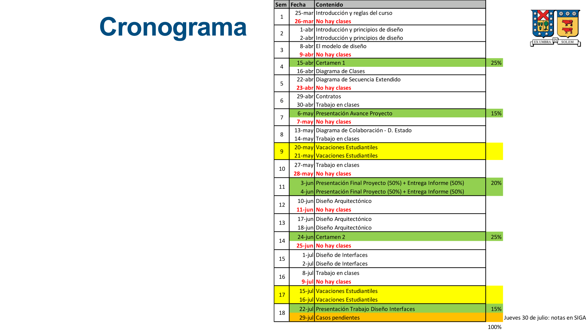

## Metodologías de Diseño e Implementación: Introducción

## Hitos

- **Certamen 1**: Introducción, principios y modelo de diseño (25%)
- Presentación avance proyecto (15%)
- Presentación final proyecto y entrega de informe (20%)
- **Certamen 2**: Diseño arquitectónico (25%)
- Presentación trabajo diseño de interfaces (15%)

## Cronograma

## Bibliografía

- Pressman, R. S. (2006). _Ingeniería del software: un enfoque práctico_.
- Sommerville, I. (2005b). _Ingeniería del software_. Pearson Educación.
- Larman, C. (2003). _UML y patrones: una introducción al análisis y diseño orientado a objetos y al proceso unificado_. Prentice Hall.
- Bass, L., Clements, P., & Kazman, R. (2012b). _Software Architecture in Practice_. Addison-Wesley.
- Becker, P., Fowler, M., Beck, K., Brant, J., Opdyke, W., & Roberts, D. (1999). _Refactoring: Improving the Design of Existing Code_. Addison-Wesley Professional.

## Introducción al Diseño

### Ingeniería de Software

:::note[Definición de Ingeniería de Software]
La ingeniería de software designa un conjunto de técnicas destinadas a la producción de un programa computacional, más allá de la sola actividad de programación.
:::

- Forman parte de esta disciplina las ciencias computacionales y la gestión de proyectos, entre otros campos, propios de la rama más genérica denominada Ingeniería Informática.

### Tareas Principales de la Ingeniería de Software

La ingeniería de software requiere llevar a cabo muchas tareas, siendo las principales:

- Especificación de Requisitos
- Análisis
- Diseño
- Programación
- Pruebas
- Documentación
- Mantenimiento

### Vistazo Rápido al Diseño

- El diseño es el sitio donde manda la **creatividad**, donde los requisitos del cliente, las necesidades del negocio y las consideraciones técnicas se unen en la formulación de un producto o sistema.
- A diferencia del modelo de análisis (que se enfoca en los requisitos de los datos, las funciones y el comportamiento), el modelo de diseño **proporciona detalles** acerca de las estructuras de datos, la arquitectura, las interfaces y los componentes del software que son necesarios para implementar el sistema.
- El diseño crea una representación o modelo del software.

:::tip[Importancia del Diseño]

- El diseño permite al ingeniero de software **modelar** el sistema o producto que se va a construir.
- Este modelo puede **evaluarse** en relación con su calidad y refinarse antes de iniciar la programación.
- El diseño es el sitio en el que se establece la **calidad** del software.
  :::

#### Pasos del Diseño

1.  Diseñar la **arquitectura** del producto.
2.  Modelar las **interfaces** de usuario, de integración con sistemas y dispositivos, y entre los componentes que lo constituyen.
3.  Diseñar los **componentes** del software que se utilizarán en la construcción del sistema.

- Estas visiones representan una acción de diseño diferente, pero todas deben ajustarse a un conjunto de conceptos básicos del diseño, que determinan todo el trabajo relacionado.

#### Producto del Diseño

- Un **modelo** que abarca representaciones arquitectónicas, de interfaz, en el nivel de componentes y de despliegue.

#### Verificación del Diseño

Para asegurarse de que el diseño se ha realizado correctamente, el equipo de diseño de software evalúa el modelo para determinar:

- Si éste contiene errores.
- Inconsistencias u omisiones.
- Si existen mejores alternativas.
- Si el modelo puede implementarse dentro de las restricciones establecidas.

## Diferencia entre Análisis y Diseño

### Análisis

:::note[Definición de Análisis]
"Análisis" es una palabra griega que significa "descomponer en componentes".
:::

- Es un proceso de búsqueda para comprender la organización, profundizar en los requisitos y modelarlos.
- Como resultado, se obtiene una especificación de lo que el sistema propuesto realizará en base a los requisitos.

### Diseño

:::note[Definición de Diseño según Rumbaugh (1997)]
"...es la forma de construir el sistema sin llegar a construirlo realmente..."
:::

- **Objetivo del Diseño**: producir una solución que cumpla con los requisitos que fueron analizados.
- Especifica **cómo** cumplirá con los requisitos el sistema a construir.
- Existirán muchas posibles soluciones de diseño, pero se debe producir/seleccionar la mejor según las circunstancias.

## Diseño Lógico y Físico

- Algunos aspectos del diseño de los sistemas dependen de la elección de la tecnología. Esto afecta:
  - La arquitectura del sistema.
  - Diseño de los componentes.
  - Interfaces entre componentes.
- Debido a lo anterior, en ocasiones el diseño se divide en dos etapas:
  - **Diseño Lógico** (independiente de la implementación).
  - **Diseño Físico** (dependiente de la implementación).

### Definiciones

- **Diseño Lógico**: está relacionado con aquellos aspectos del sistema que puedan ser diseñados sin conocimiento de la tecnología de implementación.
- **Diseño Físico**: está relacionado con aquellos aspectos del sistema que dependan de la tecnología de implementación que se vaya a utilizar.
- Contar con el diseño lógico puede resultar útil si se espera tener que reutilizar el sistema en otra plataforma efectuando pocos cambios en el diseño global.
