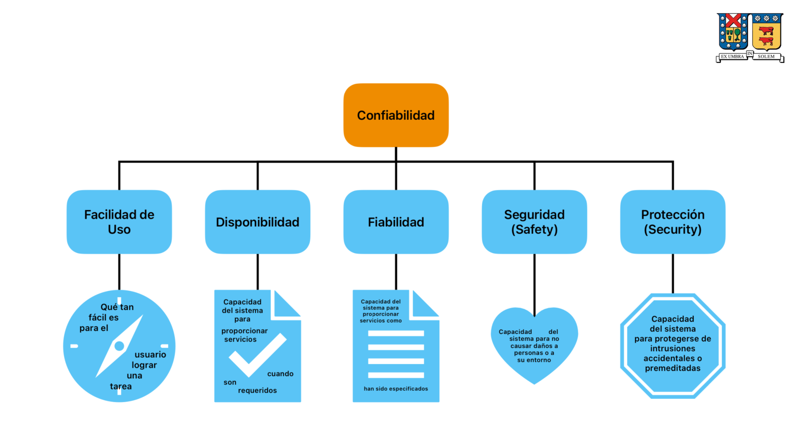
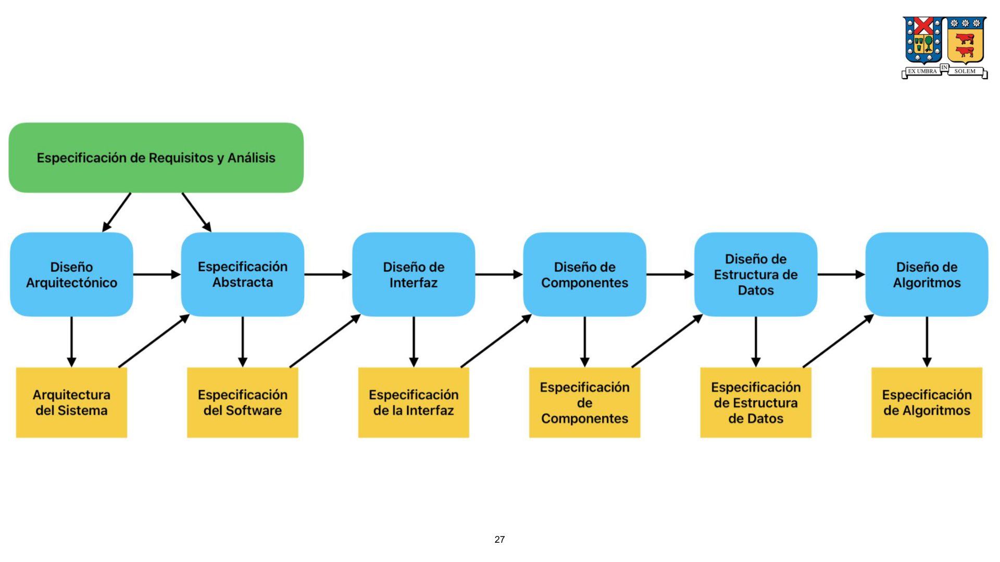
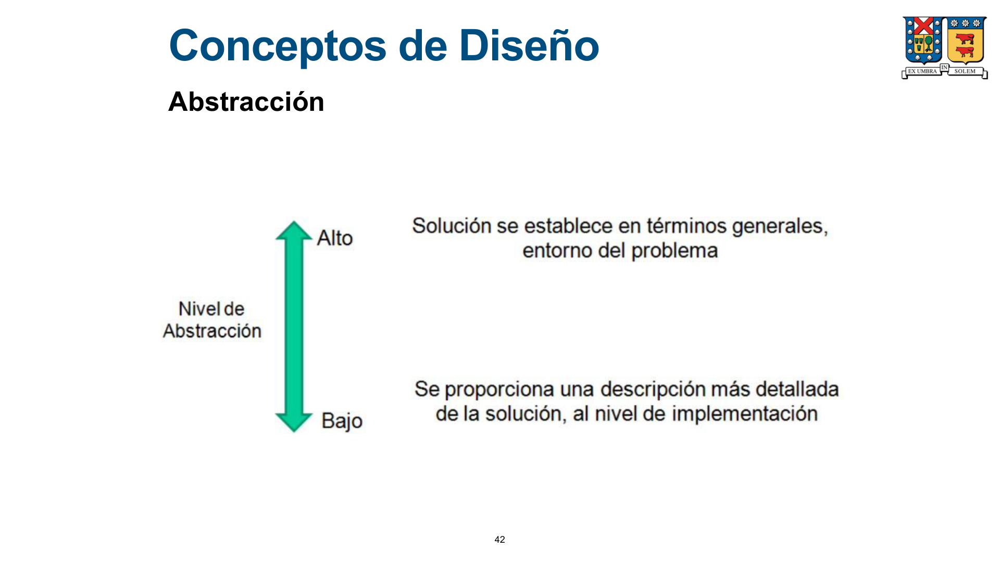
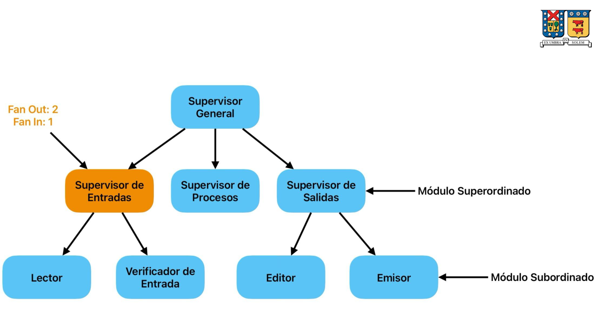
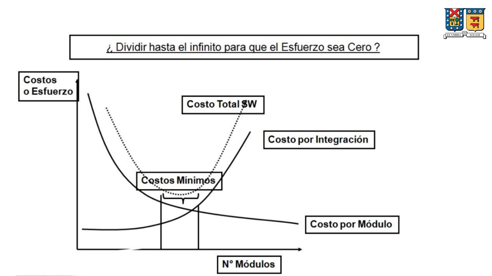
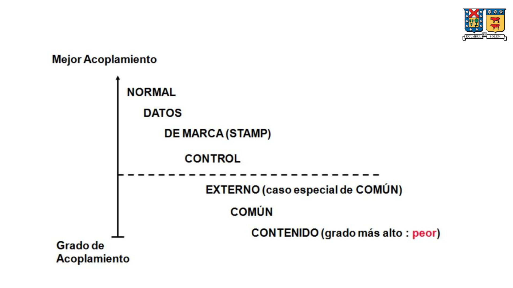
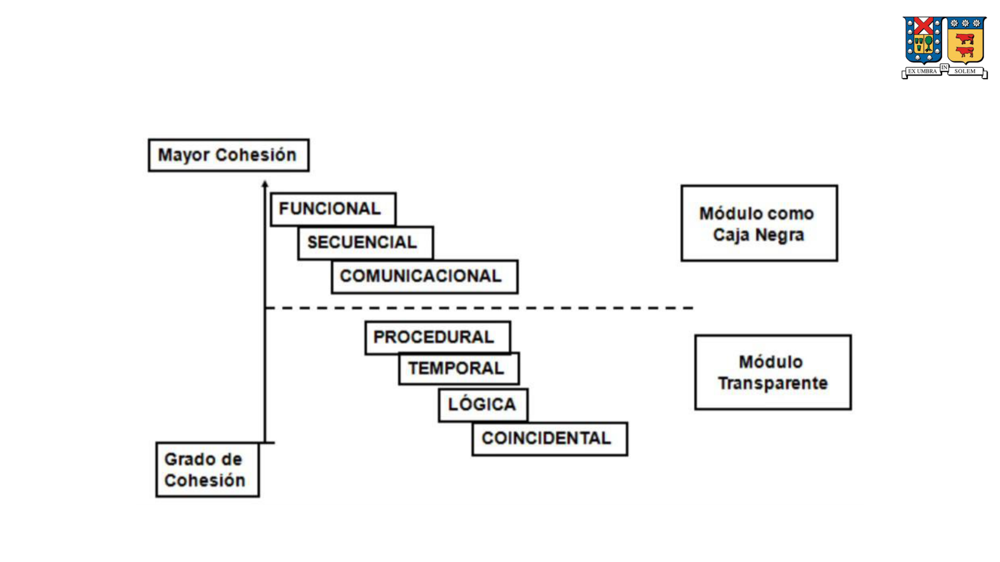

import ConceptCard from "../../../../components/ConceptCard.astro";
import ConceptGrid from "../../../../components/ConceptGrid.astro";
import Callout from "../../../../components/Callout.astro";
import TwoCol from "../../../../components/TwoCol.astro";
import SectionBox from "../../../../components/SectionBox.astro";
import Tag from "../../../../components/Tag.astro";
import TagRow from "../../../../components/TagRow.astro";
import ErdDiagram from "../../../../components/ErdDiagram.astro";

## Metodologías de Diseño e Implementación: Principios de Diseño

### Introducción

- La ingeniería del diseño abarca principios, conceptos y prácticas que conducen al desarrollo de un sistema o producto de calidad.
- Los principios del diseño establecen una filosofía primordial que guía al diseñador.
- Es fundamental comprender estos principios y conceptos antes de aplicar las mecánicas del diseño.

El modelado del diseño de software:

- Comienza con una representación global del objeto a construir, refinándose para guiar cada detalle y proporcionar diversas vistas del sistema.
- Existen varios métodos para derivar elementos del diseño de software.
- Métodos guiados por datos: dan forma a la arquitectura de software y sus componentes de procesamiento.
- Patrones: utilizan información del dominio del problema para definir estilos arquitectónicos y patrones de procesamiento.
- Orientados a objetos: se centran en la creación de estructuras de datos y operaciones para manipularlas.

### Principios de Diseño

1.  **El diseño debe ser rastreable hasta el análisis.**
    - Traduce la información del análisis en elementos que implementan las funciones más importantes.

2.  **Siempre se debe considerar la arquitectura del sistema que se va a construir.**
    - La arquitectura del software es el esqueleto del sistema; afecta interfaces, estructuras de datos, comportamiento, pruebas y facilidad de modificación.

3.  **El diseño de datos es tan importante como el diseño de funciones de procesamiento.**
    - Un diseño de datos bien estructurado simplifica el flujo del sistema, facilita el diseño e implementación de componentes y aporta eficiencia.

4.  **Las interfaces internas y externas deben diseñarse con cuidado.**
    - El buen diseño de interfaces aporta eficiencia, simplicidad, integración y facilita las pruebas de componentes.

5.  **El diseño de la interfaz de usuario debe ajustarse a la necesidad del usuario final.**
    - El enfoque principal es la facilidad de uso.

6.  **El diseño a nivel de componentes debe ser independiente en términos funcionales.**
    - La independencia funcional aporta simplicidad y cohesión.

7.  **Los componentes deben estar acoplados entre sí en forma mínima y vinculados con el ambiente externo.**
    - Un mayor acoplamiento incrementa la probabilidad de propagación de errores y reduce la facilidad de modificación.

8.  **La representación del diseño debe ser fácilmente comprensible.**
    - El propósito principal del diseño es comunicar.

9.  **El diseño se debe desarrollar de manera iterativa.**
    - Las primeras iteraciones refinan el diseño y corrigen errores. Las posteriores buscan la mayor simplicidad posible.

### Factores de Calidad

Los factores de calidad se dividen en externos e internos:

- **Factores Externos**: Aquellos percibidos directamente por los usuarios.
  - Rendimiento
  - Confiabilidad
  - Facilidad de uso
  - Seguridad
- **Factores Internos**: Importantes para los ingenieros de software, ya que conducen a un diseño técnico de alta calidad.
  - Facilidad de modificación
  - Facilidad de pruebas
  - Facilidad de soporte

Para lograr una buena calidad interna y externa, el diseñador debe comprender los conceptos de diseño.

### Características de un Buen Software



- **Diversificación**: Adquisición de un repertorio de alternativas (componentes, soluciones y conocimiento).
- **Convergencia**: Selección de elementos del repertorio que cumplan con los requisitos y el análisis, llevando a una configuración final del producto.
- **Proceso Creativo**: El proceso de diseño no puede ser completamente formalizado debido a su naturaleza creativa, aunque debe gestionarse bajo restricciones de tiempo y recursos.

### Componentes

Un componente de software ejecutable es:

- Una pieza separable, independiente del contexto.
- Una unidad con sentido propio.
- Capaz de interoperar con otros componentes dentro de un ambiente de apoyo.
- Accesible solo a través de sus interfaces.
- Listo para usar (salvo instalación y configuración).

### Proceso de Diseño

#### Consideraciones

- Identificar y entender el problema desde múltiples perspectivas.
- Evaluar características fundamentales de posibles soluciones basándose en la experiencia del diseñador, la disponibilidad de componentes reutilizables y la simplicidad del producto.
- Describir y analizar en detalle cada abstracción en la solución elegida para encontrar y corregir errores u omisiones.

#### Rol del Diseño dentro del Proceso de Desarrollo de Software

- El proceso de diseño es iterativo, desarrollando múltiples versiones que incorporan correcciones, formalidad y detalle.
- Resulta en varios modelos del sistema, cada uno con distintos niveles de abstracción.
- Tras el análisis y especificación de requisitos, el diseño de software establece la plataforma para la construcción.

#### Modelo General para el Proceso de Diseño



#### Actividades del Proceso de Diseño

- **Diseño Arquitectónico**: Identificación y documentación de los subsistemas y sus relaciones.
- **Especificación Abstracta**: Definición de los servicios que ofrecen los subsistemas y sus restricciones operativas.
- **Diseño de Interfaces**: Documentación de las interfaces de los subsistemas para permitir su uso sin conocimiento interno.
- **Diseño de Componentes**: Completar especificaciones y diseños no detallados de cada subsistema, transformando elementos estructurales en descripciones procedimentales.
- **Diseño de Estructura de Datos**: Especificación y diseño detallado de las estructuras de datos del sistema.
- **Diseño de Algoritmos**: Especificación y diseño de los algoritmos del sistema.

**Clasificación de Actividades:**

- **Diseño de Alto Nivel**: Incluye diseño arquitectónico, especificación abstracta, diseño de interfaces y diseño de componentes.
- **Diseño Detallado**: Abarca el diseño de estructuras de datos y algoritmos.

#### Productos del Proceso de Diseño

- Base para la implementación.
- Medio de comunicación.
- Información para el equipo de mantenimiento.

#### Importancia del Diseño: Calidad

- El diseño es el único puente entre los requisitos del cliente y el producto de software.
- **Riesgos de no diseñar**:
  - Construir un sistema inestable que falle con pequeños cambios.
  - Construir un sistema difícil de probar.
  - Construir un sistema cuya calidad solo se evalúe en etapas tardías.

#### Importancia del Diseño: Proceso y Calidad

- El diseño, representado a un alto nivel de abstracción, permite rastrear:
  - El objetivo específico del sistema.
  - Requisitos funcionales y de datos más detallados.
- Las iteraciones del diseño conducen a representaciones con grados de abstracción cada vez menores.

#### Guías de Evaluación del Diseño (Robert McGlaughlin)

1.  **Implementación de Requisitos**: "El diseño debe implementar todos los requisitos explícitos contenidos en el modelo de análisis y debe ajustarse a todos los requisitos implícitos que desea el cliente."
2.  **Legibilidad y Comprensión**: "El diseño debe ser una guía legible y comprensible para quienes generan código y quienes realizan las pruebas y, en consecuencia, dan soporte al software."
3.  **Imagen Completa**: "El diseño debe proporcionar una imagen completa del software, dando dirección a los dominios de datos, funcionales y de comportamiento, desde una perspectiva de implementación."

### Directrices de Calidad del Diseño

Un diseño debe:

- Presentar una estructura arquitectónica que:
  - Haya sido creada mediante estilos y patrones reconocibles.
  - Integre componentes con buenas características de diseño.
  - Pueda implementarse de manera evolutiva para facilitar la implementación y las pruebas.
- Ser modular, dividiendo el software lógicamente en elementos o subsistemas.
- Contener distintas representaciones de datos, arquitectura, interfaces y componentes.
- Conducir a:
  - Estructuras de datos apropiadas para las clases a implementar, derivadas de patrones de datos reconocibles.
  - Componentes con características funcionales independientes.
  - Interfaces que reduzcan la complejidad de las conexiones entre componentes y el ambiente externo.
- Obtenerse mediante un método repetible basado en la información del análisis de requisitos.
- Representarse con una notación que comunique eficazmente su significado.

## Conceptos de Diseño

### Abstracción

<ConceptGrid>
  <ConceptCard
    label="Abstracción"
    title="Definición"
    desc="Separar, mediante una operación intelectual, una cualidad de algo para considerarlo en su pura esencia."
  />
</ConceptGrid>



### Arquitectura

<ConceptGrid>
  <ConceptCard
    label="Arquitectura"
    title="Definición"
    desc="Elementos del sistema, propiedades externamente visibles y relaciones entre estos."
  />
</ConceptGrid>

Existen diferentes tipos de modelos para representar una arquitectura:

- **Modelos Estructurales**: Representan la arquitectura como una colección organizada de componentes.
- **Modelos de Framework**: Incrementan la abstracción del diseño al identificar frameworks repetibles en aplicaciones similares.
- **Modelos Dinámicos**: Abordan aspectos de comportamiento de la arquitectura, mostrando cómo la estructura puede cambiar por eventos externos.
- **Modelos del Proceso**: Centrados en el proceso técnico o de negocio.
- **Modelo Funcional**: Representan la jerarquía funcional de un sistema.

### Patrones

<ConceptGrid>
  <ConceptCard
    label="Patrón de Diseño"
    title="Definición"
    desc="Una solución probada a un problema recurrente en un contexto dado con fuerzas en competencia."
  />
</ConceptGrid>

La finalidad de cada patrón de diseño es permitir al diseñador determinar:

- Si el patrón es aplicable al trabajo actual.
- Si el patrón se puede reutilizar.
- Si el patrón puede servir como guía para desarrollar uno similar, pero diferente en funcionalidad o estructura.

### Modularidad

<ConceptGrid>
  <ConceptCard
    label="Modularidad"
    title="Definición"
    desc="División del software en componentes con nombres independientes y que es posible abordar en forma individual."
  />
</ConceptGrid>

- **Módulo**: Cada unidad del software claramente definida y manejable que satisface requisitos.
- Implica el particionamiento del software en módulos que, en su conjunto, resuelven el problema.
- Responde a la idea de la totalidad emergente de la noción de sistemas.

**Beneficios de la Modularidad:**

- Simplicidad
- Independencia
- Disminución de errores
- Facilidad de pruebas
- Facilidad de modificación
- Reutilización
- Facilidad de entendimiento
- Disminución en la propagación de errores

**Relación entre Módulos:**

- Un módulo que controla a otro se llama **súper ordenado**.
- Un módulo controlado por otro se llama **subordinado**.
- **Fan Out**: Medida del número de módulos controlados directamente por otro (número de subordinados inmediatos).
- **Fan In**: Medida del número de módulos que controlan directamente un determinado módulo (número de superiores inmediatos).





### Ocultamiento de la Información

<ConceptGrid>
  <ConceptCard
    label="Ocultamiento de la Información"
    title="Definición"
    desc="Decisiones de diseño que cada módulo oculta a otros."
  />
</ConceptGrid>

- Los módulos deben especificarse y diseñarse para que la información interna sea inaccesible para otros módulos que no la necesiten.
- Implica lograr una modularidad efectiva, donde los módulos solo intercambian la información estrictamente necesaria.

**Beneficios:**

- Facilidad de modificación.
- Disminución de errores y su propagación.

### Independencia Funcional

<ConceptGrid>
  <ConceptCard
    label="Independencia Funcional"
    title="Definición"
    desc="Suma directa de la modularidad, abstracción y ocultamiento de la información."
  />
</ConceptGrid>

- Se logra al desarrollar módulos con una función determinante y poca interacción excesiva con otros módulos.
- **Beneficio directo**: Facilidad de modificación y pruebas.
- Se evalúa cualitativamente mediante:
  - **Cohesión**: Medida de la fuerza funcional relativa de un módulo.
  - **Acoplamiento**: Medida de la interdependencia relativa entre los módulos.
- Un módulo cohesivo realiza una sola tarea y requiere poca interacción externa.
- El acoplamiento depende de la complejidad de la interfaz, los puntos de entrada/referencia y los datos pasados.
- Una conectividad sencilla facilita la comprensión y reduce el efecto "ola" de propagación de problemas.

### Refinamiento

<ConceptGrid>
  <ConceptCard
    label="Refinamiento"
    title="Definición"
    desc="Proceso iterativo mediante el cual se agrega detalle a una representación del diseño."
  />
</ConceptGrid>

- Configura una representación que muestra una visión global de estructuras de datos y componentes.
- Lleva la representación hacia el código fuente.
- Termina cuando la representación se expresa en términos de un lenguaje de programación.
- Es un proceso de elaboración que inicia con una representación de alta abstracción.
- La abstracción y el refinamiento son conceptos complementarios.

### Refactoring

<ConceptGrid>
  <ConceptCard
    label="Refactoring"
    title="Definición"
    desc="Técnica que simplifica la estructura interna de un componente sin cambiar su comportamiento externo."
  />
</ConceptGrid>

- Cuando un software se refactoriza, el diseño existente se examina en búsqueda de redundancias, elementos innecesarios, algoritmos insuficientes, estructuras de datos inapropiadas o cualquier otra falla de diseño que pueda corregirse.
- Debe realizarse sin modificar la función o el comportamiento del componente.

### Clases de Diseño

<ConceptGrid>
  <ConceptCard
    label="Clases de Diseño"
    title="Definición"
    desc="Versión refinada de las clases de análisis."
  />
</ConceptGrid>

- Las clases de diseño refinan las clases de análisis, añadiendo detalles para su implementación.
- Soportan la solución de negocio.
- Se sugieren 5 tipos de clases de diseño:
  - Clases de interfaz con el usuario.
  - Clases del dominio de negocio.
  - Clases del proceso.
  - Clases de persistencia.
  - Clases transversales o de sistema.

**Cuatro características de una clase de diseño:**

- **Completa y suficiente**: Encapsulamiento completo de atributos y métodos.
- **Primitivismo**: Los métodos deben implementar una sola forma de realizar los servicios de la clase.
- **Alta Cohesión**: Conjunto de responsabilidades pequeño y enfocado.
- **Bajo Acoplamiento**: Las clases de diseño deben colaborar entre sí, manteniendo la colaboración a un mínimo aceptable.

## Acoplamiento

### Introducción al Acoplamiento

<ConceptGrid>
  <ConceptCard
    label="Acoplamiento"
    title="Definición"
    desc="Corresponde al grado de independencia entre los módulos. Cuanto menor el acoplamiento, mayor la independencia."
  />
</ConceptGrid>

- Minimizar el acoplamiento es un objetivo al configurar la estructura.
- Se logra la independencia de los módulos de tres maneras:
  - Eliminando relaciones innecesarias.
  - Reduciendo el número de relaciones necesarias.
  - Debilitando la dependencia de las relaciones necesarias.

<Callout type="info" title="Grado de Acoplamiento">
  El acoplamiento puede variar desde 'Mejor' (Normal) hasta 'Peor' (Contenido),
  con niveles intermedios como Datos, Marca, Control y Externo.
</Callout>



### Acoplamiento Normal

<ConceptGrid>
  <ConceptCard
    label="Acoplamiento Normal"
    title="Definición"
    desc="Dos módulos A y B están normalmente acoplados si un módulo A llama a otro B, B retorna el control a A, y no hay traspaso de parámetros entre ellos, solo la llamada."
  />
</ConceptGrid>

**Ejemplo:**

```csharp
public class ClassA
{
    public void DoSomething()
    {
        // ...
    }
}

public class ClassB
{
    public void DoSomethingElse()
    {
        ClassA classA = new ClassA();
        classA.DoSomething();
    }
}
```

### Acoplamiento de Datos

<ConceptGrid>
  <ConceptCard
    label="Acoplamiento de Datos"
    title="Definición"
    desc="Dos módulos están acoplados por datos si se comunican mediante parámetros, donde cada parámetro es una unidad elemental de datos."
  />
</ConceptGrid>

- Es inevitable cuando los módulos necesitan comunicarse.
- Considerado adecuado si se mantiene a niveles mínimos.

**Ejemplo:**

```csharp
public class ClassA
{
    public void DoSomething(int n)
    {
        // ...
    }
}

public class ClassB
{
    public void DoSomethingElse(int x)
    {
        ClassA classA = new ClassA();
        classA.DoSomething(x);
    }
}
```

### Acoplamiento de Marca (Stamp)

<ConceptGrid>
  <ConceptCard
    label="Acoplamiento de Marca (Stamp)"
    title="Definición"
    desc="Dos módulos están acoplados por marca si se refieren a la misma estructura de datos local (un grupo compuesto de datos, como un objeto, en lugar de argumentos simples)."
  />
</ConceptGrid>

**Ejemplo:**

```csharp
public class Customer
{
    public string Rut { get; set; }
    public string FirstName { get; set; }
}

public class ClassA
{
    public void DoSomething(Customer customer)
    {
        // ...
    }
}

public class ClassB
{
    public void DoSomethingElse()
    {
        Customer customer = new Customer();
        // ...
        ClassA classA = new ClassA();
        classA.DoSomething(customer);
    }
}
```

### Acoplamiento de Control

<ConceptGrid>
  <ConceptCard
    label="Acoplamiento de Control"
    title="Definición"
    desc="Dos módulos están acoplados por control cuando uno pasa al otro indicadores de control (flags, switches) que influyen en su ejecución."
  />
</ConceptGrid>

- Provoca dependencia de ejecución entre módulos.
- **No recomendable**. Se debe usar moderadamente.

**Ejemplo:**

```csharp
public class ClassA
{
    public void DoSomething(bool doThis)
    {
        if (doThis)
        {
            // ...
        }
    }
}

public class ClassB
{
    public void DoSomethingElse()
    {
        ClassA classA = new ClassA();
        classA.DoSomething(false);
    }
}
```

### Acoplamiento Común

<ConceptGrid>
  <ConceptCard
    label="Acoplamiento Común"
    title="Definición"
    desc="Dos módulos presentan acoplamiento común si se refieren a la misma área global de datos."
  />
</ConceptGrid>

- El software con muchos datos globales es difícil de entender para los ingenieros.
- Es complicado saber qué datos son usados por un módulo específico.

**Ejemplo:**

```csharp
public static class ClassA
{
    public static string Data { get; set; }
}

public class ClassB
{
    public void DoSomethingElse()
    {
        ClassA.Data = "SomeData";
    }
}

public class ClassC
{
    public void DoSomething()
    {
        ClassA.Data = "MoreData";
    }
}
```

### Acoplamiento Externo

<ConceptGrid>
  <ConceptCard
    label="Acoplamiento Externo"
    title="Definición"
    desc="Ocurre cuando los módulos están atados a un entorno externo al software, resultando en altos niveles de acoplamiento."
  />
</ConceptGrid>

- Ejemplo: La E/S acopla un módulo a dispositivos, formatos y protocolos de comunicación.
- Debe limitarse a unos pocos módulos en el diseño.

**Ejemplo:**

```csharp
public class ClassA
{
    public void DoSomething()
    {
        // Simula una interacción con una base de datos externa
        Database.GetCustomer(1);
    }
}

public class ClassB
{
    public void DoSomethingElse()
    {
        // Simula otra interacción con una base de datos externa
        Database.GetCustomers();
    }
}
```

### Acoplamiento de Contenido

<Callout type="danger" title="Acoplamiento de Contenido: Altamente Indeseable">
  Este es un tipo de acoplamiento altamente indeseable.
</Callout>

<ConceptGrid>
  <ConceptCard
    label="Acoplamiento de Contenido"
    title="Definición"
    desc="Dos módulos presentan acoplamiento de contenido si uno hace referencia al interior del otro, desviando la secuencia de instrucciones o alterando comandos de otro módulo."
  />
</ConceptGrid>

**Ejemplo:**

```csharp
public class ClassA
{
    // ...
    private ClassC classC;

    // ...
    public ClassC ClassC { get { return this.classC; } }
    // ...
}

public class ClassB
{
    private ClassA classA;

    public void DoSomethingElse()
    {
        // Acceso directo a un miembro privado de ClassA a través de una propiedad
        // y luego llamada a un método de ese miembro.
        ClassC classC = this.classA.ClassC;
        classC.DoSomething(66); // Asumiendo DoSomething toma un int
    }
}
```

## Cohesión

### Introducción a la Cohesión

<ConceptGrid>
  <ConceptCard
    label="Cohesión"
    title="Definición"
    desc="Corresponde a la medida de relación funcional de los elementos en un módulo."
  />
</ConceptGrid>

- Los elementos de un módulo pueden ser instrucciones, definiciones de datos o llamadas a otros módulos.
- La idea es organizar estos elementos para que tengan una mayor relación entre ellos al cumplir su tarea.



### Cohesión Funcional

<ConceptGrid>
  <ConceptCard
    label="Cohesión Funcional"
    title="Definición"
    desc="Un módulo con cohesión funcional es aquel que contiene elementos que contribuyen a la ejecución de una y solo una tarea relacionada al problema."
  />
</ConceptGrid>

**Ejemplo:**

```csharp
public class Calculator
{
    public int Sum(int a, int b)
    {
        return a + b;
    }
}
```

### Cohesión Secuencial

<ConceptGrid>
  <ConceptCard
    label="Cohesión Secuencial"
    title="Definición"
    desc="Un módulo secuencialmente cohesionado es aquel cuyos elementos están envueltos en actividades tales que los datos de salida de una actividad sirven como datos de entrada para la próxima actividad."
  />
</ConceptGrid>

**Ejemplo:**

```csharp
public class ClassA
{
    public void DoSomething()
    {
        int a = this.CalculateA();
        int b = this.CalculateB(a);
        int c = this.CalculateC(b);
        // ...
    }
}
```

### Cohesión Comunicacional

<ConceptGrid>
  <ConceptCard
    label="Cohesión Comunicacional"
    title="Definición"
    desc="Un módulo presenta cohesión comunicacional cuando sus elementos contribuyen a actividades que usan la misma entrada o la misma salida. No importa el orden secuencial."
  />
</ConceptGrid>

**Ejemplo:**

```csharp
public class ClassA
{
    public void GetProduct(int productId)
    {
        string name = this.GetProductName(productId);
        DateTime dateTime = this.GetProductDate(productId);
        double price = this.GetProductPrice(productId);
        // ...
    }
}
```

### Cohesión Procedimental

<ConceptGrid>
  <ConceptCard
    label="Cohesión Procedimental"
    title="Definición"
    desc="Cuando sus elementos de procesamiento están relacionados y deben ejecutarse en un orden específico."
  />
</ConceptGrid>

**Ejemplo:**

```csharp
public class ClassA
{
    public void UpdateStock()
    {
        this.GetCurrentStock();
        this.CalculateDiffs();
        this.UpdateCurrentStock();
        // ...
    }
}
```

### Cohesión Temporal

<ConceptGrid>
  <ConceptCard
    label="Cohesión Temporal"
    title="Definición"
    desc="Un módulo con cohesión temporal es aquel cuyos elementos están envueltos en actividades relacionadas en función del momento en que se realizan."
  />
</ConceptGrid>

**Ejemplo:**

```csharp
public class ClassA
{
    public void WakeUp()
    {
        this.StopAlarm();
        this.TakeShower();
        this.GetDressed();
        // ...
    }
}
```

### Cohesión Lógica

<ConceptGrid>
  <ConceptCard
    label="Cohesión Lógica"
    title="Definición"
    desc="Un módulo tiene cohesión lógica cuando existe alguna relación entre los elementos del módulo, contribuyendo al desarrollo de actividades de una misma categoría general, donde la actividad o las actividades a ser ejecutadas se seleccionan desde fuera del módulo."
  />
</ConceptGrid>

**Ejemplo:**

```csharp
class Program
{
    static void Main()
    {
        Calculator calculator = new Calculator();
        calculator.Sum(5, 3);
        calculator.Subtract(8, 2);
        calculator.Multiply(4, 6);
        calculator.Divide(10, 2);
    }
}
```

### Cohesión Coincidental

<ConceptGrid>
  <ConceptCard
    label="Cohesión Coincidental"
    title="Definición"
    desc="Un módulo coincidentalmente cohesionado es aquel cuyos elementos desarrollan actividades sin relación significativa entre sí."
  />
</ConceptGrid>

**Ejemplo:**

```csharp
public class ClassA
{
    public double CircleArea(double radio)
    {
        return Math.PI * Math.Pow(radio, 2);
    }

    public bool ValidateEmailAddress(string email)
    {
        return email.Contains("@") && email.Contains(".");
    }

    public void Print()
    {
        Console.WriteLine("¡Hola, mundo!");
    }
}
```

## Principios SOLID

Los principios SOLID son cinco principios de diseño establecidos en los años 90 para hacer los diseños de software más comprensibles, flexibles y mantenibles.

### Single Responsibility Principle (SRP)

<ConceptGrid>
  <ConceptCard
    label="Principio de Responsabilidad Única"
    title="SRP"
    desc="Agrupar las cosas que cambian por las mismas razones. Separar las cosas que cambian por razones diferentes."
  />
</ConceptGrid>

**Ejemplo que viola el principio:**
Un `Item` con lógica de precio y lógica de envío de notificaciones.

```csharp
using System.Net.Mail;

var item = new Item
{
    Description = "Book about Design Patterns",
    Price = 1000.0M
};

// Modificación del precio (una responsabilidad)
item.Price = item.Price * 0.8M;

// Envío de notificación (otra responsabilidad)
var smtp = new SmtpClient();
smtp.Send(new MailMessage { Body = $"{item.Description} {item.Price}" });
```

**Ejemplo que cumple con el principio:**
Separando las responsabilidades en diferentes clases (`ItemRepository` y `NotificationSender`).

```csharp
using SOLID; // Asumiendo que SOLID contiene las definiciones de ItemRepository, NotificationSender, Item

var itemRepository = new ItemRepository();
var notificationSender = new NotificationSender();

var item = itemRepository.GetItem(10);
item.ChangePrice(0.8M); // La lógica del precio está encapsulada en Item
notificationSender.Send(item); // La lógica de notificación está en NotificationSender
```

### Open-Closed Principle (OCP)

<ConceptGrid>
  <ConceptCard
    label="Principio Abierto/Cerrado"
    title="OCP"
    desc="Un módulo debe estar abierto para extensión pero cerrado para modificación."
  />
</ConceptGrid>

**Ejemplo que viola el principio:**
La función `CastSpell` debe modificarse cada vez que se añade una nueva dificultad.

```csharp
// Ejemplo de uso:
// CastSpell(new Character(), new Spell { BaseDamage = 100 }, GameDifficulty.Hard);

static void CastSpell(Character npc, Spell spell, GameDifficulty difficulty)
{
    double totalDamage = 0.0;

    switch (difficulty)
    {
        case GameDifficulty.Easy:
            totalDamage = spell.BaseDamage * 1.1;
            break;
        case GameDifficulty.Normal:
            totalDamage = spell.BaseDamage;
            break;
        case GameDifficulty.Hard:
            totalDamage = spell.BaseDamage * 0.8;
            break;
    }
    npc.TakeDamage(totalDamage);
}
```

**Ejemplo que cumple con el principio:**
Usando una factoría y calculadoras específicas para cada dificultad, permitiendo añadir nuevas dificultades sin modificar `CastSpell`.

```csharp
// Ejemplo de uso:
// CastSpell(new Character(), new Spell { BaseDamage = 100 }, GameDifficulty.Hard, new HandicapCalculatorFactory());

static void CastSpell(Character npc, Spell spell, GameDifficulty difficulty,
                      HandicapCalculatorFactory handicapCalculatorFactory)
{
    var calculator = handicapCalculatorFactory.GetCalculator(difficulty);
    var totalDamage = calculator.CalculateTotalDamage(spell);
    npc.TakeDamage(totalDamage);
}
```

### Liskov Substitution Principle (LSP)

<ConceptGrid>
  <ConceptCard
    label="Principio de Sustitución de Liskov"
    title="LSP"
    desc="Un programa que usa una interfaz no debe ser confundido por una implementación de esa interfaz. Las subclases deben ser sustituibles por sus clases base sin alterar la corrección del programa."
  />
</ConceptGrid>

**Ejemplo que viola el principio:**
La clase `ForeignSale` hereda de `Sale` pero no puede calcular impuestos, lo que rompe la expectativa de que cualquier `Sale` pueda ejecutar `CalculateTax()`.

```csharp
// Clase abstracta base
public abstract class Sale // (T - Tipo Base)
{
    protected decimal amount;
    protected decimal tax;
    protected string? cliente;

    public abstract void Generate();
    public abstract void CalculateTax();
}
```

```csharp
// Subclase LocalSale
public class LocalSale : Sale // (S - Subtipo)
{
    public LocalSale(decimal amount, string customer, decimal taxes)
    {
        this.amount = amount;
        cliente = customer;
        tax = taxes;
    }

    public override void Generate()
    {
        Console.WriteLine($"Genera la venta con impuestos Cliente: {this.cliente}, Monto: {this.amount}, Impuesto: {this.tax}");
        CalculateTax();
    }

    public override void CalculateTax()
    {
        Console.WriteLine("Calcula impuestos");
    }
}
```

```csharp
// Subclase ForeignSale
public class ForeingSale : Sale // (S - Subtipo)
{
    public ForeingSale(decimal amount, string cliente, decimal taxes)
    {
        this.amount = amount;
        this.cliente = cliente;
        this.tax = taxes;
    }

    public override void Generate()
    {
        Console.WriteLine($"Genera la venta sin impuestos Cliente: {this.cliente}, Monto: {this.amount}");
        CalculateTax();
    }

    public override void CalculateTax()
    {
        throw new NotImplementedException(); // ¡Rompe el LSP!
    }
}
```

```csharp
// Programa principal
public class Program
{
    public static void Main()
    {
        Sale localSale = new LocalSale(2000, "Felipe", 400);
        localSale.Generate(); // Funciona

        Sale foreingSale = new ForeingSale(4000, "Gustavo", 0);
        foreingSale.Generate(); // Lanza NotImplementedException en CalculateTax(), rompiendo LSP
    }
}
```

**Ejemplo que cumple con el principio:**
Se introduce una abstracción intermedia `TaxableSale` y `NonTaxableSale` para manejar la lógica fiscal, de modo que `ForeignSale` ya no necesita implementar `CalculateTax` de una manera que rompa el contrato.

```csharp
// Clase abstracta base más genérica
public abstract class Sale
{
    protected decimal amount;
    protected string cliente;

    public Sale(decimal amount, string cliente)
    {
        this.amount = amount;
        this.cliente = cliente;
    }

    public abstract void Generate();
}
```

```csharp
// Clase abstracta para ventas que sí tienen impuestos
public abstract class TaxableSale : Sale
{
    protected decimal tax;

    public TaxableSale(decimal amount, string cliente, decimal tax)
        : base(amount, cliente)
    {
        this.tax = tax;
    }

    public abstract void CalculateTax();
}
```

```csharp
// Clase abstracta para ventas que NO tienen impuestos
public abstract class NonTaxableSale : Sale
{
    public NonTaxableSale(decimal amount, string cliente)
        : base(amount, cliente)
    {
    }

    public virtual void CalculateTax()
    {
        // No realiza cálculo de impuestos para ventas no gravadas
        Console.WriteLine("No se calculan impuestos para esta venta.");
    }
}
```

```csharp
// Subclase LocalSale, ahora hereda de TaxableSale
public class LocalSale : TaxableSale
{
    public LocalSale(decimal amount, string customer, decimal taxes)
        : base(amount, customer, taxes)
    {
    }

    public override void Generate()
    {
        Console.WriteLine($"Genera la venta con impuestos Cliente: {this.cliente}, Monto: {this.amount}, Impuesto: {this.tax}");
        CalculateTax();
    }

    public override void CalculateTax()
    {
        Console.WriteLine($"Calcula impuestos para venta local. Impuesto: {this.tax}");
    }
}
```

```csharp
// Subclase ForeingSale, ahora hereda de NonTaxableSale
public class ForeingSale : NonTaxableSale
{
    public ForeingSale(decimal amount, string cliente)
        : base(amount, cliente)
    {
    }

    public override void Generate()
    {
        Console.WriteLine($"Genera la venta sin impuestos Cliente: {this.cliente}, Monto: {this.amount}");
        CalculateTax();
    }

    public override void CalculateTax()
    {
        // No calculamos impuestos en ventas extranjeras
        Console.WriteLine("No se calculan impuestos para ventas extranjeras.");
    }
}
```

### Interface Segregation Principle (ISP)

<ConceptGrid>
  <ConceptCard
    label="Principio de Segregación de Interfaces"
    title="ISP"
    desc="Mantener las interfaces pequeñas para que los usuarios no terminen dependiendo de cosas que no necesitan."
  />
</ConceptGrid>

**Ejemplo que viola el principio:**
Una única interfaz `IPaymentMethod` con métodos que no todas las implementaciones de pago necesitan. `DebitCard` debe implementar `AddCharge` y `GetAvailableCredit` sin uso.

```csharp
internal interface IPaymentMethod
{
    decimal GetAvailableCredit();
    void AddCharge(int installment, decimal amount);
    void Pay(decimal amount, int installments);
}

internal class DebitCard : IPaymentMethod
{
    public void AddCharge(int installment, decimal amount)
    {
        throw new NotImplementedException(); // No aplicable a tarjeta de débito
    }

    public decimal GetAvailableCredit()
    {
        throw new NotImplementedException(); // No aplicable a tarjeta de débito
    }

    public void Pay(decimal amount, int installments)
    {
        if (installments > 0)
        {
            // Error: Las tarjetas de débito no admiten cuotas
            // (La interfaz fuerza esta lógica, que no es propia del débito)
        }
        // Process payment.
    }
}
```

**Ejemplo que cumple con el principio:**
Interfaces segregadas (`ICreditPaymentMethod` y `IDebitPaymentMethod`) para que cada tipo de pago solo implemente lo que le corresponde.

```csharp
internal interface ICreditPaymentMethod
{
    decimal GetAvailableCredit();
    void AddCharge(int installment, decimal amount);
    void Pay(decimal amount, int installments);
}

internal interface IDebitPaymentMethod
{
    void Pay(decimal amount);
}

internal class DebitCard : IDebitPaymentMethod
{
    public void Pay(decimal amount)
    {
        // Process payment.
    }
}
```

### Dependency Inversion Principle (DIP)

<ConceptGrid>
  <ConceptCard
    label="Principio de Inversión de Dependencias"
    title="DIP"
    desc="Depender en la dirección de la abstracción. Los módulos de alto nivel no deben depender de los detalles de bajo nivel."
  />
</ConceptGrid>

**Ejemplo que viola el principio:**
`CustomerService` (módulo de alto nivel) depende directamente de `Database` (detalle de bajo nivel).

```csharp
public class CustomerService
{
    private Database database;

    public CustomerService()
    {
        // Directa dependencia de la implementación concreta de la base de datos.
        database = new Database();
    }

    public void AddCustomer(string customerName)
    {
        database.SaveCustomer(customerName);
        Console.WriteLine("Customer added successfully.");
    }
}

public class Database
{
    public void SaveCustomer(string customerName)
    {
        Console.WriteLine($"Saving {customerName} to the database.");
    }
}
```

```csharp
// Programa principal que muestra la dependencia directa
public class Program
{
    public static void Main()
    {
        // CustomerService depende directamente de la implementación de Database
        CustomerService customerService = new CustomerService();
        customerService.AddCustomer("John Doe");
    }
}
```

**Ejemplo que cumple con el principio:**
`CustomerService` depende de una interfaz `ICustomerRepository` (abstracción) en lugar de la implementación concreta `DatabaseRepository`. La dependencia se invierte.

```csharp
public interface ICustomerRepository
{
    void SaveCustomer(string customerName);
}

public class CustomerService
{
    private readonly ICustomerRepository customerRepository;

    public CustomerService(ICustomerRepository customerRepository)
    {
        // El servicio ahora recibe una interfaz como dependencia
        this.customerRepository = customerRepository;
    }

    public void AddCustomer(string customerName)
    {
        customerRepository.SaveCustomer(customerName);
        Console.WriteLine("Customer added successfully.");
    }
}

// Implementación concreta que usa la base de datos
public class DatabaseRepository : ICustomerRepository
{
    public void SaveCustomer(string customerName)
    {
        Console.WriteLine($"Saving {customerName} to the database.");
    }
}
```

```csharp
public static void Main()
{
    // La clase CustomerService ahora depende de una abstracción (ICustomerRepository)
    ICustomerRepository customerRepository = new DatabaseRepository();
    CustomerService customerService = new CustomerService(customerRepository);
    customerService.AddCustomer("John Doe");
}
```
