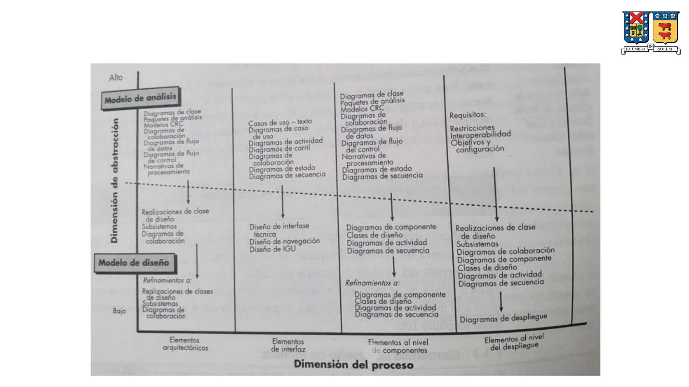

import ConceptCard from "../../../../components/ConceptCard.astro";
import ConceptGrid from "../../../../components/ConceptGrid.astro";
import Callout from "../../../../components/Callout.astro";
import TwoCol from "../../../../components/TwoCol.astro";
import SectionBox from "../../../../components/SectionBox.astro";
import Tag from "../../../../components/Tag.astro";
import TagRow from "../../../../components/TagRow.astro";
import ErdDiagram from "../../../../components/ErdDiagram.astro";

## Metodologías de Diseño e Implementación

## Modelo de Diseño

El modelo de diseño puede verse en dos dimensiones diferentes:

<ConceptGrid>
  <ConceptCard
    label="Dimensión"
    title="Del Proceso"
    desc="Indica la evolución del diseño conforme se ejecutan las tareas de diseño como parte del proceso de software."
  />
  <ConceptCard
    label="Dimensión"
    title="De Abstracción"
    desc="Representa el grado de detalle a medida que cada elemento del modelo de análisis se transforma en un equivalente del diseño y se refina de manera iterativa."
  />
</ConceptGrid>

- Los elementos del modelo de diseño utilizan muchos de los diagramas en UML aplicados en el modelo de análisis.
- La diferencia radica en el nivel de refinamiento y elaboración:
  - Proporcionan un mayor detalle para la implementación específica.
  - Resaltan la estructura y el estilo arquitectónico, los componentes que residen en la arquitectura y las interfaces.
- El diseño arquitectónico preliminar establece la plataforma, seguido por el diseño de interfaz y el diseño a nivel de componentes (a menudo en paralelo).
- El modelo de despliegue se retrasa hasta que el diseño ha sido desarrollado por completo.

## Agenda

- Modelo de Diseño
- Elementos del Diseño de Datos
- Elementos del Diseño Arquitectónico
- Elementos del Diseño de Interfaces
- Elementos del Diseño a nivel de Componentes
- Elementos del Diseño a nivel de Despliegue
- Diseño del Software basado en Patrones

## Elementos del Diseño de Datos

<ConceptGrid>
  <ConceptCard
    label="Concepto"
    title="Diseño de Datos"
    desc="Crea un modelo de datos representado con un alto grado de abstracción, que luego se refina para una implementación específica y es procesable por el sistema informático."
  />
</ConceptGrid>

- En muchas aplicaciones de software, el modelo de datos tiene una profunda influencia sobre la arquitectura del software que los debe procesar.

### Importancia de la Estructura de Datos

- **A nivel de componentes del sistema**: Las estructuras del diseño de datos y los algoritmos para manipularlos son esenciales para la creación de aplicaciones de alta calidad.
- **A nivel de aplicación**: La traducción de un modelo de datos a una base de datos es esencial para alcanzar los objetivos de negocio de un sistema.
- **A nivel de negocio**: La colección y reorganización de información almacenada en bases de datos dispersas permite la explotación de datos y el descubrimiento de conocimiento que puede impactar el éxito del negocio.

## Elementos del Diseño Arquitectónico

<ConceptGrid>
  <ConceptCard
    label="Concepto"
    title="Diseño Arquitectónico"
    desc="Es el plano de planta del software, proporcionando una visión general del sistema y su estructura."
  />
</ConceptGrid>

- El modelo arquitectónico se obtiene de tres fuentes:
  - Información sobre el dominio de aplicación del software a construir.
  - Elementos del modelo de análisis (diagramas de flujo de datos, clases de análisis, relaciones y colaboraciones).
  - Posibilidad de estilos y patrones arquitectónicos.

## Elementos del Diseño de Interfaces

<ConceptGrid>
  <ConceptCard
    label="Concepto"
    title="Diseño de Interfaz"
    desc="Equivale a los dibujos detallados de puertas, ventanas y utilidades externas de una casa. Indica cómo fluye la información hacia y desde el sistema y entre sus componentes."
  />
</ConceptGrid>

- Los dibujos y especificaciones detalladas indican cómo fluyen las cosas y la información desde y hacia la "casa" y dentro de las "habitaciones" (componentes).
- Muestra cómo el sistema se comunica externamente y cómo se comunican sus componentes internamente.

### Elementos Importantes del Diseño de Interfaces

- Interfaz con el usuario.
- Interfaces externas con otros sistemas, dispositivos, redes u otros productores o consumidores de información.
- Interfaces internas entre componentes.

<Callout type="info" title="Aspectos Clave">
  <ul>
    <li>
      El diseño de interfaces de usuario incorpora elementos estéticos,
      ergonómicos y técnicos.
    </li>
    <li>
      El diseño de interfaces externas requiere información definitiva sobre la
      entidad emisora o receptora e incorpora revisión de errores y seguridad.
    </li>
    <li>
      El diseño de interfaces internas está alineado cercanamente con el diseño
      a nivel de componentes.
    </li>
  </ul>
</Callout>

- Las realizaciones del diseño de clases de análisis representan las operaciones y esquemas de mensajes requeridos para la comunicación y colaboración entre clases.
- Cada mensaje debe ser diseñado para ajustarse a la transferencia de información requerida.
- Interfaz de una clase:
  - Determinante de las operaciones públicas visibles externamente.
  - Conjunto de operaciones que describe parte del comportamiento de una clase y proporciona acceso a dichas operaciones.

## Elementos del Diseño a nivel de Componentes

<ConceptGrid>
  <ConceptCard
    label="Concepto"
    title="Diseño a Nivel de Componentes"
    desc="Equivale a un conjunto de dibujos y especificaciones detalladas para cada habitación de una casa, describiendo por completo el detalle interno de cada componente del software."
  />
</ConceptGrid>

- Define estructuras de datos para objetos locales, detalle algorítmico para el procesamiento interno de un componente e interfaces para acceder a sus operaciones.
- Los detalles del diseño a nivel de componentes se pueden modelar a distintos grados de abstracción.
- Para la representación del procesamiento lógico, se puede utilizar un diagrama de actividades.
- El flujo detallado del procedimiento para un componente puede representarse mediante pseudocódigo o algún formato de diagrama.

## Elementos del Diseño a nivel de Despliegue

<ConceptGrid>
  <ConceptCard
    label="Concepto"
    title="Diseño a Nivel de Despliegue"
    desc="Indica cómo se ubicarán la funcionalidad y los subsistemas dentro del entorno computacional físico que soportará el software."
  />
</ConceptGrid>

- Durante el diseño, se desarrolla un diagrama de despliegue que posteriormente se refina.
- Esta perspectiva agrega valor al diseño y es recomendable modelarla.

## Diseño del Software basado en Patrones

<ConceptGrid>
  <ConceptCard
    label="Concepto"
    title="Patrón de Diseño"
    desc="Una solución general y reutilizable a un problema común en el diseño de software. Permite a los ingenieros aplicar soluciones probadas en lugar de reinventar la rueda."
  />
</ConceptGrid>

- Un ingeniero de software debe buscar toda oportunidad para aplicar patrones de diseño existentes.
- Las fuerzas de diseño describen requisitos no funcionales (portabilidad, facilidad de modificación, seguridad) asociados al software donde se aplicará el patrón.
- Las características del patrón (clases, responsabilidades, colaboraciones) indican los atributos ajustables del diseño para que el patrón se adapte a una variedad de problemas.

### Utilización de Patrones en el Diseño

- Los patrones de diseño pueden usarse una vez desarrollado el modelo de análisis, permitiendo al diseñador examinar una representación detallada del problema y sus restricciones.
- La descripción del problema se examina en varios grados de abstracción para determinar si es flexible para uno o más de los siguientes tipos de patrones:
  - **Patrones arquitectónicos**: Solucionan problemas específicos y recurrentes a nivel de arquitectura. Indican relaciones entre subsistemas y componentes, y definen reglas para especificar las relaciones entre elementos arquitectónicos.
  - **Patrones de diseño**: Se aplican a un elemento específico del diseño (como un agregado de componentes) para resolver un problema de diseño, relaciones entre componentes, o mecanismos de comunicación componente a componente.
  - **Patrones de lenguaje**: Implementan un elemento algorítmico o un componente, un protocolo de interfaz específico o un mecanismo de comunicación entre componentes.
